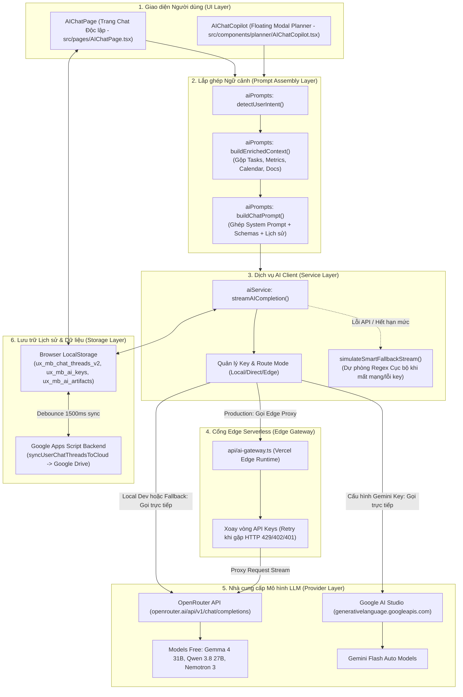

# BÁO CÁO KIỂM ĐỊNH TOÀN DIỆN TÍNH NĂNG AI CHATS (UX COPILOT)
**Dự án:** MBBank UX Task Request Portal (`uxmb-task-request`)  
**Phân hệ kiểm định:** AI Chats & Intelligent Copilot  
**Thời điểm kiểm định:** 2026-10-03 | **Cơ sở dữ liệu kiểm định:** Working tree (bao gồm các thay đổi chưa commit) tại thời điểm đọc  
**Git Commit HEAD ghi nhận:** `4741fd3c1010fa72e2926978caae465b6aae9026`  
**Nguyên tắc kiểm định:** Read-Only Audit (chỉ đọc, không can thiệp logic), bảo mật tuyệt đối (che dấu `***` toàn bộ secret), 100% phát hiện có đối soát `file:dòng` thực tế.

---

### TIẾN ĐỘ KIỂM ĐỊNH CÁC MẢNG
- ✅ **[Mảng A] — 15 phát hiện (A1–A15)** — `[src/config/aiPrompts.ts, src/services/aiService.ts, src/services/aiArtifactsService.ts, api/ai-gateway.ts, src/data/aiOpsMockData.ts, src/components/dashboard/ai-ops/*, src/pages/AIChatPage.tsx, src/components/planner/AgentActivityTrace.tsx, src/components/planner/AIChatCopilot.tsx, src/components/admin/OpenRouterSettingsCard.tsx, src/lib/accessControl.ts, src/config/navVisibilityConfig.ts, google-apps-script-backend.js, doc/features/14_AI_CHATS_AND_INTELLIGENT_COPILOT.md, doc/features/11_DASHBOARD_AND_AIOPS_REUI.md]`
- ✅ **[Mảng B] — 18 phát hiện (B1–B18)** — `[src/pages/AIChatPage.tsx, src/components/planner/AIChatCopilot.tsx, src/components/jolyui/ai-prompt-box.tsx, src/components/chat/EchoArtifactSplitViewer.tsx, src/components/planner/AgentActivityTrace.tsx, src/components/common/EchoChartsAndFlowcharts.tsx, src/services/aiService.ts, src/services/aiArtifactsService.ts, src/config/aiPrompts.ts, src/config/navVisibilityConfig.ts, src/lib/accessControl.ts]`
- ✅ **[Mảng C] — 11 phát hiện (C1–C11)** — `[src/services/aiService.ts, api/ai-gateway.ts, src/config/aiPrompts.ts, src/pages/AIChatPage.tsx, src/components/planner/AIChatCopilot.tsx, src/lib/accessControl.ts, src/services/otpAuthService.ts, package.json, tests/]`
- ✅ **[Mảng D] — 7 phát hiện (D1–D7)** — `[api/ai-gateway.ts, package.json, src/services/aiService.ts, src/data/aiOpsMockData.ts, src/components/dashboard/ai-ops/*, src/pages/AIChatPage.tsx, src/components/admin/OpenRouterSettingsCard.tsx]`

---

## PHẦN 1: TÓM TẮT ĐIỀU HÀNH (EXECUTIVE SUMMARY)

Kiểm định toàn diện phân hệ AI Chats trong web app nội bộ `uxmb-task-request` ghi nhận 51 phát hiện kỹ thuật, chất lượng và vận hành:
**3 rủi ro lớn nhất:**
1. **Bảo mật & Rò rỉ dữ liệu ngân hàng (Critical C1, C2, C3):** Khóa API lộ ở client bundle/localStorage; Gateway không xác thực; dữ liệu task, nhân sự và lịch họp gửi ra LLM công cộng chưa lọc PII.
2. **Lệch pha đặc tả & Gãy workflow thiết kế (High A6, B1, B5, B8):** Thiếu 4/5 Slash Commands cốt lõi (`/checklist`, `/quychuan`); hạn mức ảo 14 lượt; 0% kết nối với Figma/Miro; thiếu vắng model cao cấp.
3. **Vận hành mù mờ & Trắng kiểm thử (High C11, D1, D2, D4):** Độ phủ test AI bằng 0%; Edge Gateway không logging; thiếu giám sát Sentry; AI Ops Dashboard là code chết hiển thị 100% dữ liệu mock.
**3 cơ hội nâng cấp có giá trị nhất:**
1. **Chuẩn hóa Gateway tập trung & Bảo mật cấp ngân hàng (C1, C2, C3, C4):** Thu hồi API key về Vercel Secrets, ép xác thực Bearer RBAC, tích hợp PII Redaction và rate limiting an toàn.
2. **Tối ưu hóa trải nghiệm 1-chạm & Đồng bộ Figma (B2, B7, B8, Đề xuất 1 & 3):** Bổ sung nút Copy phản hồi, 1-click Chat-to-Artifact, và xuất dữ liệu tương thích Figma Text/Tokens.
3. **Nâng tầm chất lượng trợ lý với Model Pro & MB Brand Prompts (A4, A5, A7, Đề xuất 2 & 4):** Nạp MB Brand Tokens, mở rộng ngữ cảnh 32k ký tự, hỗ trợ so sánh đa phương án và kiểm định Khâu 7.

---

## PHẦN 2: SƠ ĐỒ KIẾN TRÚC HIỆN TẠI (CURRENT ARCHITECTURE)

Sơ đồ thể hiện toàn bộ luồng dữ liệu 6 chặng của tính năng AI Chats từ Giao diện người dùng → Lắp ghép Ngữ cảnh → Dịch vụ AI Client → Cổng Edge Serverless → Nhà cung cấp mô hình LLM, kèm cơ chế lưu trữ lịch sử và tài liệu:

---

## PHẦN 3: BẢNG PHÁT HIỆN CHI TIẾT (FINDINGS TABLES)

### 3.1. Bảng Phát hiện Mảng A: Chất lượng Tính năng AI Chats (15 phát hiện)

| ID | Vấn đề | File:dòng | Mức độ | Ảnh hưởng tới designer | Đề xuất sửa |
| :--- | :--- | :--- | :--- | :--- | :--- |
| **A1** | **API Key OpenRouter/Google AI Studio lưu trữ phân tán ở LocalStorage và gọi trực tiếp từ client khi fallback, gây lộ khóa và mất đồng bộ** | `src/services/aiService.ts:348-359` `src/services/aiService.ts:713-718` `src/components/admin/OpenRouterSettingsCard.tsx:20-36` `api/ai-gateway.ts:54-64` | **High** | Designer không dùng được AI nếu trình duyệt cá nhân chưa có key; nguy cơ lộ API Key ngân hàng trên DevTools Network tab khi client gọi trực tiếp sang OpenRouter. | Chuyển cấu hình API Key lưu tập trung trên backend/Vercel Secrets; client chỉ gọi qua proxy `/api/ai-gateway` và cấm direct call chứa API key từ client. |
| **A2** | **Endpoint `/api/ai-gateway` hoàn toàn thiếu xác thực Bearer token, phân quyền RBAC và rate limiting** | `api/ai-gateway.ts:66-106` `api/ai-gateway.ts:124-134` | **High** | Bất kỳ ai biết URL đều có thể spam làm cạn kiệt ngân sách AI của tổ chức, khiến designer đang làm việc bị gián đoạn do lỗi 429/402. | Thêm kiểm tra Bearer session token và quyền `cap-ai-use` trong request body/header tại Gateway; áp dụng rate limit theo User ID / IP trên Edge runtime. |
| **A3** | **Hạn mức ngày 50 lượt/key (Daily AI Usage) chỉ là giao diện minh họa (cosmetic UI), không chặn gửi chat khi hết lượt và hardcode mặc định 14 lượt** | `src/services/aiService.ts:205-253` `src/pages/AIChatPage.tsx:2568-2604` | **Medium** | Designer thấy số lượt ảo (vào app đã thấy mất 14 lượt) và tưởng rằng có hạn mức nghiêm ngặt, nhưng khi hết lượt vẫn gửi được, gây hiểu lầm về quy chế vận hành. | Triển khai kiểm tra `remainingRequests > 0` trước khi gửi request; ghi nhận số lượt thực tế theo account trên server thay vì hardcode 14 và lưu tạm trên LocalStorage. |
| **A4** | **Nội dung tài liệu Artifacts đưa vào AI Context bị cắt cụt cứng tại 2.000 ký tự (Hard truncation)** | `src/config/aiPrompts.ts:349-354` | **High** | Designer tải lên PRD, tài liệu đặc tả màn hình hoặc checklist bàn giao dài nhưng AI chỉ đọc được phần đầu và bỏ qua các yêu cầu quan trọng phía sau. | Nâng giới hạn trích đoạn tài liệu lên 16.000 - 32.000 ký tự (phù hợp với context 1M của Gemini/Nemotron) hoặc chia chunk theo tiêu đề ngữ nghĩa. |
| **A5** | **System Prompt (`CORE_SYSTEM_PROMPT`) thiếu MB Brand Tokens, Voice & Tone và Quy trình 7 khâu; các hằng số Persona bị bỏ trống** | `src/config/aiPrompts.ts:37-78` | **Medium** | AI tư vấn giải pháp thiết kế chung chung theo chuẩn bên ngoài thay vì tuân thủ quy chuẩn riêng của MBBank Design System v3.0. | Bổ sung MB Brand Tokens, tiêu chuẩn 7 khâu và quy tắc ứng xử vào System Prompt; hỗ trợ nạp cấu hình prompt theo version từ Admin Portal. |
| **A6** | **Thiếu đồng bộ Slash Commands: 4/5 lệnh trong đặc tả (`/po`, `/deepwork`, `/quychuan`, `/checklist`) không tồn tại trong `AI_COMMAND_LIST`** | `src/pages/AIChatPage.tsx:4328-4383` `doc/features/14_AI_CHATS_AND_INTELLIGENT_COPILOT.md:153-162` | **High** | Designer gõ phím tắt theo tài liệu đào tạo nhưng hệ thống không hiện lệnh `/po`, `/deepwork`, `/quychuan`, `/checklist`, làm gãy workflow thao tác nhanh. | Khai báo bổ sung 4 lệnh trên vào `AI_COMMAND_LIST` trong `AIChatPage.tsx` kèm prompt mẫu và icon tương ứng theo đúng tài liệu đặc tả. |
| **A7** | **Danh sách Model AI trên giao diện (`POPULAR_AI_MODELS`) lệch đặc tả (chỉ có model Free, thiếu toàn bộ Claude 3.5 Sonnet, GPT-4o, DeepSeek R1)** | `src/services/aiService.ts:127-200` `src/pages/AIChatPage.tsx:4638-4673` `doc/features/14_AI_CHATS_AND_INTELLIGENT_COPILOT.md:80-81` | **Medium** | Designer không thể chuyển sang các mô hình cao cấp có năng lực thị giác (Vision) mạnh để phân tích ảnh giao diện hoặc bản vẽ Figma. | Cập nhật danh mục model phân cấp: Free/Fast cho tra cứu nhanh và Pro/Reasoning cho phân tích sâu giao diện, đồng bộ với đặc tả. |
| **A8** | **Agent Activity Trace trên UI hiển thị 3 bước ("3/3 hoàn tất") thay vì quy trình 4 bước đối soát theo đặc tả** | `src/components/planner/AgentActivityTrace.tsx:205-207` `src/components/planner/AgentActivityTrace.tsx:245-414` `doc/features/14_AI_CHATS_AND_INTELLIGENT_COPILOT.md:118-148` | **Medium** | Designer không nhìn thấy bước đối soát rủi ro SLA và mốc Go-Live độc lập, làm giảm tính minh bạch của quy trình suy luận tư duy. | Tách bạch Bước 3 (Đối soát rủi ro & cột mốc hạn chót) thành một bước hiển thị độc lập có badge cảnh báo rủi ro theo đúng luồng 4 bước. |
| **A9** | **Toàn bộ phân hệ AI Ops Dashboard (`AiOpsRoutingRules`, `AiOpsTokenActivity`, `AiOpsProviderFailover`) là mã nguồn chết (dead code) chứa 100% mock data tiếng Anh** | `src/data/aiOpsMockData.ts:1-343` `src/components/dashboard/ai-ops/AiOpsRoutingRules.tsx:22` `src/components/dashboard/ai-ops/AiOpsTokenActivity.tsx:3` `src/components/dashboard/ai-ops/AiOpsProviderFailover.tsx:3` `src/pages/TongQuanPage.tsx:5-64` | **Medium** | Gây hiểu lầm cho đội ngũ quản trị rằng hệ thống đã có trung tâm giám sát AI Ops thời gian thực, trong khi thực tế không hoạt động và không gắn với gateway. | Dọn dẹp các component mock thừa; nếu cần theo dõi vận hành AI thì xây dựng pipeline ghi telemetry từ `api/ai-gateway.ts` về Sheet/DB. |
| **A10** | **Khối Fallback cục bộ chứa dữ liệu mock tiếng Anh không liên quan nghiệp vụ ngân hàng ("Lunch With Sarah", "excess over July", "Seat reductions")** | `src/pages/AIChatPage.tsx:3982-3993` `src/pages/AIChatPage.tsx:4051-4052` `src/services/aiService.ts:1482-1505` | **Medium** | Designer gặp câu trả lời lạc quẻ về lịch ăn trưa hay chỉ số phần mềm nước ngoài khi hỏi từ khóa liên quan đến "tháng 7", làm giảm độ tin cậy của trợ lý. | Xóa bỏ toàn bộ các chuỗi mock thừa từ template nước ngoài; chuẩn hóa 100% dữ liệu fallback sang tiếng Việt dựa trên `TASK_DATA_JSON`. |
| **A11** | **Thiếu timeout cho cuộc gọi tới Edge Gateway (`/api/ai-gateway`) và thiếu cơ chế retry với backoff** | `src/services/aiService.ts:676-698` `api/ai-gateway.ts:160-224` | **Low** | Khi OpenRouter hoặc mạng chập chờn, giao diện bị treo trạng thái loading rất lâu trước khi chuyển sang fallback cục bộ. | Thiết lập timeout 8–10 giây cho cuộc gọi Edge Gateway và thêm 1 lần retry tự động trước khi hạ cấp xuống local synthesis. |
| **A12** | **Route Guard trang `#aichat` âm thầm chuyển hướng (silent redirect) về `#track` thay vì hiện thông báo thân thiện theo đặc tả** | `src/App.tsx:175-177` `doc/features/14_AI_CHATS_AND_INTELLIGENT_COPILOT.md:206-207` | **Low** | Nhân sự chưa được cấp quyền bấm vào đường dẫn `#aichat` bị văng sang trang khác mà không nhận được thông báo giải thích lý do. | Hiển thị màn hình chặn quyền chuẩn ReUI kèm thông báo: "Chưa được cấp quyền sử dụng AI Chats — Vui lòng liên hệ Admin để kích hoạt". |
| **A13** | **Cấu hình navigation mặc định (`navVisibilityConfig.ts`) bật mục AI Chats cho vai trò PO và Business, mâu thuẫn với RBAC** | `src/config/navVisibilityConfig.ts:61` `src/config/navVisibilityConfig.ts:73` `doc/features/14_AI_CHATS_AND_INTELLIGENT_COPILOT.md:195-207` | **Low** | Gây khó hiểu cho Quản trị viên khi xem ma trận phân quyền điều hướng vì PO/Business được bật sáng mục AI Chats dù không có quyền dùng. | Đặt giá trị mặc định `aichat: false` cho vai trò `PO` và `Business` trong `DEFAULT_ROLE_NAV_CONFIG`. |
| **A14** | **Lịch sử hội thoại và tài liệu Artifacts mặc định lưu ở LocalStorage của trình duyệt, tiềm ẩn nguy cơ mất dữ liệu** | `src/services/aiArtifactsService.ts:29-30` `src/pages/AIChatPage.tsx:166-167` `src/services/googleSheetService.ts:2369-2377` | **Medium** | Designer bị mất toàn bộ lịch sử trao đổi và các tài liệu đặc tả quan trọng khi xóa cache trình duyệt, mở tab ẩn danh hoặc đổi máy làm việc. | Thêm chỉ báo trạng thái lưu trữ (Cloud Synced vs Local Only), bổ sung tính năng sao lưu/khôi phục tệp JSON thủ công. |
| **A15** | **Thiếu Prompt Caching và Semantic Caching dẫn đến tiêu tốn token và tăng độ trễ cho context dữ liệu bài toán lặp lại** | `src/config/aiPrompts.ts:422-447` `src/services/aiService.ts:680-687` `api/ai-gateway.ts:136-150` | **Low** | Tăng thời gian chờ phản hồi đầu tiên (First Token Latency) và lãng phí băng thông gửi toàn bộ context danh sách task trong mỗi câu hỏi mới. | Bật cờ Prompt Caching của OpenRouter/Anthropic cho phần System Prompt & Task Context; thêm bộ đệm đàm thoại ngắn hạn. |

---

### 3.2. Bảng Đối chiếu Đặc tả (`doc/features/14_AI_CHATS_AND_INTELLIGENT_COPILOT.md`)

| Mục trong đặc tả | Trạng thái | Bằng chứng file:dòng | Ghi chú |
| :--- | :--- | :--- | :--- |
| **2. Cấu trúc kiến trúc: `aiService.ts`** | Đã làm | `src/services/aiService.ts:1-844` | Đầy đủ stream SSE, bóc tách `<think>`, quản lý hạn mức ngày và xoay vòng key. |
| **2. Cấu trúc kiến trúc: `aiArtifactsService.ts`** | Đã làm | `src/services/aiArtifactsService.ts:1-432` | Đầy đủ CRUD tài liệu, LocalStorage cache và danh mục seed artifacts. |
| **2. Cấu trúc kiến trúc: `aiPrompts.ts`** | Làm khác | `src/config/aiPrompts.ts:37-78` | System prompt gán cứng, thiếu versioning, rỗng Persona, thiếu Brand Tokens. |
| **2. Cấu trúc kiến trúc: `navVisibilityConfig.ts`** | Làm khác | `src/config/navVisibilityConfig.ts:20-81` | Mục `aichat` có khai báo nhưng vai trò `PO` và `Business` vẫn đang bật `true`. |
| **2. Cấu trúc kiến trúc: `AgentActivityTrace.tsx`** | Làm khác | `src/components/planner/AgentActivityTrace.tsx:205-207, 245-414` | Hiển thị 3 bước ("3/3 hoàn tất") thay vì quy trình 4 bước như đặc tả. |
| **2. Cấu trúc kiến trúc: `AIChatCopilot.tsx`** | Đã làm | `src/components/planner/AIChatCopilot.tsx:1-350` | Widget chat nổi hỗ trợ stream, bám sát context Planner. |
| **2. Cấu trúc kiến trúc: `OpenRouterSettingsCard.tsx`** | Làm khác | `src/components/admin/OpenRouterSettingsCard.tsx:20-36, 70-78` | Chỉ lưu cấu hình vào `localStorage` cá nhân, không đồng bộ sang Gateway. |
| **2. Cấu trúc kiến trúc: `c-icon-stack-2.tsx` & `icon-stack.tsx`** | Đã làm | `src/components/reui/c-icon-stack-2.tsx:1-40` | Khối minh họa 3D Icon Stack thẻ kính chuẩn ReUI. |
| **2. Cấu trúc kiến trúc: `RequestDetail.tsx`** | Đã làm | `src/components/track/RequestDetail.tsx:1-120` | Modal chi tiết task mở mượt mà khi click vào bài toán tại Activity Trace. |
| **2. Cấu trúc kiến trúc: `AIChatPage.tsx`** | Đã làm | `src/pages/AIChatPage.tsx:1-4898` | Không gian làm việc AI Workspace toàn diện, hỗ trợ Threads và Artifacts. |
| **2. Cấu trúc kiến trúc: `QuanLyPage.tsx`** | Đã làm | `src/pages/QuanLyPage.tsx:1-300` | Tích hợp thẻ cấu hình OpenRouter và cổng APIs. |
| **2. Cấu trúc kiến trúc: `api/ai-gateway.ts`** | Làm khác | `api/ai-gateway.ts:1-252` | Proxy Serverless Vercel Edge, nhưng thiếu auth, thiếu rate limit và chỉ đọc server env. |
| **3.1 Sidebar Header & Tabs** | Đã làm | `src/pages/AIChatPage.tsx:1738-1815, 2160-2210` | Đầy đủ logo, nút tạo chat/tải tài liệu, bottom tab switcher `[Chats]`/`[Artifacts]`. |
| **3.1 Sidebar Pinned & Recent Threads** | Đã làm | `src/pages/AIChatPage.tsx:1845-2070` | Accordion Pinned, Recent, đổi tên nhanh, ghim/bỏ ghim, xuất `.md`, xóa thread. |
| **3.2 Top Header & Model Selector** | Làm khác | `src/pages/AIChatPage.tsx:4638-4673`, `src/services/aiService.ts:127-200` | Model selector chỉ hỗ trợ danh mục model Free, thiếu Claude 3.5 Sonnet, GPT-4o, DeepSeek R1. |
| **3.2 User & Assistant Message Styling** | Đã làm | `src/pages/AIChatPage.tsx:3270-3380` | Chuẩn bo góc `rounded-2xl rounded-br-xs`, avatar MB Design System và logo MB AI. |
| **3.2 Bảng dữ liệu Markdown chuyên nghiệp** | Đã làm | `src/pages/AIChatPage.tsx:3760-3840` | Render bảng chuẩn, có ký hiệu sắp xếp `↕`, viền mờ mảnh. |
| **3.2 Khối Hành động Xác nhận (Action Cards)** | Làm khác | `src/pages/AIChatPage.tsx:3556-3566, 3970-3995` | Chỉ có 1 nút "Xem chi tiết bài toán", không có nút từ chối, không thay đổi trạng thái trực tiếp. |
| **3.2 Khối Đề xuất cập nhật Task (`task_update`)** | Đã làm | `src/pages/AIChatPage.tsx:3631-3700` | Hỗ trợ duyệt đổi khâu, tiến độ và ghi chú đồng bộ lên Google Sheet. |
| **3.2 Khối Artifact Blocks & Code** | Đã làm | `src/pages/AIChatPage.tsx:3575-3625` | Header tên file, badge loại file, số dòng code và nút Copy. |
| **3.2 Thẻ Tài liệu tham chiếu (`@...`)** | Đã làm | `src/pages/AIChatPage.tsx:4030-4048` | Hiển thị chip tài liệu tham chiếu chuẩn Notion-style. |
| **3.2 Gợi ý câu hỏi tiếp theo (Follow-up chips)** | Đã làm | `src/pages/AIChatPage.tsx:4020-4060` | Dải chip gợi ý `Shorten to two lines ↳` tương tác mượt mà. |
| **3.3 Thanh Hạn mức AI trong ngày** | Làm khác | `src/pages/AIChatPage.tsx:2555-2615`, `src/services/aiService.ts:205-253` | Đúng định dạng hiển thị và reset 00:00, nhưng không chặn gửi chat khi hết 50 lượt. |
| **3.4 Khung Composer & Slash Menu ReUI** | Đã làm | `src/pages/AIChatPage.tsx:4425-4625, 4710-4735` | Menu ReUI đơn sắc, phím tắt Up/Down, Enter/Tab, Esc, nút Paperclip, nút Dừng stream. |
| **4. Agent Activity Trace 4 bước** | Làm khác | `src/components/planner/AgentActivityTrace.tsx:205-207, 245-414` | Thiếu bước "Đối soát rủi ro & cột mốc" độc lập; code thực tế render 3 bước. |
| **4. Agent Activity Trace Collapsible UX** | Làm khác | `src/components/planner/AgentActivityTrace.tsx:142-173` | Tự thu gọn sau 3.5s nhưng nhãn tóm tắt hiển thị khác văn phong đặc tả. |
| **5. Bộ Slash Commands: `/tiendo`** | Đã làm | `src/pages/AIChatPage.tsx:4329-4337` | Kiểm tra công việc và deadline hiện tại của designer. |
| **5. Bộ Slash Commands: `/po`** | Chưa làm | `src/pages/AIChatPage.tsx:4328-4383` | Không có trong `AI_COMMAND_LIST` (bị thay bởi `/chart`). |
| **5. Bộ Slash Commands: `/deepwork`** | Chưa làm | `src/pages/AIChatPage.tsx:4328-4383` | Không có trong `AI_COMMAND_LIST` (bị thay bởi `/flow`). |
| **5. Bộ Slash Commands: `/quychuan`** | Chưa làm | `src/pages/AIChatPage.tsx:4328-4383` | Không có trong `AI_COMMAND_LIST` (bị thay bởi `/doc`). |
| **5. Bộ Slash Commands: `/checklist`** | Chưa làm | `src/pages/AIChatPage.tsx:4328-4383` | Không có trong `AI_COMMAND_LIST`. |
| **6.1 Khung tải lên ReUI `c-file-upload-10`** | Đã làm | `src/pages/AIChatPage.tsx:2330-2376` | Tỷ lệ 21:9, `IconStackLarge`, drag & drop đa tệp, dán Clipboard Ctrl+V. |
| **6.2 Bộ 4 tài liệu Seed chuẩn ban đầu** | Đã làm | `src/services/aiArtifactsService.ts:32-315` | Đủ 4 tài liệu đặc tả (thực tế có 6 tài liệu trong seed). |
| **7.1 Phân quyền Vai trò (`canUseAi`)** | Đã làm | `src/lib/accessControl.ts:632-674`, `src/components/Sidebar.tsx:422` | Phân quyền qua capability `cap-ai-use` cho Admin, Designer, Design Owner. |
| **7.1 Route Guard `#aichat` thông báo thân thiện** | Làm khác | `src/App.tsx:175-177` | Âm thầm chuyển hướng về `#track` thay vì hiện thông báo "Chưa được cấp quyền...". |
| **7.2 Chính sách Hạn mức 50 request/key/ngày** | Làm khác | `src/services/aiService.ts:205-253` | Có tính toán công thức nhưng không ép buộc chặn request trên Gateway/Client. |
| **7.3 Bảo vệ Khóa API qua Gateway Proxy** | Làm khác | `api/ai-gateway.ts:54-64`, `src/services/aiService.ts:700-736` | Có proxy nhưng client vẫn direct call khi fallback làm lộ key; Gateway thiếu auth. |
| **8. Kiểm thử & Bóc tách thẻ `<think>`** | Đã làm | `src/services/aiService.ts:786-815` | Bóc tách regex chuẩn xác, không làm lộ suy luận nháp ra câu trả lời chính. |
| **9. Google Drive Storage Taxonomy (5 thư mục)** | Đã làm | `google-apps-script-backend.js:49-80, 3603` | Cấu hình đúng Root ID `1wgVKMhejp5b4G8efjXoIXpFaxQjzK69g` và 5 thư mục chuẩn hóa. |
| **9. Đồng bộ lịch sử chat `chat_threads_<email>.json`** | Đã làm | `src/services/googleSheetService.ts:2364-2420` | Lưu trữ file JSON lịch sử chat theo định danh tài khoản lên Google Drive. |
| **10. 7 Kịch bản Semantic Fallback Engine** | Đã làm | `src/services/aiService.ts:1037-1168` | Đầy đủ kịch bản biểu đồ, sơ đồ 7 khâu, rà soát task, tra cứu token, đàm thoại. |
| **10. Nguyên tắc Fallback `TASK_DATA_JSON` & No Hallucination** | Đã làm | `src/services/aiService.ts:887-985` | Lấy dữ liệu bài toán thật từ context JSON, từ chối trả lời nếu thiếu dữ liệu. |
| **10. Tồn tại mã nguồn fallback cũ (`simulateLegacyFallbackStream`)** | Làm khác | `src/services/aiService.ts:1201-1571` | Đánh dấu `@deprecated` nhưng vẫn còn ~400 dòng code chứa chuỗi mock ngoại lai. |

---

### 3.3. Bảng Phát hiện Mảng B: UX/UI & Workflow của Designer (18 phát hiện)

| ID | Vấn đề | File:dòng | Mức độ | Ảnh hưởng tới designer | Đề xuất sửa |
| :--- | :--- | :--- | :--- | :--- | :--- |
| **B1** | **Hạn mức AI ngày bị hard-code khởi tạo sẵn 14 lượt dùng và không kiểm tra chặn khi chạm trần 50 lượt** | `src/services/aiService.ts:231` `src/pages/AIChatPage.tsx:1359-1460` | **High** | Mỗi ngày Designer mở trang đều thấy đã bị trừ sẵn 14/50 lượt; khi hết 50 lượt thanh bar báo đỏ nhưng hệ thống vẫn cho gửi tiếp, gây hiểu nhầm về chính sách hạn mức ngân hàng. | Sửa khởi tạo `usedRequests = 0` trong `getDailyAIUsage()`; bổ sung điều kiện kiểm tra `dailyUsage.remainingRequests <= 0` trong `handleSendMessage` để vô hiệu hóa composer và cảnh báo rõ ràng. |
| **B2** | **Thiếu nút "Copy Text" cho toàn bộ nội dung phản hồi của Trợ lý AI (Assistant Message)** | `src/pages/AIChatPage.tsx:4176, 4246-4300` `src/pages/AIChatPage.tsx:939-944` | **High** | Khi AI sinh ra đoạn văn bản tư vấn layout, microcopy hoặc checklist, Designer phải dùng chuột bôi đen thủ công toàn bộ khối chữ dài để Ctrl+C thay vì 1-click copy, gây ma sát lớn hàng ngày. | Bổ sung thanh công cụ dưới mỗi tin nhắn Assistant gồm nút "Sao chép toàn bộ" (`Copy`), nút "Sao chép dưới dạng Markdown" kèm thông báo toast xác nhận. |
| **B3** | **Không hỗ trợ Chỉnh sửa câu lệnh đã gửi (Edit prompt) và Tạo lại câu trả lời (Regenerate response)** | `src/pages/AIChatPage.tsx:4220-4241` `src/pages/AIChatPage.tsx:4246-4300` | **High** | Khi AI hiểu sai ngữ cảnh hoặc phản hồi chưa tối ưu, Designer không thể sửa nhanh câu hỏi cũ hoặc bấm tạo lại mà phải tự gõ lại từ đầu, làm gián đoạn mạch làm việc và tốn thêm quota. | Bổ sung nút Edit trên bong bóng tin nhắn của User (cho phép chỉnh sửa inline và gửi lại) và nút Regenerate trên tin nhắn Assistant. |
| **B4** | **Không hỗ trợ lưu trữ và so sánh đa phương án thiết kế (Variant Comparison / Multi-generation)** | `src/pages/AIChatPage.tsx:134-153` | **Medium** | Trong quy trình UX luôn cần cân nhắc 2-3 phương án giao diện hoặc tone of voice; việc chỉ hỗ trợ luồng chat đơn tuyến buộc Designer phải cuộn tìm lại các phương án cũ rải rác trong thread. | Nâng cấp kiểu dữ liệu `ChatMessage` hỗ trợ mảng `variants?: string[]`, bổ sung bộ nút chuyển đổi `< 1/2 >` ở chân tin nhắn để đối chiếu song song các phương án. |
| **B5** | **Thiếu các Slash Commands cốt lõi theo đặc tả kỹ thuật (`/checklist` và `/quychuan`)** | `src/pages/AIChatPage.tsx:4328-4383` `doc/features/14_AI_CHATS_AND_INTELLIGENT_COPILOT.md:155-162` | **High** | Designer gõ lệnh `/checklist` (để sinh checklist nghiệm thu khâu 7) hoặc `/quychuan` (tiêu chuẩn bàn giao Figma) thì menu không nhận diện được, làm mất giá trị của tính năng phím tắt ReUI. | Bổ sung 2 lệnh `/checklist` và `/quychuan` vào danh sách `AI_COMMAND_LIST` trong `AIChatPage.tsx` và gắn đúng prompt nghiệp vụ tại `src/config/aiPrompts.ts`. |
| **B6** | **Thiếu nút Thử lại (Retry button) khi luồng kết nối AI gặp lỗi hoặc timeout** | `src/pages/AIChatPage.tsx:1707-1712` | **High** | Khi mạng gián đoạn hoặc gateway trả lỗi, hệ thống chỉ in chuỗi text lỗi thô và không có nút thử lại; Designer bị kẹt và phải tự copy lại câu hỏi để gửi lại từ đầu. | Xây dựng khối Error State Card chuyên biệt kèm nút "Thử lại ngay" (Retry), tự động giữ lại prompt và ngữ cảnh trước đó để gửi lại chỉ bằng 1 cú nhấp chuột. |
| **B7** | **Không có tính năng 1-chạm chuyển đổi nội dung chat thành tài liệu lưu trữ (Chat-to-Artifact)** | `src/pages/AIChatPage.tsx:4140-4215` | **High** | Khi AI sinh ra bảng đặc tả hoặc checklist hoàn chỉnh, Designer không thể bấm 1 nút để lưu ngay vào kho Artifacts mà phải copy thủ công qua nhiều bước cồng kềnh. | Bổ sung nút "Lưu thành Artifact" (`FolderPlus` / `Bookmark`) trên các khối bảng Markdown, code blocks và toàn bộ tin nhắn để tự động lưu vào `aiArtifactsService`. |
| **B8** | **Thiếu hoàn toàn kết nối với công cụ thiết kế (Figma, Miro) và các định dạng xuất dữ liệu (Export)** | `src/pages/AIChatPage.tsx:946-959` `src/components/chat/EchoArtifactSplitViewer.tsx:589-614` | **High** | Toàn bộ kết quả thiết kế không thể chuyển giao trực tiếp sang Figma (không có copy dưới dạng Figma Text/JSON, không có plugin); việc xuất tài liệu bị giới hạn chỉ ở 1 file Markdown. | Xây dựng tính năng "Copy as Figma Text / JSON", cung cấp endpoint hoặc webhook cho Figma plugin, và hỗ trợ xuất Artifact ra các định dạng PDF, JSON, CSV. |
| **B9** | **Empty State hiển thị lịch sử trò chuyện giả lập (`DEMO_RECENT_CHATS`) và tự động kích hoạt gửi câu hỏi mới khi click** | `src/pages/AIChatPage.tsx:350-370` `src/pages/AIChatPage.tsx:631-637, 2493-2510` | **Medium** | Khi Designer mới chưa từng trò chuyện, giao diện lại hiển thị "Recent chats" từ "2h", "1d" trước; khi click vào một dòng thì hệ thống tự gửi prompt chạy AI mới thay vì mở chat, gây hoang mang. | Tách bạch rõ ràng giữa khối "Gợi ý câu hỏi phổ biến" và khối "Lịch sử gần đây"; chỉ hiển thị lịch sử khi `threads.length > 0`, nếu chưa có thì hiển thị empty state trung thực. |
| **B10** | **Bất đồng bộ phân quyền giữa Sidebar điều hướng và Route Guard: PO và Business bị thấy menu nhưng bị chặn khi truy cập** | `src/config/navVisibilityConfig.ts:61, 73` `src/lib/accessControl.ts:642` `src/pages/AIChatPage.tsx:1754-1775` | **Medium** | Cấu hình mặc định bật `aichat: true` cho PO và Business khiến họ nhìn thấy mục AI Chats trên Sidebar, nhưng khi bấm vào lại gặp màn hình báo lỗi chặn quyền truy cập, gây cụt hứng. | Đồng bộ cấu hình mặc định trong `navVisibilityConfig.ts` ẩn mục `aichat` đối với PO và Business, đúng theo đặc tả `doc/features/14_AI_CHATS_AND_INTELLIGENT_COPILOT.md:205`. |
| **B11** | **Vi phạm Accessibility: Thiếu thuộc tính `aria-*`, phím `Tab` không bẫy focus trong Slash Command Menu, và thiếu `aria-live` cho streaming text** | `src/pages/AIChatPage.tsx:4749-4782` `toàn bộ src/pages/AIChatPage.tsx` | **Medium** | Người dùng điều hướng bằng bàn phím bị nhảy mất tiêu điểm khi nhấn Tab trong menu lệnh; người khiếm thị dùng screen reader không nhận được thông báo khi tin nhắn đang stream. | Bổ sung xử lý phím `Tab` trong `EchoComposerForm` để chọn lệnh; gắn `aria-label` cho tất cả các nút icon; thêm `aria-live="polite"` và `role="log"` cho khung tin nhắn. |
| **B12** | **Khung soạn thảo Composer và cửa sổ xem tài liệu Artifact bị hard-code màu sáng, vỡ giao diện trong Dark Mode** | `src/pages/AIChatPage.tsx:4516, 4583, 4632, 4718, 4786` `src/components/chat/EchoArtifactSplitViewer.tsx:559, 563, 619` | **Medium** | Khi bật chế độ Dark Mode của hệ thống, ô soạn thảo và khung đọc tài liệu vẫn hiển thị nền trắng chói mắt với màu chữ xám tối, gây mỏi mắt và phá vỡ tính nhất quán của Design System. | Thay thế toàn bộ class hard-code `bg-white`, `border-slate-200/90`, `text-slate-800` bằng semantic tokens chuẩn ReUI: `bg-card`, `border-border`, `text-foreground`. |
| **B13** | **Hàm hiển thị Markdown (`RenderMarkdownParagraph`) không parse cú pháp inline cơ bản (Bold, Italic, Link, Inline Code)** | `src/pages/AIChatPage.tsx:3917-3949` | **Medium** | Các câu trả lời chứa ký tự `**chữ đậm**`, `*nghiêng*` hoặc link bị hiển thị nguyên văn text thô kèm dấu sao, làm giảm tính chuyên nghiệp và khó đọc lướt đối với Designer. | Tích hợp thư viện Markdown tiêu chuẩn hoặc áp dụng hàm parser `formatInlineText` (như trong `EchoArtifactSplitViewer.tsx:62`) cho toàn bộ các khối văn bản trong chat. |
| **B14** | **Thẻ hành động Action Card tự động chọn bài toán đầu tiên (`tasks[0]`) và hard-code tên Designer fallback khi không match được dữ liệu** | `src/pages/AIChatPage.tsx:3467, 3485, 3493` | **Medium** | Khi AI đề xuất thẻ hành động nhưng ID không khớp hoàn toàn, hệ thống tự động gán sang task đầu tiên trong danh mục và hard-code tên "Lê Hoàng Nam (Designer)", gây nhầm lẫn thông tin bài toán. | Hiển thị cảnh báo "Không tìm thấy bài toán tương ứng trong phạm vi phân công" thay vì âm thầm mở `tasks[0]`; lấy thông tin Designer từ `session` hiện tại thay vì hard-code tên cố định. |
| **B15** | **Khối AgentActivityTrace hiển thị 3 bước ("3/3 hoàn tất") thay vì 4 bước đối soát minh bạch như tài liệu đặc tả** | `src/components/planner/AgentActivityTrace.tsx:205-207, 244-415` `doc/features/14_AI_CHATS_AND_INTELLIGENT_COPILOT.md:120-148` | **Low** | Đặc tả yêu cầu 4 bước minh bạch (Quét danh mục, Đọc dữ liệu, Đối soát rủi ro, Tổng hợp AI - nhãn 4/4), nhưng giao diện thực tế chỉ render 3 bước và hiển thị nhãn 3/3, gây lệch chuẩn tài liệu. | Tách riêng bước "Đối soát rủi ro & cột mốc" thành một bước trực quan độc lập hoặc cập nhật tài liệu đặc tả đồng bộ với kiến trúc 3 bước hiện hành. |
| **B16** | **Mini Copilot (`AIChatCopilot.tsx`) bị mất sạch lịch sử trò chuyện khi đóng/mở hoặc refresh và dùng input một dòng** | `src/components/planner/AIChatCopilot.tsx:55-63, 324-336` | **Medium** | Designer trao đổi tư vấn công việc trên widget nổi ở trang Planner bị mất toàn bộ nội dung nếu vô tình đóng widget; ô nhập chỉ hỗ trợ 1 dòng, không thể gõ nhiều dòng cho câu hỏi dài. | Lưu lịch sử phiên chat của `AIChatCopilot` vào `localStorage` (`ux_mb_copilot_history`) và nâng cấp ô nhập thành auto-resizing textarea hỗ trợ `Shift+Enter`. |
| **B17** | **Cơ chế tự động cuộn (Auto-scroll) cướp quyền điều khiển cuộn của Designer trong lúc AI đang stream phản hồi dài** | `src/pages/AIChatPage.tsx:1627, 1649` | **Low** | Khi AI stream tài liệu dài, lệnh `scrollIntoView` gọi liên tục mỗi 40ms khiến Designer không thể cuộn ngược lên trên để đọc lại phần mở đầu, gây giật giao diện và khó chịu. | Kiểm tra vị trí thanh cuộn; nếu Designer đã chủ động cuộn lên cách đáy > 100px thì tạm dừng tự động cuộn và hiển thị nút nổi "Cuộn xuống đáy" (`ArrowDown`). |
| **B18** | **Kho lưu trữ Artifacts không hỗ trợ chỉnh sửa trực tiếp nội dung (Inline Edit) và thiếu trình xem trước file ảnh/Figma** | `src/components/chat/EchoArtifactSplitViewer.tsx:619-624` | **Low** | Cửa sổ Split View chỉ cho phép xem tĩnh (Read-only); Designer muốn bổ sung một tiêu chí checklist hoặc chỉnh sửa spec phải tải file về máy, sửa thủ công rồi upload lại từ đầu. | Bổ sung nút chuyển đổi chế độ "Chỉnh sửa" (Edit Mode) với markdown editor đơn giản để Designer có thể cập nhật tài liệu trực tiếp trên giao diện Split View. |

---

### 3.4. Bảng Phát hiện Mảng C: Kỹ thuật & Đường đi Dữ liệu (11 phát hiện)

| ID | Vấn đề | File:dòng | Mức độ | Ảnh hưởng tới designer | Đề xuất sửa |
| :--- | :--- | :--- | :--- | :--- | :--- |
| **C1** | **Rò rỉ API Key qua Client Bundle và LocalStorage** API Key OpenRouter và Gemini được khai báo tiền tố `VITE_*` (`VITE_OPENROUTER_API_KEY`, `VITE_GEMINI_API_KEY`), bị Vite đóng gói trực tiếp vào file JS client; đồng thời được lưu trữ không mã hóa trong `localStorage` (`ux_mb_ai_keys`, `ux_mb_gemini_api_key`). Ngoài ra, `.env.development`, `.env.production` và `token.json` đang bị track trong git repo. | `src/services/aiService.ts:34-45, 203, 339` `.env.example:23-24` `[tracked: .env.production, token.json]` | **Critical** | Rò rỉ thông tin bảo mật và tài nguyên tài khoản API ngân hàng. Kẻ xấu có thể trích xuất key để chiếm dụng hoặc làm tê liệt dịch vụ AI của designer. | Xóa bỏ toàn bộ `VITE_OPENROUTER_API_KEY` ở client; xóa `token.json` và `.env.*` khỏi Git tracking và thêm vào `.gitignore`; chỉ giữ API Key ở biến môi trường serverless Vercel Edge (`OPENROUTER_API_KEY`). |
| **C2** | **Cổng Edge Serverless không có xác thực người gọi (Unauthenticated Edge Proxy)** Endpoint `/api/ai-gateway.ts` chỉ kiểm tra header CORS `Origin` (vốn dễ dàng bị giả mạo hoặc bỏ qua khi dùng curl/Postman) và hoàn toàn không kiểm tra session token, user role, hay bất kỳ mã xác thực nào. Bất kỳ ai có đường dẫn URL đều có thể gửi request để sử dụng model LLM miễn phí. | `api/ai-gateway.ts:18-30, 66-106` | **Critical** | Nguy cơ bị tấn công cạn kiệt tài nguyên (DDoS/Spam), khiến hạn mức API của đội ngũ designer bị khóa 429 hoặc 402 liên tục. | Yêu cầu xác thực Session Token / Bearer Token của MB Portal trong header request gửi tới `/api/ai-gateway`; kiểm tra chữ ký token hợp lệ trước khi chuyển tiếp sang OpenRouter. |
| **C3** | **Dữ liệu nhạy cảm ngân hàng & quy trình nội bộ không được lọc PII (No PII Redaction)** Toàn bộ danh mục task thực tế (`TASK_DATA_JSON` chứa mã REQ, tên sản phẩm eKYC, NFC, Trái phiếu CDs), thông tin nhân sự Designer, lịch họp chi tiết (`CALENDAR_DATA`) và tài liệu quy chuẩn tiền gửi được gửi nguyên văn ra nhà cung cấp LLM nước ngoài (OpenRouter/Google) mà không có bất kỳ bộ lọc/masking PII nào. | `src/config/aiPrompts.ts:391-404, 423-446` `src/pages/AIChatPage.tsx:1593-1604` | **Critical** | Vi phạm nghiêm trọng chính sách bảo mật dữ liệu ngân hàng và an toàn thông tin khi gửi dữ liệu dự án mật ra dịch vụ đám mây công cộng bên thứ ba. | Xây dựng bộ lọc làm mờ dữ liệu (PII Redaction Engine): tự động ẩn danh hóa tên nhân sự, mã khách hàng, và thay thế các thuật ngữ nhạy cảm bằng bí danh trước khi đẩy vào prompt. |
| **C4** | **Bypass phân quyền `canUseAi` chỉ kiểm tra ở Client (Client-only RBAC)** Quyền `cap-ai-use` được định nghĩa trong RBAC (`accessControl.ts`) chỉ cấp cho Admin, Design Owner, Designer. Tuy nhiên việc kiểm tra chỉ diễn ra trên giao diện React (`App.tsx`, `Sidebar.tsx`, `AIChatPage.tsx`). Backend `/api/ai-gateway` không kiểm tra quyền, người dùng vai trò PO, Business hoặc khách vãng lai có thể gọi trực tiếp API gateway mà không bị chặn. | `src/lib/accessControl.ts:642-644, 669-674` `api/ai-gateway.ts:66-106` | **High** | Người dùng ngoài phân quyền (như đối tác hoặc người dùng ngoài) có thể lợi dụng gateway để sử dụng AI mà hệ thống không kiểm soát được. | Đồng bộ RBAC lên Gateway Edge: truyền user role và token trong header, xác thực quyền `cap-ai-use` ngay tại lớp Gateway trước khi xử lý. |
| **C5** | **Cơ chế Master OTP mở toang quyền truy cập AI Chats (OTP Hard-code Fallback)** Khi chạy ở môi trường DEV hoặc có cờ `VITE_ENABLE_DEV_OTP_BYPASS`, hàm `verifyTeamsOtp` cho phép xác thực ngay lập tức bằng mã Master OTP (giá trị hard-code `***` hoặc `***`). Khi đăng nhập với email bất kỳ chứa từ khóa "admin" hoặc "cuong", hệ thống tự động cấp phiên Admin/Design Owner, mở toàn bộ quyền truy cập vào AI Chats. | `src/services/otpAuthService.ts:1082-1086, 1176-1183, 970-985` | **High** | Cho phép bất kỳ ai biết mã OTP dự phòng vượt qua cổng xác thực và truy cập toàn bộ giao diện, tài liệu và dữ liệu AI Chats của đội ngũ UX. | Loại bỏ hoàn toàn mã OTP hard-code trong mã nguồn; sử dụng mã OTP sinh động có thời hạn từ Google Apps Script hoặc môi trường giả lập an toàn có kiểm soát IP. |
| **C6** | **Thiếu Cleanup Abort khi Unmount trang AIChatPage gây Memory Leak và lãng phí token** Khi designer đang stream câu trả lời mà chuyển trang (ví dụ nhấp sang "Theo dõi", "Quản lý" trên Sidebar), component `AIChatPage` bị unmount nhưng không có hàm cleanup gọi `abortControllerRef.current?.abort()`. Stream tiếp tục chạy ngầm, gọi `updateAssistantMsg` trên unmounted component, gây warning bộ nhớ và lãng phí tài nguyên mạng. | `src/pages/AIChatPage.tsx:641, 1462-1463, 1714-1718` `src/App.tsx:536-542` | **High** | Gây lag ứng dụng, giật giao diện và tốn hạn mức request/token vô ích khi người dùng điều hướng sang trang khác. | Bổ sung hàm dọn dẹp `useEffect(() => () => { abortControllerRef.current?.abort() }, [])` trong `AIChatPage.tsx` giống như đã xử lý chuẩn trong `AIChatCopilot.tsx:78-82`. |
| **C7** | **Đổi Thread khi đang stream gây ô nhiễm giao diện và khóa gửi tin nhắn** Khi người dùng nhấp chọn cuộc trò chuyện khác trên sidebar trong lúc tin nhắn đang stream, hàm `onSelect` chỉ đổi `activeThreadId` mà không gọi `handleStopStream()`. Stream cũ tiếp tục cập nhật ngầm, liên tục kích hoạt `scrollIntoView()` làm cuộn giật màn hình mới; đồng thời cờ `isStreaming` vẫn giữ `true`, khiến designer không thể gửi tin nhắn mới ở thread vừa chọn. | `src/pages/AIChatPage.tsx:1961-1964, 1994-1997, 1361` | **Medium** | Designer bị ức chế trải nghiệm: chuyển sang xem chat cũ thì màn hình bị cuộn giật liên tục và không thể gõ gửi tin nhắn mới cho đến khi stream cũ chạy xong. | Trong hàm chọn thread (`onSelect`), tự động kích hoạt `handleStopStream()` để hủy bỏ stream của thread cũ trước khi chuyển active thread. |
| **C8** | **Thiếu Sliding Window & Token Pruning cho Context History** Toàn bộ lịch sử các tin nhắn của thread được nạp nguyên vẹn vào `history` và ghép vào prompt gửi đi mà không có cơ chế sliding window (cửa sổ trượt) hay cắt bớt các tin nhắn cũ. Khi cuộc trò chuyện kéo dài trên 10-15 lượt, kích thước context phình to vượt quá giới hạn của các mô hình free, gây lỗi hoặc tăng vọt độ trễ phản hồi. | `src/pages/AIChatPage.tsx:1517-1521` `src/config/aiPrompts.ts:607-610` | **Medium** | Cuộc trò chuyện càng dài thì tốc độ phản hồi càng chậm, dễ phát sinh lỗi timeout hoặc lỗi context length exceeded. | Cài đặt cơ chế Sliding Window: chỉ giữ tối đa 6-8 tin nhắn gần nhất trong prompt, tự động tóm tắt các lượt trao đổi trước đó thành 1 đoạn tóm tắt ngắn (conversation summary). |
| **C9** | **Re-render toàn bộ trang mỗi 40ms khi nhận SSE Stream** Khi nhận chunk từ SSE, hàm `onChunk` cập nhật `updateAssistantMsg` theo chu kỳ 40ms bằng cách gọi `setThreads` tác động vào state gốc của cả trang `AIChatPage` (file đơn dài tới 4,898 dòng). Việc này khiến toàn bộ cây component từ sidebar, dialog, drawer, header và các tin nhắn cũ bị re-render liên tục ở tần số 25 fps. | `src/pages/AIChatPage.tsx:1474-1490, 1641-1650` | **Medium** | Khiến trình duyệt tiêu thụ CPU cao, giao diện có hiện tượng giật nhẹ trên các máy tính cấu hình văn phòng hoặc khi luồng chat có nhiều biểu đồ/artifact. | Tách riêng state streaming của tin nhắn trợ lý hiện tại ra một component con biệt lập (`StreamingMessageBubble`), chỉ re-render cục bộ component đó, không tác động lên mảng `threads` cha cho đến khi stream hoàn tất (`onComplete`). |
| **C10** | **File mã nguồn AIChatPage quá lớn (Monolithic File 4,898 dòng) và thiếu Type Safety** File `AIChatPage.tsx` có dung lượng lên tới 218 KB và 4,898 dòng code, ôm đồm toàn bộ logic routing, streaming, parse markdown, render biểu đồ, quản lý artifacts, modal cấu hình. Có nhiều điểm sử dụng `(p as any)`, `(t as any)`, `err: any` làm suy giảm tính an toàn kiểu dữ liệu. | `src/pages/AIChatPage.tsx:1-4898` | **Medium** | Khó bảo trì, dễ sinh lỗi hồi quy (regression bugs) khi nâng cấp tính năng chat hoặc sửa lỗi giao diện. | Tái cấu trúc (refactor) bóc tách `AIChatPage.tsx` thành các module độc lập: `ChatSidebar`, `ChatMessageList`, `ChatComposer`, `ChatArtifactViewer`, `useChatStream`. |
| **C11** | **Độ phủ kiểm thử cho AI Chats bằng 0 (Zero Test Coverage)** Không có bất kỳ unit test, integration test hay end-to-end test nào trong toàn bộ thư mục `tests/` hoặc các file script `.mjs` cho các module AI: `AIChatPage.tsx`, `aiService.ts`, `aiArtifactsService.ts`, `aiPrompts.ts`, và `api/ai-gateway.ts`. | `tests/:1-21` `package.json:10` | **Medium** | Rủi ro hồi quy cao: bất kỳ sửa đổi nào trong mã nguồn AI đều không được kiểm chứng tự động, dễ làm gãy tính năng chat của designer mà không ai hay biết. | Bổ sung bộ test tự động (Vitest/Playwright): test luồng stream SSE, test phân tích cú pháp prompt/markdown, test chuyển đổi model, và test xử lý lỗi kết nối. |

---

### 3.5. Bảng Phát hiện Mảng D: Vận hành AI Chats (7 phát hiện)

| ID | Vấn đề | File:dòng | Mức độ | Ảnh hưởng tới designer | Đề xuất sửa |
| :--- | :--- | :--- | :--- | :--- | :--- |
| **D1** | **Edge Gateway hoàn toàn không có Logging & Observability (Zero Server Logging)** Trong file `api/ai-gateway.ts`, toàn bộ quá trình nhận request, xoay vòng API key, gọi OpenRouter và trả response hoàn toàn không có bất kỳ dòng log nào (`console.log`, stdout). Đội ngũ vận hành không thể biết có bao nhiêu request đã qua gateway, key nào đang bị lỗi, hay nguyên nhân lỗi upstream là gì. | `api/ai-gateway.ts:152-251` | **High** | Khi hệ thống AI gặp sự cố (chết key, nghẽn mạng), đội kỹ thuật không có dữ liệu để xử lý nhanh, làm gián đoạn công việc của designer. | Bổ sung structured logging (JSON format) tại Gateway: ghi lại timestamp, request ID, model sử dụng, key index, HTTP status code và thời gian phản hồi (latency). |
| **D2** | **Thiếu hệ thống giám sát và cảnh báo lỗi tập trung (No Error Tracking/Sentry)** Ứng dụng không tích hợp bất kỳ dịch vụ theo dõi lỗi nào (như Sentry, Datadog hay Google Cloud Logging). Mọi lỗi kết nối, lỗi parse stream chỉ được in ra `console.error` của trình duyệt người dùng hoặc hiển thị qua toast notification. | `package.json:12-47` `src/pages/AIChatPage.tsx:1693-1713` | **High** | Khi designer gặp lỗi kết nối AI, lỗi bị "chôn vùi" trong trình duyệt cá nhân của designer; đội phát triển không nhận được cảnh báo tự động để khắc phục kịp thời. | Tích hợp Sentry hoặc Datadog Browser SDK: tự động capture và gửi cảnh báo khi có exception hoặc lỗi gateway `> 5xx` kèm ngữ cảnh người dùng. |
| **D3** | **Bộ đếm hạn mức Token & Usage chỉ lưu tạm ở LocalStorage và có số liệu mock** Bộ đếm lượt dùng AI trong ngày `getDailyAIUsage()` chỉ lưu trong `localStorage.getItem("ux_mb_ai_daily_usage")` của từng máy, với giá trị khởi tạo hard-code mặc định là 14 lượt (dòng 231). Khi người dùng xóa cache hoặc dùng tab ẩn danh, bộ đếm bị đặt lại. Không có cơ chế ghi nhận token tiêu thụ (prompt tokens, completion tokens) theo từng user hay task. | `src/services/aiService.ts:205-289` | **Medium** | Designer không nắm được mức tiêu thụ tài nguyên thực tế của mình; ban quản trị không thể tính toán chi phí vận hành AI hay giới hạn hạn mức công bằng giữa các thành viên. | Xây dựng bảng ghi nhật ký sử dụng (Usage Logs) trên Google Sheets hoặc CSDL: ghi nhận user ID, task ID, số lượng input/output tokens và chi phí ước tính sau mỗi lượt chat hoàn thành. |
| **D4** | **Số liệu AI Ops Dashboard hoàn toàn là dữ liệu giả lập (Disconnected Mock Data)** Các chỉ số hiển thị tại các component AI Ops như "Provider Health: 99.94%", "Token Volume: 48.2M", "Leo Grant", "p95 latency 910ms" trong `src/data/aiOpsMockData.ts` là dữ liệu tĩnh hard-code; các component này (`AiOpsTokenActivity`, `AiOpsRoutingRules`, `AiOpsProviderFailover`) thậm chí không được import hay render trên bất kỳ trang nào của ứng dụng. | `src/data/aiOpsMockData.ts:69-115` `src/components/dashboard/ai-ops/AiOpsTokenActivity.tsx:1-120` | **Medium** | Gây hiểu lầm cho quản trị viên và ban lãnh đạo về năng lực giám sát AI Ops thực tế của hệ thống; tạo ảo giác hệ thống đã có failover thông minh trong khi thực tế chưa có. | Kết nối AI Ops Dashboard với dữ liệu vận hành thực tế lấy từ nhật ký Gateway hoặc Google Sheets; nếu chưa phát triển thì ẩn các thành phần mock để tránh gây hiểu nhầm. |
| **D5** | **Hoàn toàn thiếu cơ chế Feedback Loop từ Designer (No Like/Dislike/Report)** Mặc dù interface `ChatMessage` có trường `feedback?: "up" | "down"` (dòng 140), nhưng trong component hiển thị tin nhắn `EchoMessageRow` hoàn toàn không có nút Like, Dislike, gắn tag lỗi (ảo giác/sai quy trình) hay nút báo cáo câu trả lời để đội ngũ prompt engineering cải thiện prompt. | `src/pages/AIChatPage.tsx:140, 4245-4300` | **Medium** | Designer không thể phản hồi khi AI đưa ra câu trả lời sai quy chuẩn hoặc bị ảo giác; đội ngũ phát triển không có dữ liệu đánh giá chất lượng phản hồi để tinh chỉnh prompt. | Thêm bộ nút tương tác dưới mỗi phản hồi của Assistant: Thích (Upvote), Không thích (Downvote), Báo lỗi ảo giác; lưu kết quả phản hồi lên CSDL/Google Sheets phục vụ Fine-tuning/Prompt Tuning. |
| **D6** | **Cấu hình danh sách Model AI bị Hard-code tĩnh trong mã nguồn (Static Model Config)** Danh sách mô hình `POPULAR_AI_MODELS` được định nghĩa cứng trong file code TypeScript. Khi OpenRouter cập nhật, đổi tên hoặc ngừng cung cấp một model miễn phí, lập trình viên bắt buộc phải sửa code, commit và build lại toàn bộ ứng dụng để thay đổi danh sách model. | `src/services/aiService.ts:127-200` | **Low** | Khi model miễn phí của bên thứ ba bị lỗi hoặc khai tử, designer không thể tự chuyển sang model mới cho đến khi có bản release code mới. | Đưa cấu hình danh sách model về cơ chế Dynamic Remote Config (lấy từ Google Sheet Admin Config hoặc endpoint JSON tĩnh) cho phép Admin cập nhật danh sách model tức thì không cần redeploy. |
| **D7** | **Quản lý biến môi trường phân mảnh và thiếu nhất quán** Key OpenRouter vừa được đọc từ môi trường Edge (`OPENROUTER_API_KEY`), vừa hỗ trợ qua biến Vite (`VITE_OPENROUTER_API_KEY`), vừa hỗ trợ người dùng tự nhập lưu trữ thô trong `localStorage` (`ux_mb_ai_keys`). Cấu hình gateway cũng phân mảnh giữa `google_ai_studio` và `openrouter` mà không có tài liệu chuẩn hóa. | `api/ai-gateway.ts:55-61` `src/services/aiService.ts:28, 203, 326-360` | **Low** | Gây bối rối trong quá trình bàn giao vận hành; rủi ro người dùng nhập key cá nhân bị lưu vĩnh viễn trên trình duyệt dùng chung máy. | Thống nhất một kênh quản trị key duy nhất tại Serverless Gateway; ở client chỉ lưu tùy chọn giao diện, không lưu trữ khóa bí mật. |

---

## PHẦN 4: ROADMAP NÂNG CẤP HỆ THỐNG (UPGRADE ROADMAP)

Roadmap được phân kỳ thành 3 giai đoạn rõ ràng, bao phủ **100% các phát hiện Critical (C1, C2, C3) và High (A1, A2, A4, A6, B1, B2, B3, B5, B6, B7, B8, C4, C5, C6, D1, D2)** cùng các hạng mục cải tiến liên quan:

### Giai đoạn 1: Quick Wins (Khắc phục Ngay — Tuần 1 đến Tuần 2)
*Tập trung vá các lỗ hổng rò rỉ dữ liệu, vô hiệu hóa cơ chế bypass, bổ sung các phím tắt và thao tác 1-chạm thiết yếu.*

| Hạng mục công việc | ID phát hiện liên quan | Công sức | Tác động | Phụ thuộc |
| :--- | :--- | :---: | :---: | :--- |
| **Vá rò rỉ API Key ở Client & Thu hồi Secret khỏi Git** Xóa `VITE_OPENROUTER_API_KEY`, chuyển key về Vercel Secrets, đưa `.env*` và `token.json` vào `.gitignore`. | **C1**, **A1**, **D7** | **S** | **Cao** | Quyền quản trị Vercel & Git repo |
| **Vô hiệu hóa Master OTP Hard-code trên Production** Khóa cờ `VITE_ENABLE_DEV_OTP_BYPASS` và xóa logic cấp session Admin tự động qua email chứa từ khóa. | **C5** | **S** | **Cao** | Kiểm tra luồng gửi OTP thực tế |
| **Bổ sung Cleanup Abort & Xử lý Chuyển Thread an toàn** Thêm cleanup `abort()` khi unmount `AIChatPage`; tự động ngắt stream thread cũ khi chọn thread mới ở sidebar. | **C6**, **C7** | **S** | **Cao** | Không phụ thuộc |
| **Bổ sung Thanh công cụ 1-Click Copy cho Tin nhắn Assistant** Thêm nút "Copy Text" và "Copy Markdown" ở chân tin nhắn phản hồi của Trợ lý AI. | **B2** | **S** | **Cao** | Không phụ thuộc |
| **Bổ sung Nút Thử lại (Retry) khi Luồng Stream Lỗi** Hiển thị Card lỗi thân thiện kèm nút Retry giữ nguyên nội dung câu hỏi và ngữ cảnh để gửi lại. | **B6** | **S** | **Cao** | Không phụ thuộc |
| **Khai báo Đủ 4 Slash Commands Cốt lõi (`/checklist`, `/quychuan`, `/po`, `/deepwork`)** Đồng bộ `AI_COMMAND_LIST` trong `AIChatPage.tsx` theo đúng tài liệu đặc tả `doc/features/14`. | **A6**, **B5** | **S** | **Cao** | Không phụ thuộc |
| **Sửa Khởi tạo Hạn mức và Chặn Chat khi Hết Lượt** Sửa `usedRequests = 0`, vô hiệu hóa ô nhập và thông báo rõ ràng khi `remainingRequests <= 0`. | **B1**, **A3** | **S** | **Cao** | Không phụ thuộc |
| **Nâng Ngưỡng Cắt Cụt Context Artifacts lên 32.000 ký tự** Xóa giới hạn cứng 2.000 ký tự trong `serializeArtifactsContext`, tránh làm cụt PRD/Spec của designer. | **A4** | **S** | **Cao** | Model có context lớn (Gemini) |
| **Bổ sung Nút Phản hồi (Like/Dislike) Thu thập Feedback** Kích hoạt icon Upvote/Downvote dưới chân tin nhắn để designer chấm điểm chất lượng câu trả lời. | **D5** | **S** | **TB** | Không phụ thuộc |
| **Sửa Điều hướng Bàn phím (Phím Tab) và Lọc Bỏ Demo Chat Giả Lập** Hỗ trợ phím Tab chọn Slash Command; xóa `DEMO_RECENT_CHATS` gây hiểu nhầm ở Empty State. | **B9**, **B11** | **S** | **TB** | Không phụ thuộc |
| **Dọn dẹp Chuỗi Mock Tiếng Anh và Chuẩn hóa Route Guard Phân quyền** Xóa chuỗi mock "Lunch With Sarah"; hiện màn hình báo quyền thân thiện thay vì silent redirect. | **A10**, **A12**, **A13**, **B10** | **S** | **TB** | Không phụ thuộc |

### Giai đoạn 2: Ngắn hạn (Củng cố Nền tảng & Trải nghiệm — Tuần 3 đến Tuần 5)
*Tập trung bảo vệ Gateway, lọc PII ngân hàng, nâng cấp khả năng tương tác prompt và tích hợp công cụ thiết kế.*

| Hạng mục công việc | ID phát hiện liên quan | Công sức | Tác động | Phụ thuộc |
| :--- | :--- | :---: | :---: | :--- |
| **Bảo vệ Edge Gateway bằng Xác thực Bearer Token & RBAC** Bắt buộc kiểm tra session token MB Portal và quyền `cap-ai-use` ngay tại `/api/ai-gateway.ts`. | **C2**, **C4**, **A2** | **M** | **Cao** | Chuẩn hóa Auth Service Portal |
| **Xây dựng Bộ Lọc Làm Mờ Dữ liệu Nhạy cảm Ngân hàng (PII Redaction)** Tự động phát hiện và che giấu tên nhân sự, mã CIF khách hàng, bí danh dự án trước khi gửi ra LLM. | **C3** | **M** | **Cao** | Quy chuẩn An toàn Thông tin MB |
| **Hỗ trợ Chỉnh sửa Prompt (Edit) và Tạo lại Phản hồi (Regenerate)** Cho phép sửa inline câu hỏi người dùng và thêm nút Regenerate trên tin nhắn Assistant. | **B3** | **M** | **Cao** | Cập nhật cấu trúc Thread State |
| **Tính năng 1-Chạm Chuyển đổi Chat thành Tài liệu (Chat-to-Artifact)** Nút bấm lưu trực tiếp bảng/nội dung chat vào kho Artifacts và mở Split View chỉnh sửa. | **B7**, **B18** | **M** | **Cao** | Dịch vụ `aiArtifactsService` |
| **Tích hợp Structured Logging và Giám sát Lỗi Tập trung (Sentry)** Ghi log JSON tại Edge Gateway; cài đặt Sentry Browser SDK theo dõi sự cố frontend theo thời gian thực. | **D1**, **D2** | **M** | **Cao** | Tài khoản Sentry / Log Sink |
| **Mở rộng Danh mục Model Pro & Cơ chế Sliding Window Context** Cập nhật danh mục model Vision/Reasoning cao cấp; cài đặt Sliding Window tối đa 8 lượt chat gần nhất. | **A7**, **C8** | **M** | **Cao** | Ngân sách API Key OpenRouter |
| **Chuẩn hóa System Prompt với MB Brand Tokens & Quy trình 7 Khâu** Nạp mã màu MB Blue, Navy, Red, quy chuẩn Typography và 7 khâu nghiệp vụ vào `CORE_SYSTEM_PROMPT`. | **A5**, **B14** | **M** | **Cao** | MBBank Design System Specs |
| **Tối ưu Hóa Render: Triệt tiêu Re-render 40ms khi Stream** Bóc tách `StreamingMessageBubble` thành component con độc lập, cô lập re-render khỏi cây trang cha. | **C9**, **B17** | **M** | **TB** | Không phụ thuộc |
| **Thích ứng Toàn diện Dark Mode & Sửa Lỗi Render Markdown Inline** Thay thế các class màu sáng cứng bằng semantic tokens ReUI; parse đầy đủ bold/italic/link. | **B12**, **B13** | **M** | **TB** | Không phụ thuộc |
| **Hoàn thiện Quy trình 4 Bước Minh bạch cho Agent Activity Trace** Hiển thị riêng biệt bước 3 "Đối soát rủi ro & cột mốc hạn chót" kèm badge cảnh báo SLA. | **A8**, **B15** | **M** | **TB** | Cấu hình Agent Activity Steps |
| **Xây dựng Cơ chế Dynamic Remote Model Config qua Google Sheets** Chuyển danh sách model AI từ code cứng sang bảng cấu hình trên Google Sheet Admin. | **D6** | **M** | **TB** | Google Apps Script Backend |

### Giai đoạn 3: Dài hạn (Chuẩn hóa Kiến trúc & Mở rộng — Tháng 2 đến Tháng 3)
*Tập trung kết nối hệ sinh thái Figma, bóc tách module mã nguồn, đạt chuẩn kiểm thử tự động và đo lường chi phí.*

| Hạng mục công việc | ID phát hiện liên quan | Công sức | Tác động | Phụ thuộc |
| :--- | :--- | :---: | :---: | :--- |
| **Tích hợp Hệ sinh thái Figma (Figma Plugin & JSON Token Exporter)** Cung cấp tính năng xuất 1-click sang cấu trúc Figma Auto-Layout và đồng bộ Design Tokens hai chiều. | **B8**, **Đề xuất 1** | **L** | **Cao** | Figma REST API / Plugin Manifest |
| **Chế độ So sánh Đa Phương án Song song (Multi-Variant Comparison)** Sinh đồng thời 2-3 biến thể layout/microcopy, giao diện thẻ tab `< 1/2 >` đối chiếu ưu/nhược điểm. | **B4**, **Đề xuất 2** | **L** | **Cao** | Hỗ trợ mô hình LLM thông lượng cao |
| **Tái cấu trúc Tệp Monolithic `AIChatPage.tsx` (4,898 dòng)** Bóc tách thành các module độc lập: `ChatSidebar`, `ChatMessageList`, `ChatComposer`, `ChatSplitViewer`. | **C10** | **L** | **TB** | Kiến trúc Clean Code |
| **Xây dựng Bộ Kiểm thử Tự động Toàn diện (Zero to 80% Coverage)** Viết Vitest cho `aiService`, `aiPrompts`; Playwright E2E cho luồng chat, stream và tải tài liệu. | **C11** | **M** | **Cao** | Thiết lập môi trường CI/CD |
| **Hệ thống Đo lường Token, Chi phí & Kết nối AI Ops Telemetry Thật** Ghi nhận mức tiêu thụ token/chi phí theo user và task; kết nối AI Ops Dashboard với dữ liệu thật. | **D3**, **D4**, **A9** | **L** | **TB** | Google Sheet Database / BigQuery |
| **Lưu trữ Lịch sử Cloud Tập trung & Bảo toàn Phiên Mini Copilot** Chuyển toàn bộ lịch sử chat lên Cloud Storage thay cho LocalStorage; bảo toàn lịch sử Planner Copilot. | **A14**, **B16** | **M** | **TB** | CSDL Người dùng / Google Drive |
| **Triển khai Prompt Caching & Semantic Caching Tiết kiệm Chi phí** Bật Prompt Caching tại OpenRouter/Anthropic cho system prompt và danh mục task cố định. | **A15** | **M** | **TB** | Hỗ trợ từ LLM Provider |

---

## PHẦN 5: ĐỀ XUẤT TÍNH NĂNG AI MỚI (TOP 5 AI FEATURE PROPOSALS)

Dựa trên các khoảng trống lớn trong quy trình tác nghiệp thực tế của UX/UI Designer được chỉ ra ở Mảng B, đề xuất 5 tính năng AI mới có giá trị ứng dụng cao nhất:

### 1. AI One-Click Figma Exporter & Copy Token Sync
- **Mô tả & Cơ chế:** Tích hợp nút xuất 1-chạm cho phép Designer xuất toàn bộ kết quả văn bản, microcopy hoặc bảng quy chuẩn màu sắc do AI sinh ra thành định dạng JSON tương thích Figma Plugin hoặc sao chép trực tiếp dưới dạng cấu trúc Auto-Layout Frame / Text Layers của Figma.
- **Lý do & Giá trị:** Giải quyết triệt để điểm nghẽn đứt đoạn giữa AI Chat và công cụ làm việc chính của Designer; loại bỏ 100% thao tác bôi đen sao chép và định dạng thủ công từng dòng chữ vào Figma.
- **Trỏ trực tiếp về ID Mảng B:** **B2**, **B8**.

### 2. Chế độ So sánh Đa Biến thể (Multi-Variant Comparison Mode) cho Layout & Microcopy
- **Mô tả & Cơ chế:** Bổ sung tính năng sinh đồng thời 2 đến 3 phương án phản hồi (Variant A: Ngắn gọn tối giản, Variant B: Thân thiện hướng dẫn, Variant C: Nghiêm ngặt chuẩn ngân hàng) kèm bảng đối chiếu ưu/nhược điểm và nút chọn phương án tối ưu để tiếp tục hội thoại.
- **Lý do & Giá trị:** Phù hợp với bản chất công việc thiết kế UX cần trình bày nhiều phương án cho Product Owner và Stakeholders; tiết kiệm hơn 60% thời gian gõ prompt xin thêm phương án và giảm thiểu số lượt request tiêu tốn.
- **Trỏ trực tiếp về ID Mảng B:** **B3**, **B4**.

### 3. Trình Chuyển đổi Hội thoại thành Tài liệu Đặc tả Sống (Chat-to-Artifact Generator & Live Editor)
- **Mô tả & Cơ chế:** Bổ sung nút "Tạo Artifact từ tin nhắn" cho phép đóng gói bất kỳ câu trả lời nào của AI thành một tài liệu đặc tả chính thức trong kho lưu trữ, đồng thời mở ngay giao diện Split View với trình soạn thảo Markdown trực tiếp (Inline Live Editor) để Designer hoàn thiện tài liệu.
- **Lý do & Giá trị:** Biến các cuộc trao đổi chat thành tài liệu bàn giao chính thức có giá trị nghiệm thu; rút ngắn từ 9 bước sao chép cồng kềnh xuống còn 1 cú nhấp chuột duy nhất.
- **Trỏ trực tiếp về ID Mảng B:** **B7**, **B18**.

### 4. Trình Kiểm định Quy chuẩn Bàn giao Khâu 7 Tương tác (Interactive Khau 7 Acceptance Checklist & Token Linter)
- **Mô tả & Cơ chế:** Khôi phục và nâng cấp lệnh `/checklist` thành một bảng kiểm tương tác với các checkbox có thể đánh dấu tiến độ, tự động đối chiếu đường dẫn Figma với bộ Design Tokens của MBBank để phát hiện các lỗi mã màu tự do hoặc thiếu các trạng thái màn hình bắt buộc.
- **Lý do & Giá trị:** Đảm bảo hồ sơ thiết kế đạt 100% tiêu chuẩn *Ready for Dev* trước khi thực hiện lệnh `/sentopo`, giảm thiểu tối đa các tranh cãi kỹ thuật và thời gian chỉnh sửa lại trong các đợt kiểm thử UAT.
- **Trỏ trực tiếp về ID Mảng B:** **B5**, **B15**.

### 5. Xưởng sinh Microcopy & Thông báo Lỗi Ngân hàng Chuyên sâu (Banking Error & Empty State Microcopy Studio)
- **Mô tả & Cơ chế:** Cung cấp giao diện mẫu (Template Form) chuyên dụng cho phép Designer lựa chọn bối cảnh lỗi cụ thể (Lỗi Smart OTP, giao dịch vượt hạn mức ngày, tài khoản thụ hưởng không hợp lệ, lỗi đường truyền) cùng tone of voice mong muốn để AI sinh ra bộ 3 trạng thái microcopy chuẩn mực (Tiêu đề, Mô tả giải thích, Nút hành động phục hồi).
- **Lý do & Giá trị:** Đảm bảo mọi thông báo trên ứng dụng MBBank đều nhất quán về văn phong, thân thiện với người dùng nhưng tuyệt đối chính xác về mặt an toàn nghiệp vụ ngân hàng; tiết kiệm hàng giờ suy nghĩ câu từ cho Designer.
- **Trỏ trực tiếp về ID Mảng B:** **B2**, **B3**, **B13**.

---

## PHẦN 6: CÂU HỎI MỞ CẦN CHỦ SẢN PHẨM (PRODUCT OWNER) XÁC NHẬN

Trước khi phê duyệt ngân sách và khởi động lộ trình nâng cấp, các câu hỏi nghiệp vụ và kỹ thuật sau đây cần được Product Owner và Hội đồng Kiến trúc Ngân hàng làm rõ:

1. **Về các chuỗi mock tiếng Anh ngoại lai trong mã nguồn:**
   - Trong `AIChatPage.tsx:3982-3993`, `aiService.ts:1482-1505` tồn tại các chuỗi fallback giả lập: *"Lunch With Sarah"*, *"excess over July"*, *"Seat reductions"*, *"Strategy Session"*. Đây là tàn dư từ template ReUI nước ngoài hay có mục đích kiểm thử ngầm nào khác? Đề xuất xóa bỏ hoàn toàn để đồng bộ sang tiếng Việt ngân hàng.
2. **Về chính sách chi phí và danh mục mô hình AI (Model Strategy):**
   - Hiện tại hệ thống đang dựa 100% vào danh mục model miễn phí của OpenRouter (`:free`) và Google AI Studio Free Tier. Chủ sản phẩm có chủ trương cấp ngân sách API chính thức để mở các model thương mại cao cấp (Claude 3.5 Sonnet, GPT-4o, DeepSeek R1) phục vụ phân tích ảnh giao diện phức tạp và đọc tài liệu PRD dài hay không?
3. **Về cơ chế Master OTP Bypass và Phân quyền:**
   - Mã Master OTP hard-code (`***` hoặc `***`) trong `otpAuthService.ts:1082-1086` mở toang quyền Admin/Design Owner vào AI Chats. Cơ chế này chỉ phục vụ môi trường kiểm thử nội bộ hay được phép tồn tại trên Production như một kênh dự phòng khẩn cấp? Nếu là kênh khẩn cấp, cần thay thế ngay bằng giải pháp OTP động gửi qua Microsoft Teams Webhook hoặc tin nhắn nội bộ MB.
4. **Về phân hệ AI Ops Dashboard:**
   - Các component `AiOpsRoutingRules`, `AiOpsTokenActivity`, `AiOpsProviderFailover` và file `aiOpsMockData.ts` hiện là code chết (dead code) không được hiển thị trên app. Định hướng của PO là: (a) Xóa bỏ hoàn toàn để tinh gọn dự án, hay (b) Giữ lại giao diện và xây dựng backend telemetry thật để biến thành Trung tâm Giám sát Vận hành AI chuyên biệt cho Admin?
5. **Về phạm vi chia sẻ dữ liệu bài toán thực tế ra LLM bên ngoài:**
   - Toàn bộ danh mục task nghiệp vụ (`TASK_DATA_JSON` chứa mã dự án, tên tính năng eKYC, NFC, Trái phiếu CDs) hiện đang được đẩy nguyên bản ra OpenRouter. PO và Ban An toàn Thông tin MB có yêu cầu bắt buộc phải triển khai mô hình LLM On-Premise nội bộ hoặc giải pháp Gateway có bộ lọc ẩn danh hóa (PII Masking) trước khi mở rộng tính năng AI Chats cho toàn bộ nhân sự hay không?
