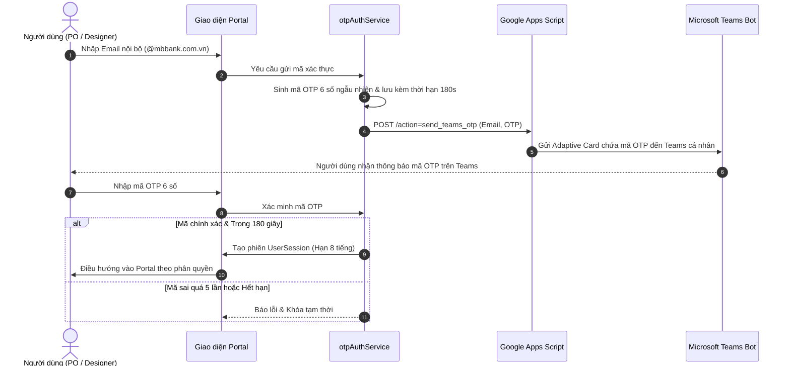

# 📘 TÀI LIỆU TOÀN DIỆN DỰ ÁN MB UX REQUEST PORTAL & TASK MANAGEMENT SYSTEM
> **Hệ thống**: MB UX Request Portal  
> **Phiên bản tài liệu**: 2.0 (Cập nhật toàn diện kiến trúc, tính năng, đánh giá năng lực & quy chuẩn kỹ thuật)  
> **Địa điểm lưu trữ**: `Deploy App/doc/PROJECT_DOCUMENTATION.md`  
> **Dành cho**: Ban Lãnh Đạo, Product Owners (PO), UX Designers, AI Assistant & Đội ngũ Kỹ sư Phát triển (Developers)

---

## 📑 MỤC LỤC

1. [Tổng quan Dự án & Bối cảnh Nghiệp vụ (Executive Summary & Business Context)](#1-tổng-quan-dự-án--bối-cảnh-nghiệp-vụ)
2. [Kiến trúc Kỹ thuật & Tech Stack (Architecture & Tech Stack)](#2-kiến-trúc-kỹ-thuật--tech-stack)
3. [Mô hình Phân quyền Truy cập (Role-Based Access Control - RBAC)](#3-mô-hình-phân-quyền-truy-cập-rbac)
4. [Cơ chế Xác thực & Quản trị Phiên (Authentication & Session Security)](#4-cơ-chế-xác-thực--quản-trị-phiên)
5. [Chi tiết Danh mục Tính năng & Các Màn hình Chức năng](#5-chi-tiết-danh-mục-tính-năng--các-màn-hình-chức-năng)
   - [5.1 Màn hình Đăng nhập & Xác thực OTP Teams](#51-màn-hình-đăng-nhập--xác-thực-otp-teams)
   - [5.2 Màn hình Tổng Quan (Overview Dashboard)](#52-màn-hình-tổng-quan-overview-dashboard)
   - [5.3 Màn hình Tạo Yêu Cầu UX (Create Request)](#53-màn-hình-tạo-yêu-cầu-ux-create-request)
   - [5.4 Màn hình Theo Dõi Yêu Cầu (Track Request & Kanban)](#54-màn-hình-theo-dõi-yêu-cầu-track-request--kanban)
   - [5.5 Màn hình Quản Trị Hệ Thống (Admin Settings Portal)](#55-màn-hình-quản-trị-hệ-thống-admin-settings-portal)
   - [5.6 Phân hệ Khảo Sát & Đánh Giá Năng Lực UX (Test Assessment)](#56-phân-hệ-khảo-sát--đánh-giá-năng-lực-ux-test-assessment)
   - [5.7 Bộ Tiện Ích & Công Cụ Tích Hợp (Built-in Tools)](#57-bộ-tiện-ích--công-cụ-tích-hợp-built-in-tools)
6. [Cấu trúc Dữ liệu, Mô hình Task & Storage Map](#6-cấu-trúc-dữ-liệu-mô-hình-task--storage-map)
7. [Ma trận Phân tích Phạm vi Ảnh hưởng (Impact Analysis Matrix)](#7-ma-trận-phân-tích-phạm-vi-ảnh-hưởng-impact-analysis-matrix)
8. [Quy chuẩn Kỹ thuật & Bẫy Lập trình Cần Tránh (Gotchas & Best Practices)](#8-quy-chuẩn-kỹ-thuật--bẫy-lập-trình-cần-tránh)
9. [Hướng dẫn Cài đặt, Khởi chạy & Triển khai (Run & Deployment Guide)](#9-hướng-dẫn-cài-đặt-khởi-chạy--triển-khai)

---

## 1. TỔNG QUAN DỰ ÁN & BỐI CẢNH NGHIỆP VỤ

### 1.1 Bài toán thực tế & Sứ mệnh của Hệ thống
Trong môi trường ngân hàng số và các tổ chức tài chính quy mô lớn, Khối Công nghệ & Khối Sản phẩm thường xuyên phát sinh hàng trăm yêu cầu thiết kế trải nghiệm người dùng (UX/UI). Tuy nhiên, quy trình truyền thống gặp các nút thắt lớn:
- **Thiếu minh bạch về tải việc (Capacity Blindness)**: Product Owner (PO) gửi yêu cầu mà không nắm được UX Squad có đang quá tải hay không, dẫn đến trễ hạn cam kết (SLA).
- **Phân mảnh kênh tiếp nhận**: Yêu cầu bị rải rác qua Chat cá nhân, Email, Teams, Excel gây thất thoát tài liệu đặc tả (PRD/Spec).
- **Khó theo dõi tiến độ khâu**: PO không biết task đang ở bước Khám phá (Discovery), Vẽ luồng (User Flow), Thiết kế giao diện (UI) hay Bàn giao (Handoff).
- **Hệ thống quá cồng kềnh**: Các công cụ Jira/ClickUp phức tạp đòi hỏi bản quyền đắt đỏ và cấu hình nặng nề.

**MB UX Request Portal** được xây dựng như một giải pháp **Portal Tự phục vụ (Self-service Portal)** kết hợp **Hệ quản trị tác vụ trực quan**:
1. Cho phép PO xem trước **Tải việc của từng UX Squad** trước khi gửi yêu cầu.
2. Cung cấp quy trình gửi yêu cầu có cấu trúc chuẩn mực với tài liệu đính kèm lưu tự động trên Cloud Google Drive.
3. Cung cấp công cụ theo dõi tiến độ đa góc nhìn: **Kanban Board, Interactive Gantt Timeline, Table, Grid**.
4. Quản lý khâu và SLA theo thời gian thực kèm cảnh báo trễ hạn.
5. Tích hợp phân hệ **Khảo sát & Đánh giá Năng lực (Test Assessment)** cho phép đo lường và sát hạch chuyên môn UX của nhân sự hoặc ứng viên.

### 1.2 Các Đối Tượng Người Dùng (Key Stakeholders)
1. **Product Owner (PO)**: Người khởi tạo yêu cầu từ các Khối Nghiệp vụ (Thẻ, Tiết kiệm, Vay, Doanh nghiệp...). Chỉ thao tác trên các sản phẩm được phân quyền.
2. **UX Designer**: Người trực tiếp triển khai thiết kế, cập nhật tiến độ, kéo thẻ Kanban và đính kèm link bàn giao Figma/Prototype.
3. **Design Owner / UX Lead**: Quản lý khối lượng công việc của từng Squad, phê duyệt yêu cầu, phân bổ Designer và giám sát tiến độ toàn hệ thống.
4. **Hệ thống Quản trị (Admin)**: Thiết lập phân quyền (RBAC), quản lý cấu trúc Menu Sidebar, tùy biến các khâu trong quy trình UX, cấu hình hạn mức Squad và thiết lập tích hợp Cloud.

---

## 2. KIẾN TRÚC KỸ THUẬT & TECH STACK

Hệ thống được thiết kế theo kiến trúc **Serverless Modern SPA (Single Page Application)** kết hợp với **Google Workspace Ecosystem**:

```
┌─────────────────────────────────────────────────────────────────────────────────┐
│                           FRONTEND CLIENT APPLICATION                           │
│     React 19 + TypeScript 5.7 + Vite 8 + Tailwind CSS v4 + Framer Motion        │
│          Radix UI Slot + ReUI / JolyUI Design System + Matter.js + XLSX         │
└────────────────────────────────────────┬────────────────────────────────────────┘
                                         │ RESTful HTTPS / JSON Payloads
                                         ▼
┌─────────────────────────────────────────────────────────────────────────────────┐
│                        GOOGLE APPS SCRIPT SERVERLESS API                        │
│                 (google-apps-script-backend.js - Deploy trên Cloud)             │
│        Endpoints: doGet (query, sync) & doPost (create, update, upload, otp)    │
└────────────────────┬─────────────────────────────┬──────────────────────────────┘
                     │                             │
                     ▼                             ▼
┌────────────────────────────────────────┐ ┌──────────────────────────────────────┐
│       GOOGLE SHEETS DATA VAULT         │ │      GOOGLE DRIVE ASSET STORAGE      │
│  - RAW_REQUESTS (Core JSON Payload)    │ │  - UX_Portal_Avatars (Ảnh đại diện)  │
│  - RAW_SETTINGS (Cấu hình hệ thống)    │ │  - UX_Portal_Attachments (Tài liệu)  │
│  - Requests_View (Bảng xem nghiệp vụ)  │ └──────────────────────────────────────┘
│  - Users_View (Danh sách nhân sự)      │
└────────────────────────────────────────┘
                     │
                     ▼ Webhook / Adaptive Cards
┌─────────────────────────────────────────────────────────────────────────────────┐
│                         MICROSOFT TEAMS NOTIFICATION & OTP                      │
│                  Gửi mã xác thực 6 số và thông báo yêu cầu mới                  │
└─────────────────────────────────────────────────────────────────────────────────┘
```

### 2.1 Chi tiết Công nghệ Frontend (Frontend Stack)
- **Framework & Core**: `React 19` và `React DOM 19` kết hợp `TypeScript 5.7` đảm bảo kiểu dữ liệu chặt chẽ và tương thích các tính năng mới nhất (Action, Suspense, Concurrent rendering).
- **Bundler & Dev Server**: `Vite 8` mang lại tốc độ biên dịch HMR cực nhanh, tối ưu hóa bundle qua Rollup code-splitting.
- **Styling Engine**: `Tailwind CSS v4` tích hợp trực tiếp qua `@tailwindcss/vite` (không cần `postcss.config.js` hay `tailwind.config.js`), toàn bộ biến CSS token và chủ đề được định nghĩa tại `src/index.css`.
- **UI Components & Hiệu ứng**:
  - `Radix UI Slot` & `class-variance-authority`: Hỗ trợ component đa biến thể headless.
  - `Lucide React` (v1.31): Bộ biểu tượng vector chuẩn xác, thanh thoát.
  - `Framer Motion` (v13.1): Quản lý diễn hoạt kéo thả, chuyển trang, hiệu ứng bung mở modal mượt mà.
  - `ReUI & JolyUI System`: Thư viện giao diện đặc quyền với các component hiệu ứng cao cấp như `BorderBeam`, `SpotlightCard`, `InteractiveHoverButton`, `ShineBadge`, `AI Prompt Input Box`.
  - `Matter.js`: Engine vật lý phục vụ hiệu ứng chúc mừng (Confetti Physics) khi gửi task thành công.
  - `SheetJS / XLSX`: Đọc, phân tích và xuất file Excel cho phân hệ Đánh giá Đề thi UX.

### 2.2 Kiến trúc Tối ưu Hiệu năng (Performance Optimization)
- **React.lazy & Suspense Code-Splitting**: 5 màn hình chính (`TongQuanPage`, `CreateRequestPage`, `TrackRequestPage`, `QuanLyPage`, `TestAssessmentPage`) được tách thành các chunks riêng biệt.
- **Preloading & Idle Prefetching**: Khi người dùng hover menu hoặc trình duyệt rảnh rỗi (`requestIdleCallback`), các trang tiếp theo được nạp ngầm trước vào cache bộ nhớ.
- **Fallback Loading Skeletons**: Sử dụng khung xương hiệu ứng Shimmer mượt mà, ngăn hiện tượng giật cục Layout (CLS = 0).

### 2.3 Backend & Tầng Lưu Trữ (Google Workspace Backend)
1. **Google Apps Script (`google-apps-script-backend.js`)**:
   - Hoạt động như một API Gateway không máy chủ (Serverless), xử lý CORS, bóc tách JSON, phân luồng hành động và quản lý xác thực.
2. **Mô hình Lưu trữ Kép Google Sheets (JSON Storage Optimization)**:
   - Thay vì lưu từng trường vào hàng chục cột phẳng dễ gây lỗi tràn và sai lệch định dạng, hệ thống áp dụng cơ chế **JSON-first**:
   - Sheet `RAW_REQUESTS`: Lưu ID, Ngày tạo và toàn bộ đối tượng Task hoàn chỉnh dưới dạng chuỗi JSON nén vào cột `Payload`.
   - Sheet `Requests_View`: Tự động đồng bộ các cột cơ bản để người dùng có thể mở Google Sheets đọc nhanh bằng mắt thường.
   - Sheet `RAW_SETTINGS`: Lưu cấu hình Phân quyền Menu, Khâu UX, Danh mục Squad, Danh mục Sản phẩm.
3. **Google Drive Integration**:
   - File tài liệu đính kèm và Ảnh đại diện được chuyển thành Base64 từ Frontend, đẩy qua Apps Script và lưu trữ an toàn trong các thư mục riêng trên Drive, trả về Direct Link công khai cho Portal.

---

## 3. MÔ HÌNH PHÂN QUYỀN TRUY CẬP (RBAC)

Hệ thống thiết lập ma trận phân quyền 4 cấp độ rõ ràng:

```
                  ┌─────────────────────────────────────┐
                  │                ADMIN                │
                  │   Toàn quyền Cấu hình & Dữ liệu     │
                  └──────────────────┬──────────────────┘
                                     │
                  ┌──────────────────┴──────────────────┐
                  │            DESIGN OWNER             │
                  │      Quản lý Squad & Phê duyệt      │
                  └──────────────────┬──────────────────┘
                                     │
                  ┌──────────────────┴──────────────────┐
                  │              DESIGNER               │
                  │      Thực thi Task & Cập nhật       │
                  └─────────────────────────────────────┘

                  ┌─────────────────────────────────────┐
                  │            PRODUCT OWNER            │
                  │      Tạo & Giám sát Sản phẩm        │
                  └─────────────────────────────────────┘
```

### 3.1 Bảng Phân Quyền Chi Tiết (Role Permission Matrix)

| Chức Năng / Màn Hình | Admin | Design Owner | Designer | Product Owner (PO) |
| :--- | :---: | :---: | :---: | :---: |
| **Xem Dashboard Tổng Quan** | ✅ Toàn bộ | ✅ Toàn bộ | ✅ Toàn bộ | ❌ *(Mặc định tắt)* |
| **Theo dõi Yêu cầu (Kanban / Gantt)** | ✅ Toàn bộ | ✅ Toàn bộ | ✅ Task của Squad | ✅ Chỉ Task của PO |
| **Kéo thả / Đổi khâu Task** | ✅ Toàn quyền | ✅ Toàn quyền | ✅ Task được giao | ❌ Chỉ xem |
| **Tạo Yêu Cầu UX Mới** | ✅ Mọi SP | ✅ Mọi SP | ✅ Mọi SP | ⚠️ Chỉ SP được phân quyền |
| **Sát hạch / Làm bài thi UX** | ✅ Xem & Chấm | ✅ Xem & Chấm | ✅ Làm bài thi | ❌ Không áp dụng |
| **Tải lên & Quản lý Đề thi UX** | ✅ Toàn quyền | ✅ Toàn quyền | ❌ | ❌ |
| **Quản trị Nhân sự & Phân quyền Menu**| ✅ Toàn quyền | ❌ | ❌ | ❌ |
| **Tùy biến Quy trình Khâu & SLA** | ✅ Toàn quyền | ❌ | ❌ | ❌ |
| **Cấu hình Master Data (Squads/Products)**| ✅ Toàn quyền | ❌ | ❌ | ❌ |
| **Cấu hình Webhook & Tích hợp Apps Script**| ✅ Toàn quyền | ❌ | ❌ | ❌ |
| **Xem Nhật ký Hệ thống (Audit Logs)** | ✅ Toàn quyền | ❌ | ❌ | ❌ |
| **Công cụ Nén ảnh** | ✅ | ✅ | ✅ | ✅ |

### 3.2 Cơ Chế Tùy Biến Menu Động (Dynamic Navigation & Reordering)
- Quản trị viên (Admin) có quyền bật/tắt hiển thị từng mục Menu cho từng Role thông qua giao diện Toggle tại **Admin Setting ➔ Tab 1**.
- Hỗ trợ **Kéo thả (Drag & Drop)** hoặc nút bấm `⬆️`/`⬇️` để sắp xếp lại thứ tự hiển thị của các mục trong từng nhóm menu:
  - **Nhóm 1 - PLATFORM**: Tổng quan (`overview`), Theo dõi (`track`), Tạo yêu cầu (`create`), Bài test UX (`test`).
  - **Nhóm 2 - RESOURCES**: Nén ảnh (`compressor`).
- Mọi điều chỉnh được phát tín hiệu toàn cục qua Custom Event `nav_visibility_changed` để thanh Sidebar cập nhật tức thì trên trình duyệt mà không cần F5 tải lại trang.

---

## 4. CƠ CHẾ XÁC THỰC & QUẢN TRỊ PHIÊN

### 4.1 Quy Trình Đăng Nhập Xác Thực OTP Teams
Hệ thống sử dụng cơ chế xác thực không mật khẩu (Passwordless Authentication) thông qua Teams Webhook:



### 4.2 Các Ràng Buộc & Bảo Mật Phiên (Session Management)
- **Thời hạn phiên làm việc**: Kéo dài tối đa **8 giờ** liên tục (`SESSION_DURATION_SECONDS = 28800`).
- **Cơ chế Lưu trữ Đa tầng**:
  - `sessionStorage` (`ux_portal_session_auth`): Đóng vai trò phiên chính xác cho từng tab hiện thời.
  - `localStorage` (`ux_portal_session_auth` / `ux_portal_session`): Giúp người dùng mở tab mới không bị văng đăng nhập và hỗ trợ sự kiện `storage` đa tab.
- **Tự động chuyển hướng vai trò**:
  - Khi người dùng đăng nhập với vai trò **PO**, hệ thống tự động đưa về màn hình **"Theo dõi Yêu cầu" (`#track`)** để PO quản lý ngay công việc của mình.
- **Cơ chế Đăng Xuất An Toàn**:
  - Khi bấm Đăng xuất, hàm `clearSession()` dọn sạch toàn bộ các khóa liên quan trong cả `sessionStorage` và `localStorage`, phát tín hiệu `auth_session_changed` và đưa người dùng về màn hình Login Gate.

---

## 5. CHI TIẾT DANH MỤC TÍNH NĂNG & CÁC MÀN HÌNH CHỨC NĂNG

### 5.1 Màn hình Đăng nhập & Xác thực OTP Teams
- **Chế độ Demo Quick Login**: Cung cấp 4 thẻ tài khoản đại diện cho 4 vai trò (`Admin`, `Design Owner`, `Designer`, `PO`) giúp Ban Lãnh Đạo và Người thử nghiệm kiểm tra tính năng nhanh chóng chỉ bằng 1 cú nhấp chuột.
- **Xác thực OTP Email Chính Thức**:
  - Ô nhập Email công vụ chuẩn `@mbbank.com.vn`.
  - Bộ đếm ngược 180 giây trực quan với thanh tiến độ thời gian thực.
  - Bàn phím số OTP 6 ô rời rạc tự động nhảy con trỏ (Auto-focus) và hỗ trợ dán mã (Paste) thuận tiện.
  - Kiểm soát brute-force: Chặn yêu cầu sau 5 lần nhập sai liên tiếp.

### 5.2 Màn hình Tổng Quan (Overview Dashboard)
Nằm tại `src/pages/TongQuanPage.tsx`, là trung tâm chỉ huy số liệu trực quan:
- **Hàng thẻ KPI Tổng thể**:
  - Tổng số Task tiếp nhận.
  - Số Task đang triển khai (In Progress).
  - Số Task đã hoàn thành nghiệm thu.
  - Cảnh báo Task vi phạm hoặc có nguy cơ chậm hạn SLA.
  - Chỉ số Hiệu suất & Tải việc trung bình của toàn đội ngũ.
- **Biểu đồ Vận tốc & Xu hướng (Velocity Trend Section)**:
  - Phân tích khối lượng công việc hoàn thành theo từng chu kỳ Sprint/Tháng.
  - Biểu đồ phân bổ công việc theo mức độ ưu tiên (High, Medium, Low).
- **Trục Thời Gian Tương Tác (Interactive Gantt Timeline)**:
  - Thể hiện trực quan dải thời gian từ ngày bắt đầu đến hạn chót của từng đầu việc.
  - Phân màu theo trạng thái khâu giúp nhìn rõ điểm nghẽn tiến độ.
- **Bảng Trạng Thái Năng Lực Squad (UX Squad Availability & Workload)**:
  - Hiển thị danh thiếp từng Squad kèm chỉ số Active Tasks / Capacity Limit.
  - Thanh trạng thái năng lực tự động đổi màu: *Khả dụng (Xanh)*, *Bận (Vàng)*, *Quá tải (Đỏ)*.
- **Ngăn Kéo Chi Tiết Thành Viên (Member Workload Drawer)**:
  - Nhấp vào từng Squad hoặc Thành viên để mở Drawer bên phải xem danh sách các task cụ thể người đó đang phụ trách.
- **Khung Hỏi Đáp Nhanh Trí Tuệ Nhân Tạo (JolyUI AI Prompt Box)**:
  - Hộp nhập câu lệnh với hiệu ứng viền ánh sáng động `BorderBeam`.
  - Hỗ trợ gợi ý câu hỏi nhanh: *"Squad nào đang rảnh nhất?"*, *"Có bao nhiêu task sắp trễ hạn?"*.
- **Cảnh Báo SLA Dành Riêng Cho PO**:
  - PO khi vào hệ thống sẽ thấy ngay các cảnh báo đếm ngược hạn chót của sản phẩm mình quản lý.

### 5.3 Màn hình Tạo Yêu Cầu UX (Create Request)
Nằm tại `src/pages/CreateRequestPage.tsx` và `src/components/form/RequestForm.tsx`:
- **Khảo sát Tải Việc Trước Khi Gửi (Pre-submission Workload Check)**:
  - Hiển thị ngay trên đầu form để người gửi biết Squad mục tiêu có đang bận hay không, khuyến khích tối ưu hóa kế hoạch trước khi giao việc.
- **Form Nhập Liệu Tiêu Chuẩn 4 Bước**:
  1. *Thông tin cốt lõi*: Tiêu đề công việc, Squad thụ hưởng, Sản phẩm/Phân hệ (tự động lọc theo quyền nếu là PO), Loại yêu cầu (Thiết kế mới, Cải tiến, Sửa lỗi...).
  2. *Mục tiêu kinh doanh*: Bài toán người dùng cần giải quyết, chỉ số đo lường hiệu quả (Conversion rate, Drop-off rate...).
  3. *Cam kết Thời gian*: Hạn chót mong muốn kèm **Lý do chọn hạn chót** (Release app, Sprint Dev...).
  4. *Tài liệu & Đính kèm*: Link tài liệu Brief/PRD, Tải tệp trực tiếp lên Google Drive.
- **Ngăn Kéo Xem Lại (Review Sheet)**:
  - Cho phép người tạo xem lại toàn bộ thông tin đã điền dưới dạng văn bản tóm tắt trước khi chính thức bấm Gửi.
- **Hiệu Ứng Chúc Mừng (Success Celebration)**:
  - Kích hoạt pháo hoa vật lý (Matter.js Physics Confetti) và cấp ngay mã yêu cầu duy nhất (VD: `UXMB-2026-088`).

### 5.4 Màn hình Theo Dõi Yêu Cầu (Track Request & Kanban)
Nằm tại `src/pages/TrackRequestPage.tsx`:
- **4 Chế Độ Hiển Thị Linh Hoạt**:
  1. **Kanban Board**: Kéo thả thẻ task giữa các cột khâu. Thẻ task thể hiện ngày tháng hoàn thành (định dạng `DD/MM/YYYY`), nhãn độ ưu tiên, thanh % tiến độ, avatar nhân sự phụ trách.
  2. **Table View**: Dạng bảng tính phân trang chuyên nghiệp, hỗ trợ sắp xếp cột theo hạn chót, tiến độ hoặc mức ưu tiên.
  3. **Grid View**: Thẻ dạng lưới tích hợp hiệu ứng con trỏ chuột `SpotlightCard`.
  4. **List View**: Dạng danh sách cô đọng, tối ưu cho việc quét nhanh hàng loạt đầu việc.
- **Bộ Lọc Đa Chiều Nâng Cao (Filter Popover)**:
  - Lọc tức thì theo Squad, Trạng thái khâu, Mức độ ưu tiên, Người phụ trách và Tìm kiếm toàn văn theo từ khóa.
- **Modal Chi Tiết Task 6 Phân Vùng (`RequestDetail.tsx`)**:
  - *Vùng 1 - Thông tin chung*: Mã task, Tiêu đề, Badge độ ưu tiên, Squad, Sản phẩm.
  - *Vùng 2 - Tiến độ & Chuyển khâu*: Dropdown chọn khâu nhanh, thanh trượt % tiến độ, ô nhập ghi chú cập nhật.
  - *Vùng 3 - Thông tin PO*: Người yêu cầu, Email Teams, Mục tiêu kinh doanh, Lý do chọn hạn chót.
  - *Vùng 4 - Đội ngũ Phụ trách*: Designer triển khai, Reviewer/Lead duyệt, Ngày bắt đầu, Deadline cam kết.
  - *Vùng 5 - Tài liệu Bàn Giao*: Link Figma, Thư mục Google Drive, Tài liệu đặc tả.
  - *Vùng 6 - Nhật Ký Lịch Sử Khâu (`task_updates`)*: Dòng thời gian ghi nhận chi tiết thời điểm chuyển bước, ai thực hiện và ghi chú nội dung công việc.

### 5.5 Màn hình Quản Trị Hệ Thống (Admin Settings Portal)
Nằm tại `src/pages/QuanLyPage.tsx`, chỉ mở cho vai trò `Admin`:
- **Tab 1: Nhân sự & Phân quyền Menu**:
  - Quản lý danh sách thành viên toàn hệ sinh thái (Avatar, Họ tên, Email, Role, Đa-Squad, Đa-Sản phẩm).
  - Tải ảnh đại diện trực tiếp lên thư mục Google Drive `UX_Portal_Avatars`.
  - Ma trận bật/tắt menu cho 4 vai trò và giao diện kéo thả đổi thứ tự Menu Sidebar.
- **Tab 2: Quy trình & Khâu UX (SLA & Deliverables)**:
  - Quản lý danh sách khâu theo dạng chuỗi dọc trực quan.
  - Kéo thả thẻ hoặc bấm nút `⬆️`/`⬇️` để đổi thứ tự quy trình (số thứ tự tự động đánh lại `1, 2, 3...`).
  - Thêm mới, Sửa, Xóa khâu (ràng buộc tối thiểu 2 khâu) và Khôi phục quy trình 6 bước mặc định.
  - Mỗi khâu quy định rõ SLA ngày chuẩn và Sản phẩm bàn giao bắt buộc (Deliverables).
- **Tab 3: Danh Mục Master Data (Squads & Products)**:
  - Quản lý danh mục UX Squads: Tên, Mã code, Hạn mức số lượng task tối đa (Đã loại bỏ trường Lead PO/Designer để tối ưu linh hoạt).
  - Quản lý danh mục Sản phẩm / Phân hệ ngân hàng trực thuộc.
- **Tab 4: Tích Hợp Hệ Thống (System Integrations)**:
  - Cấu hình URL Web App Google Apps Script.
  - Cấu hình Teams Webhook URL.
  - Nút bấm Kiểm tra kết nối trực tiếp (Ping Test) với Google Sheet và Teams.
- **Tab 5: Nhật Ký Kiểm Toán (Audit Logs)**:
  - Ghi vết mọi thao tác thêm/sửa/xóa của Admin kèm mốc thời gian và tài khoản thực hiện.

### 5.6 Phân Hệ Khảo Sát & Đánh Giá Năng Lực UX (Test Assessment)
Nằm tại `src/pages/TestAssessmentPage.tsx` và `src/components/test-assessment/`:
- **Quản Trị Ngân Hàng Đề Thi (`TestManagementView.tsx`)**:
  - Tạo đề thi mới với thời gian làm bài (phút), điểm đạt, danh mục chuyên môn và Squad mục tiêu.
  - Tải lên đề thi nhanh từ tệp **Excel (`.xlsx`, `.xls`)** hoặc file **JSON** thông qua `TestUploadModal.tsx`.
  - Hỗ trợ cả 2 dạng câu hỏi: **Trắc nghiệm (Multiple Choice)** và **Tự luận (Essay / Case Study)**.
- **Môi Trường Làm Bài Thi Tương Tác (`TestRunnerView.tsx`)**:
  - Giao diện làm bài thi chuyên nghiệp dành cho ứng viên / Designer.
  - Bộ đếm ngược thời gian làm bài (Countdown Timer) tự động nộp bài khi hết giờ.
  - Bảng điều hướng câu hỏi giúp thí sinh nhảy nhanh giữa các câu và đánh dấu câu đã làm.
  - Cơ chế cảnh báo rời màn hình (Anti-cheat tab switch detection).
  - Tự động chấm điểm ngay phần trắc nghiệm sau khi nộp bài.
- **Modal Chấm Điểm Tự Luận Theo Tiêu Chí (`GradeEssayModal.tsx`)**:
  - Dành cho Admin / Lead Designer chấm điểm các câu hỏi tình huống tự luận.
  - Hiển thị bài làm của thí sinh, thang điểm tối đa và khung nhận xét phản hồi chi tiết.
  - Tự động cộng dồn điểm trắc nghiệm và điểm tự luận để tính kết quả xếp loại cuối cùng.

### 5.7 Bộ Tiện Ích & Công Cụ Tích Hợp (Built-in Tools)
- **Trình Nén Ảnh Chuyên Dụng (`ImageCompressorModal.tsx`)**:
  - Hoạt động 100% trên trình duyệt người dùng qua HTML5 Canvas API (không gửi ảnh lên server, bảo mật tuyệt đối ảnh thiết kế nội bộ).
  - Tùy biến tỷ lệ nén chất lượng (0.1 - 1.0) và độ phân giải tối đa.
  - Xem trước kích thước file trước/sau khi nén và tải về tức thì.

---

## 6. CẤU TRÚC DỮ LIỆU, MÔ HÌNH TASK & STORAGE MAP

### 6.1 Bản Đồ Lưu Trữ Trình Duyệt (Storage Keys Mapping)

| Key Lưu Trữ | Vùng Lưu | Kiểu Dữ Liệu | Chức Năng |
| :--- | :---: | :--- | :--- |
| `ux_portal_session_auth` | Session & Local | `UserSession` (JSON) | Lưu phiên đăng nhập người dùng (Email, Tên, Role, Squads, Products, Avatar). |
| `ux_portal_session` | Local Storage | `UserSession` (JSON) | Khóa phụ trợ đảm bảo đồng bộ đăng nhập giữa các Tab trình duyệt. |
| `ux_portal_nav_visibility`| Local Storage | `RoleNavConfig` (JSON) | Ma trận bật/tắt hiển thị từng mục menu cho 4 vai trò. |
| `ux_portal_nav_order` | Local Storage | `NavOrderConfig` (JSON) | Danh sách thứ tự sắp xếp các mục menu trong `Platform` và `Resources`. |
| `mbbank_admin_phases` | Local Storage | `UxPhaseSetting[]` | Danh sách cấu hình các khâu trong quy trình UX và SLA chuẩn. |
| `mbbank_admin_squads` | Local Storage | `SquadSetting[]` | Danh mục UX Squads và giới hạn hạn mức task đồng thời. |
| `mbbank_admin_products` | Local Storage | `ProductSetting[]` | Danh mục Sản phẩm / Phân hệ nghiệp vụ trong ngân hàng. |
| `mbbank_team_members` | Local Storage | `TeamMember[]` | Danh bạ nhân sự thiết kế và PO, liên kết Đa-Squad/Đa-Sản phẩm. |
| `mbbank_audit_logs` | Local Storage | `AuditLogItem[]` | Lịch sử vết hoạt động của quản trị viên. |
| `ux_portal_google_sheet_config` | Local Storage | `GoogleSheetConfig` | Cấu hình URL Web App Google Apps Script và chế độ tự động đồng bộ. |
| `ux_portal_test_exams` | Local Storage | `TestExam[]` | Danh sách các đề thi khảo sát năng lực UX. |
| `ux_portal_test_submissions` | Local Storage | `TestSubmission[]` | Danh sách bài làm và kết quả thi của các nhân sự. |

### 6.2 Schema Cốt Lõi: Yêu Cầu Thiết Kế UX (`UXRequest`)

```typescript
export interface TaskUpdateRecord {
  timestamp: string          // Thời điểm ghi nhận (ISO string hoặc DD/MM/YYYY HH:mm)
  author: string             // Người thực hiện cập nhật
  from_phase: string         // Khâu trước đó
  to_phase: string           // Khâu chuyển đến
  note?: string              // Ghi chú nhật ký tiến độ
}

export interface UXRequest {
  request_id: string                 // Mã định danh duy nhất (VD: UXMB-2026-088)
  title: string                      // Tiêu đề yêu cầu thiết kế
  squad: string                      // Squad phụ trách chính
  product: string                    // Sản phẩm / Phân hệ trực thuộc
  request_type: string               // Loại yêu cầu (Thiết kế mới, Cải tiến, Sửa lỗi...)
  current_phase: string              // Tên khâu hiện tại (Discovery, User Flow, UI Design...)
  progress: number                   // Tiến độ thực tế (0 - 100%)
  priority: "High" | "Medium" | "Low" // Mức độ ưu tiên
  submitted_at: string               // Ngày tạo yêu cầu (DD/MM/YYYY)
  deadline: string                   // Hạn chót cam kết hoàn thành (DD/MM/YYYY)
  deadline_reason?: string           // Lý do chọn hạn chót (Sprint Dev, Ngày Golive...)
  po_name: string                    // Họ tên Product Owner
  po_email: string                   // Email Teams của Product Owner
  assigned_designer?: string         // Designer thực thi chính
  reviewer?: string                  // Design Owner / Lead thẩm định
  business_goal?: string             // Mục tiêu kinh doanh & Bài toán người dùng
  expected_output?: string           // Kết quả mong đợi (Figma Flow, Design System, Prototype...)
  doc_links?: string[]               // Link tài liệu đặc tả (Confluence, PRD, Google Doc)
  figma_url?: string                 // Link bàn giao file thiết kế Figma
  attachments?: Array<{              // Danh sách tệp đính kèm lưu trên Google Drive
    name: string
    url: string
    size?: number
  }>
  task_updates?: TaskUpdateRecord[]  // Toàn bộ lịch sử vết chuyển khâu và trao đổi tiến độ
}
```

### 6.3 Schema Phân Hệ Khảo Sát Năng Lực UX (`TestAssessment`)

```typescript
export type QuestionType = "trac_nghiem" | "tu_luan"

export interface Question {
  id: string
  order: number
  type: QuestionType
  question: string
  options?: Array<{ key: "A" | "B" | "C" | "D"; text: string }>
  correctAnswer?: "A" | "B" | "C" | "D"
  points: number
  explanation?: string
}

export interface TestExam {
  id: string
  title: string
  description: string
  category?: string
  targetSquads?: string[]
  timeLimitMinutes: number           // Thời gian làm bài (phút)
  passingScore?: number              // Điểm tối thiểu để đạt
  totalPoints: number
  totalQuestions: number
  mcqCount: number
  essayCount: number
  questions: Question[]
  status: "Active" | "Draft" | "Closed"
  createdAt: string
  createdBy: string
}

export interface TestSubmission {
  id: string
  testId: string
  testTitle: string
  userEmail: string
  userName: string
  startedAt: string
  submittedAt: string
  timeSpentSeconds: number
  scoreMcq: number                   // Điểm trắc nghiệm (Tự động chấm)
  scoreEssay: number                 // Điểm tự luận (Admin/Lead chấm)
  totalScore: number                 // Tổng điểm đạt được
  maxScore: number                   // Thang điểm tối đa
  percentage: number                 // Tỷ lệ % hoàn thành
  status: "Chờ chấm tự luận" | "Đã hoàn thành"
  answers: UserAnswer[]
  gradedAt?: string
  gradedBy?: string
}
```

---

## 7. MA TRẬN PHÂN TÍCH PHẠM VI ẢNH HƯỞNG (IMPACT ANALYSIS MATRIX)

Trước khi chỉnh sửa hoặc nâng cấp bất kỳ tính năng nào, Kỹ sư / AI bắt buộc tra cứu ma trận sau để kiểm tra tính toàn vẹn:

| Thành Phần Chỉnh Sửa | Tệp Nguồn Trực Tiếp | Phạm Vi Ảnh Hưởng Cần Kiểm Tra Toàn Diện |
| :--- | :--- | :--- |
| **Sửa Cấu trúc Menu & Sidebar** | `src/config/navVisibilityConfig.ts`<br>`src/components/Sidebar.tsx`<br>`src/pages/QuanLyPage.tsx` | - Kiểm tra hiển thị chính xác trên cả 4 vai trò (`Admin`, `Design Owner`, `Designer`, `PO`).<br>- Kiểm tra tính năng kéo thả đổi thứ tự có cập nhật tức thì trên Sidebar không.<br>- Đảm bảo bắn sự kiện `nav_visibility_changed`. |
| **Sửa Quy Trình Khâu & SLA** | `src/config/statusConfig.ts`<br>`src/components/kanban/KanbanBoard.tsx`<br>`src/components/track/RequestDetail.tsx`<br>`src/pages/QuanLyPage.tsx` | - Khâu trên cột Kanban phải nhận động theo cấu hình `mbbank_admin_phases`.<br>- Dropdown chuyển khâu trong modal chi tiết task phải hiển thị đúng thứ tự mới.<br>- Kiểm tra tương thích với các task cũ đang nằm ở khâu đã bị xóa. |
| **Sửa Xác Thực & Phiên Đăng Nhập** | `src/services/otpAuthService.ts`<br>`src/components/auth/LoginGate.tsx`<br>`src/components/auth/TeamsOtpModal.tsx`<br>`src/App.tsx` | - Đăng xuất phải xóa sạch cả `sessionStorage` VÀ `localStorage`.<br>- Timeout 8 tiếng không làm gián đoạn người dùng đang thao tác.<br>- Đảm bảo PO luôn được tự động đưa về `#track` khi đăng nhập. |
| **Sửa Bố Cục Layout Chung** | `src/App.tsx`<br>`src/components/Sidebar.tsx` | - Khung nội dung chính desktop **BẮT BUỘC** có lề trái `md:ml-60` (240px) để không bị Sidebar đè lên.<br>- Bảng Kanban không dùng class `snap-x` để không bị mất thẻ task ở mép trái màn hình. |
| **Sửa Tích Hợp Google Cloud & Drive** | `src/services/googleSheetService.ts`<br>`google-apps-script-backend.js` | - Hàm chuyển Base64 phải cắt bỏ prefix `data:...;base64,`.<br>- Thông báo cho người dùng "Deploy New Version" trong Google Apps Script khi cập nhật backend. |
| **Sửa Phân Hệ Sát Hạch UX** | `src/services/testAssessmentService.ts`<br>`src/pages/TestAssessmentPage.tsx`<br>`src/components/test-assessment/*` | - Đảm bảo tính toán đúng điểm tối đa (`maxScore`) và điểm trắc nghiệm.<br>- Kiểm tra import file Excel không bị lỗi các trường câu hỏi rỗng. |

---

## 8. QUY CHUẨN KỸ THUẬT & BẪY LẬP TRÌNH CẦN TRÁNH

> [!CAUTION]
> **1. Bẫy Thụt Lề Desktop Sidebar (`md:ml-60`)**:  
> Thanh Sidebar bên trái có chiều rộng cố định `w-60` (`240px`). Toàn bộ khung nội dung bao bọc của mọi trang (`TongQuanPage`, `TrackRequestPage`, `CreateRequestPage`, `QuanLyPage`, `TestAssessmentPage`) bắt buộc phải có khoảng cách lùi lề `md:ml-60`. Nếu bỏ quên, thanh Sidebar sẽ đè lên toàn bộ các nút bấm phía bên trái!

> [!WARNING]
> **2. Cơ Chế Xóa Sạch Phiên Đăng Nhập Khi Logout**:  
> Tuyệt đối không chỉ xóa `sessionStorage`. Luôn phải gọi hàm `logoutTeamsSession()` để làm sạch đồng thời:
> ```typescript
> sessionStorage.removeItem("ux_portal_session_auth");
> localStorage.removeItem("ux_portal_session_auth");
> localStorage.removeItem("ux_portal_session");
> ```

> [!IMPORTANT]
> **3. Bắn Sự Kiện Đồng Bộ Toàn Cục (Event Bus)**:  
> Khi lưu dữ liệu cấu hình menu, phân quyền hoặc phiên đăng nhập, luôn kích hoạt chuỗi sự kiện:
> ```typescript
> window.dispatchEvent(new Event("storage"));
> window.dispatchEvent(new Event("nav_visibility_changed"));
> window.dispatchEvent(new Event("auth_session_changed"));
> ```

> [!NOTE]
> **4. Quy Tắc Triển Khai Backend Google Apps Script**:  
> Tệp `google-apps-script-backend.js` nằm trong mã nguồn máy tính là bản lưu trữ mã gốc. Khi có sửa đổi logic backend, code trên Google Cloud **không tự động cập nhật**. Bạn cần sao chép nội dung tệp này dán vào giao diện soạn thảo của Google Apps Script và chọn **Deploy ➔ Manage Deployments ➔ New Version**.

> [!TIP]
> **5. Kiểm Tra Biên Dịch TypeScript Trước Khi Bàn Giao**:  
> Luôn thực hiện kiểm tra `npx tsc --noEmit` để đảm bảo 100% không có lỗi type nào phát sinh.

---

## 9. HƯỚNG DẪN CÀI ĐẶT, KHỞI CHẠY & TRIỂN KHAI

### 9.1 Yêu Cầu Môi Trường (System Prerequisites)
- **Node.js**: Phiên bản 18.x hoặc 20.x LTS trở lên.
- **Trình quản lý gói**: `npm` hoặc `pnpm`.

### 9.2 Các Bước Khởi Chạy Local (Local Development)

```bash
# 1. Di chuyển vào thư mục dự án
cd "d:/Working/TaskUXTeam/Deploy App"

# 2. Cài đặt các gói thư viện phụ thuộc
npm install
# hoặc nếu dùng pnpm:
pnpm install

# 3. Khởi chạy máy chủ phát triển Vite HMR
npm run dev

# 4. Kiểm tra lỗi kiểu dữ liệu TypeScript
npx tsc --noEmit

# 5. Đóng gói bản phát hành tối ưu (Production Build)
npm run build
```

Sau khi chạy lệnh `npm run dev`, ứng dụng sẽ mở tại địa chỉ `http://localhost:5173` (hoặc cổng mạng nội bộ được chỉ định).

### 9.3 Cấu Hình Tích Hợp Google Apps Script & Teams Webhook
1. Mở trang Quản trị: Đăng nhập bằng tài khoản **Admin** ➔ Chọn menu **Quản Lý Hệ Thống** (`#manage`).
2. Vào **Tab 4: Tích Hợp Hệ Thống**:
   - Dán URL Web App Google Apps Script vào ô `Google Apps Script Web App URL`.
   - Dán URL Incoming Webhook của Microsoft Teams vào ô `Teams Webhook URL`.
   - Bấm nút **Kiểm tra kết nối** để xác nhận tín hiệu xanh.
   - Bấm **Lưu cấu hình tích hợp**.

---
*Tài liệu này là đặc tả chuẩn mực duy nhất (Single Source of Truth) phục vụ công tác bảo trì, phát triển và mở rộng hệ sinh thái MB UX Request Portal.*
