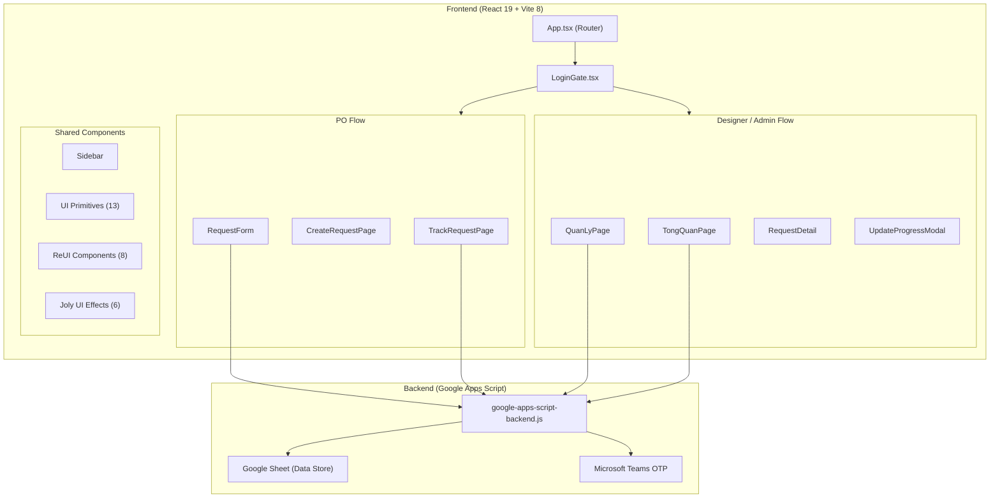

# 🔍 UX Portal MB Bank — Product Audit & Recommendations

> **Ngày kiểm tra:** 20/08/2026  
> **Phiên bản:** v3.0 (uxmb-task-request)  
> **Tech Stack:** React 19 + Vite 8 + Tailwind CSS v4 + Framer Motion + Google Apps Script Backend  
> **Người thực hiện:** AI Product Auditor

---

## Mục lục

1. [Tổng quan kiến trúc](#1-tổng-quan-kiến-trúc)
2. [Lỗi nghiêm trọng cần sửa ngay (Critical Bugs)](#2-lỗi-nghiêm-trọng-cần-sửa-ngay)
3. [Vấn đề UX/UI & Content](#3-vấn-đề-uxui--content)
4. [Chất lượng mã nguồn (Code Quality)](#4-chất-lượng-mã-nguồn)
5. [Bảo mật & Xác thực (Security)](#5-bảo-mật--xác-thực)
6. [Hiệu năng (Performance)](#6-hiệu-năng)
7. [Accessibility (A11y)](#7-accessibility)
8. [Đề xuất cải tiến (Recommendations)](#8-đề-xuất-cải-tiến)
9. [Roadmap đề xuất](#9-roadmap-đề-xuất)

---

## 1. Tổng quan kiến trúc

### 1.1 Sơ đồ hệ thống



### 1.2 Cấu trúc file

| Layer | Files | Chức năng |
|-------|-------|-----------|
| **Pages** | 4 files | `TongQuanPage`, `CreateRequestPage`, `TrackRequestPage`, `QuanLyPage` |
| **Components** | 28+ files | Auth, Form, Track, Squad, UI, ReUI, JolyUI |
| **Services** | 2 files | `otpAuthService.ts`, `googleSheetService.ts` |
| **API** | 1 file | `api.ts` — proxy layer tới Google Apps Script |
| **Data** | 1 file | `mockData.ts` — types & mock helpers |
| **Config** | `token.json` | Design tokens (typography, colors, spacing) |

### 1.3 Roles & RBAC

| Role | Phạm vi truy cập |
|------|-------------------|
| **PO** | Tạo yêu cầu, Theo dõi yêu cầu của mình (không có Sidebar nav) |
| **Designer** | Tổng quan, Yêu cầu được phân công, Cập nhật tiến độ |
| **Design Owner** | Tất cả quyền Designer + Phân công Designer + Quản lý toàn bộ |
| **Admin** | Toàn quyền hệ thống |

---

## 2. Lỗi nghiêm trọng cần sửa ngay

### 🔴 BUG-01: `QuanLyPage.tsx` — Biến không tồn tại (Build Error)

**File:** [`QuanLyPage.tsx`](file:///d:/AI%20dev/MBBank/UXMBTaskRequest-main/UXMBTaskRequest-main/src/pages/QuanLyPage.tsx#L202-L208)

**Mô tả:** Empty state sử dụng 3 biến chưa được khai báo: `searchQuery`, `setSearchQuery`, `squadFilter`, `setSquadFilter`. Đồng thời so sánh `statusFilter !== "ALL"` nhưng giá trị mặc định là `"Tất cả"` (tiếng Việt).

```diff
- searchQuery || statusFilter !== "ALL" || squadFilter !== "ALL"
-   ? {
-       label: "Xóa bộ lọc",
-       onClick: () => {
-         setSearchQuery("")
-         setStatusFilter("ALL")
-         setSquadFilter("ALL")
-       },
+ searchFilter || statusFilter !== "Tất cả"
+   ? {
+       label: "Xóa bộ lọc",
+       onClick: () => {
+         setSearchFilter("")
+         setStatusFilter("Tất cả")
+       },
```

**Mức độ:** 🔴 **Critical** — Gây crash runtime khi danh sách trống.

---

### 🔴 BUG-02: `TrackRequestPage.tsx` — Giá trị reset filter không khớp

**File:** [`TrackRequestPage.tsx`](file:///d:/AI%20dev/MBBank/UXMBTaskRequest-main/UXMBTaskRequest-main/src/pages/TrackRequestPage.tsx#L578-L584)

**Mô tả:** Nút "Xóa bộ lọc" trong Empty State reset filter về `"ALL"` (uppercase) nhưng giá trị mặc định của `productFilter` và `statusFilter` là `"all"` (lowercase). Điều này khiến bộ lọc không thực sự được xóa — dropdown hiển thị sai.

```diff
- query || productFilter !== "ALL" || statusFilter !== "ALL"
+ query || productFilter !== "all" || statusFilter !== "all"
    ? {
        label: "Xóa bộ lọc",
        onClick: () => {
          setQuery("")
-         setProductFilter("ALL")
-         setStatusFilter("ALL")
+         setProductFilter("all")
+         setStatusFilter("all")
        },
```

**Mức độ:** 🔴 **Critical** — Nút "Xóa bộ lọc" không hoạt động đúng.

---

### 🟡 BUG-03: `RequestForm.tsx` — Typo trong tiêu đề Section 02

**File:** [`RequestForm.tsx`](file:///d:/AI%20dev/MBBank/UXMBTaskRequest-main/UXMBTaskRequest-main/src/components/form/RequestForm.tsx#L402)

```diff
- 02 · MÔ TẢ CHI TIẾT NHU CẦN CẦN UX TEAM HỖ TRỢ
+ 02 · MÔ TẢ CHI TIẾT NHU CẦU CẦN UX TEAM HỖ TRỢ
```

**Mức độ:** 🟡 **Medium** — Lỗi chính tả trong UI, ảnh hưởng uy tín sản phẩm.

---

### 🟡 BUG-04: Trùng lặp `statusBadgeVariant` map

**Mô tả:** Đối tượng `statusBadgeVariant` được khai báo giống hệt trong 3 file riêng biệt:
- [`RequestCard.tsx`](file:///d:/AI%20dev/MBBank/UXMBTaskRequest-main/UXMBTaskRequest-main/src/components/track/RequestCard.tsx#L12-L21)
- [`RequestDetail.tsx`](file:///d:/AI%20dev/MBBank/UXMBTaskRequest-main/UXMBTaskRequest-main/src/components/track/RequestDetail.tsx#L42-L51)
- [`QuanLyPage.tsx`](file:///d:/AI%20dev/MBBank/UXMBTaskRequest-main/UXMBTaskRequest-main/src/pages/QuanLyPage.tsx#L32-L41)

**Đề xuất:** Trích thành shared constant trong `src/data/mockData.ts` hoặc `src/lib/statusConfig.ts`.

**Mức độ:** 🟡 **Medium** — Vi phạm DRY, dễ gây inconsistency khi thay đổi.

---

## 3. Vấn đề UX/UI & Content

### 3.1 Nhất quán ngôn ngữ (Language Consistency)

| Vị trí | Hiện tại | Đề xuất |
|--------|----------|---------|
| Table header `TrackRequestPage` | `"Designer working"` | `"Designer phụ trách"` hoặc `"Người thực hiện"` |
| Table header `TrackRequestPage` | `"Status"` | `"Trạng thái"` |
| Pagination `TrackRequestPage` | `"Rows per page"` | `"Số dòng mỗi trang"` |
| Pagination `TrackRequestPage` | `"1 - 6 of 12"` | `"1 - 6 trên 12"` |
| `RequestForm` right card | `"Hosted by"` | `"Người gửi"` hoặc `"Tạo bởi"` |
| `RequestForm` footer | `"® Power by MB UXTeam"` | `"® Powered by MB UX Team"` |
| `RequestDetail` deliverables | `"Interactive Prototype"` | `"Prototype tương tác"` |
| `RequestDetail` deliverables | `"UX Spec & Handoff"` | `"Tài liệu UX & Bàn giao"` |
| `RequestDetail` deliverables | `"Design System & Screens"` | `"Hệ thống thiết kế & Màn hình"` |
| Login page | `"Quick Demo Role Picker"` | `"Chọn nhanh vai trò thử nghiệm"` |

> [!IMPORTANT]
> Sản phẩm nội bộ MBBank nên thống nhất **100% tiếng Việt** cho label và copy hướng đến người dùng. Chỉ giữ tiếng Anh cho terms chuyên ngành (Designer, Figma, Prototype, UX Squad).

### 3.2 Trải nghiệm form (RequestForm)

| Vấn đề | Chi tiết | Đề xuất |
|--------|----------|---------|
| Thiếu auto-save draft | Form mất toàn bộ nếu user refresh hoặc bấm back | Lưu draft vào `localStorage` |
| Thiếu progress indicator | Không rõ đang ở bước nào trong quy trình gửi | Thêm Stepper 3 bước: Nhập → Xem lại → Hoàn tất |
| `expected_output` cứng | Cố định 2 giá trị `["Wireframe", "Prototype tương tác"]` | Cho phép chọn checkboxes từ danh sách dynamic |
| Không có word count | Textarea mô tả không hiển thị số ký tự | Thêm character counter |

### 3.3 Empty States

| Vấn đề | Chi tiết |
|--------|----------|
| `TongQuanPage` thiếu empty state | Khi không có request nào, trang vẫn hiển thị stat cards với giá trị 0 mà không có hướng dẫn |
| Illustration tĩnh | 3D stacked cards illustration chỉ là CSS shapes, có thể thay bằng SVG illustration sinh động hơn |

### 3.4 Responsive & Mobile

| Vấn đề | Chi tiết |
|--------|----------|
| Table quá rộng trên mobile | `TrackRequestPage` table 4 cột chiếm nhiều không gian, cần chuyển sang card view trên mobile |
| PO Header thiếu hamburger menu | Role PO trên mobile không có cách navigate ngoài PoHeader |
| `QuanLyPage` filter bar | Tabs + search + view toggle bị ngắt dòng trên < 640px |

---

## 4. Chất lượng mã nguồn

### 4.1 Điểm tích cực ✅

- **Code splitting** — Tất cả pages được lazy-loaded với `React.lazy` + `Suspense`
- **Idle prefetch** — Background prefetch pages khi browser rảnh (`requestIdleCallback`)
- **Component system** — UI primitives (Button, Badge, Input, etc.) được xây dựng tốt với CVA variants
- **Type safety** — TypeScript interfaces cho FormState, UXRequest, UserSession, etc.
- **Design tokens** — `token.json` → CSS variables → Tailwind theme integration

### 4.2 Vấn đề cần cải thiện

| Mục | Chi tiết | Mức độ |
|-----|----------|--------|
| **Không có test** | 0 unit tests, 0 integration tests, 0 e2e tests | 🔴 |
| **Không có error boundary** | React Error Boundary chưa được implement | 🔴 |
| **Thiếu TypeScript strict** | `any` type được sử dụng ở `set()` function trong `RequestForm` (line 129) | 🟡 |
| **File quá lớn** | `RequestForm.tsx` (812 lines), `TrackRequestPage.tsx` (703 lines) — nên tách thành smaller components | 🟡 |
| **Duplicate code** | `handleLogout`, session polling logic, status badge maps lặp lại ở nhiều file | 🟡 |
| **Magic strings** | Status values (`"Đang thực hiện"`, `"Hoàn thành"`) rải rác khắp nơi — nên dùng enum hoặc const | 🟡 |
| **Unused imports** | Một số icons import nhưng không sử dụng (ví dụ `Inbox` trong `TrackRequestPage`) | 🟢 |
| **CSS token duplication** | `index.css` khai báo color tokens trong cả `:root` VÀ `@theme` block | 🟢 |

### 4.3 Cấu trúc file đề xuất cải thiện

```
src/
├── constants/
│   ├── status.ts          # Status enums & badge configs
│   ├── phases.ts          # UX phases constant
│   └── routes.ts          # Page route types
├── hooks/
│   ├── useSession.ts      # Session management hook
│   ├── useRequests.ts     # Data fetching hook
│   └── useFilters.ts      # Filter state hook
├── components/
│   ├── layout/
│   │   ├── PoHeader.tsx   # Tách PoHeader ra khỏi App.tsx
│   │   └── PageShell.tsx  # Wrapper chung cho pages
│   └── ...existing...
```

---

## 5. Bảo mật & Xác thực

### 5.1 Vấn đề hiện tại

| Mục | Chi tiết | Mức độ |
|-----|----------|--------|
| **Demo login bypass** | `DEMO_ACCOUNTS` hardcoded cho phép đăng nhập không cần OTP — phải disable ở production | 🔴 |
| **Session lưu localStorage** | Token và session info lưu `localStorage` → dễ bị XSS đọc | 🟡 |
| **Không có CSRF protection** | API calls tới Google Apps Script không có CSRF token | 🟡 |
| **OTP rate limiting chỉ ở client** | `remainingAttempts` quản lý ở frontend — server cần enforce | 🟡 |
| **Không có session refresh** | Session hết hạn sau 8h mà không có refresh token mechanism | 🟢 |
| **RBAC check ở client** | `canEdit` logic trong `RequestDetail` chỉ check ở frontend — API backend cần verify | 🔴 |

### 5.2 Đề xuất

1. **Production build** phải loại bỏ `DEMO_ACCOUNTS` quick login
2. Di chuyển RBAC enforcement sang server-side (Google Apps Script `doPost`)
3. Implement `HttpOnly` cookie cho session thay vì `localStorage`
4. Thêm rate limiting cho OTP requests ở server level

---

## 6. Hiệu năng

### 6.1 Điểm tốt ✅

- Code splitting với `React.lazy` → giảm initial bundle
- Idle prefetch cho navigations
- `useMemo` cho filter logic trong `TrackRequestPage`
- Skeleton loading states cho tất cả pages

### 6.2 Vấn đề

| Mục | Chi tiết | Mức độ |
|-----|----------|--------|
| **Session polling** | `setInterval(1000ms)` trong `TrackRequestPage` mỗi giây — quá tốn tài nguyên | 🟡 |
| **Duplicate polling** | `App.tsx` polling session mỗi 5s, `Sidebar.tsx` polling mỗi 2s — cần centralize | 🟡 |
| **Missing `React.memo`** | Components như `RequestCard`, `EmptyState` render lại mỗi khi parent re-render | 🟢 |
| **Framer Motion bundle** | `framer-motion` (>100KB gzip) loaded cho toàn bộ app dù chỉ dùng ở vài component | 🟢 |
| **Ảnh avatar external** | Hardcoded Unsplash URLs cho mock avatars — nếu dùng trong production sẽ chậm | 🟢 |

### 6.3 Đề xuất tối ưu

```typescript
// Centralize session management với React Context
const SessionContext = createContext<{
  session: UserSession | null
  logout: () => void
  remaining: number
}>({ session: null, logout: () => {}, remaining: 0 })

// Custom hook thay vì polling ở mỗi component
function useSession() {
  return useContext(SessionContext)
}
```

---

## 7. Accessibility

| Mục | Chi tiết | Mức độ |
|-----|----------|--------|
| **Table thiếu caption** | `<table>` trong TrackRequestPage không có `<caption>` hoặc `aria-label` | 🟡 |
| **OTP input** | `OtpInput` component thiếu `aria-label` cho từng ô số | 🟡 |
| **Color contrast** | `text-slate-400` trên `bg-white` có thể không đạt WCAG AA (ratio < 4.5:1) | 🟡 |
| **Focus management** | Modal `Dialog` thiếu focus trap rõ ràng khi mở | 🟡 |
| **Keyboard navigation** | Dropdown menus (`DropdownMenu`) chưa hỗ trợ keyboard arrows | 🟡 |
| **Skip navigation** | Không có "Skip to main content" link | 🟢 |
| **Image alt text** | Avatar images có alt text nhưng chỉ dùng tên user, thiếu role context | 🟢 |

---

## 8. Đề xuất cải tiến

### 8.1 Chức năng ưu tiên cao

| # | Tính năng | Mô tả | Ảnh hưởng |
|---|-----------|-------|-----------|
| 1 | **Real-time notifications** | Push notification khi Designer cập nhật tiến độ → PO nhận ngay | 🔵 PO Experience |
| 2 | **Comment / Chat thread** | Cho phép PO & Designer trao đổi trực tiếp trong request detail | 🔵 Collaboration |
| 3 | **Auto-save draft** | Lưu nháp form vào localStorage khi PO đang nhập | 🔵 PO Experience |
| 4 | **Bulk actions** | Cho phép Design Owner/Admin chọn nhiều request → bulk assign, bulk status update | 🟢 Efficiency |
| 5 | **Search & Filter persist** | Ghi nhớ filter state khi navigate đi rồi quay lại | 🟢 UX |
| 6 | **Export to CSV/PDF** | Export danh sách request với filter hiện tại | 🟢 Reporting |

### 8.2 Cải thiện kỹ thuật

| # | Tối ưu | Chi tiết |
|---|--------|----------|
| 1 | **Session Context** | Centralize session management → loại bỏ polling trùng lặp ở 3+ components |
| 2 | **Status Constants** | Tạo `src/constants/status.ts` chứa enum & badge config → DRY |
| 3 | **Custom Hooks** | `useRequests()`, `useFilters()`, `useSession()` → tách logic ra khỏi components |
| 4 | **Error Boundary** | Wrap `Suspense` trong `ErrorBoundary` → graceful error handling |
| 5 | **Unit Tests** | Vitest + React Testing Library cho critical flows: login, form validation, filter logic |
| 6 | **Storybook** | Document UI components (Button, Badge, Frame, etc.) → design consistency |

### 8.3 Cải thiện UX Copy

| Vị trí | Hiện tại | Đề xuất |
|--------|----------|---------|
| Empty state title | "Không tìm thấy bài toán nào" | "Chưa có kết quả phù hợp" |
| Empty state CTA | "Xóa bộ lọc" | "Đặt lại bộ lọc" |
| Success screen | "Tiếp nhận yêu cầu thành công" | "Yêu cầu đã được gửi thành công!" |
| Success screen | "Mã Request ID chính thức" | "Mã theo dõi yêu cầu" |
| Form submit button | "Gửi yêu cầu UX" | "Tiếp tục xem lại" (vì bước tiếp theo là Review, chưa phải gửi chính thức) |
| Review modal title | "Xem lại hồ sơ yêu cầu UX" | "Xác nhận thông tin trước khi gửi" |

---

## 9. Roadmap đề xuất

### Phase 1: Sửa lỗi & Ổn định (Tuần 1)

- [x] Fix BUG-01: Biến không tồn tại trong `QuanLyPage.tsx`
- [x] Fix BUG-02: Filter reset giá trị sai trong `TrackRequestPage.tsx`
- [x] Fix BUG-03: Typo "NHU CẦN CẦN" → "NHU CẦU CẦN"
- [ ] Thống nhất toàn bộ UI copy sang tiếng Việt
- [ ] Trích `statusBadgeVariant` thành shared constant
- [ ] Thêm React Error Boundary

### Phase 2: Tái cấu trúc (Tuần 2-3)

- [ ] Tạo `SessionContext` centralize session management
- [ ] Tạo custom hooks (`useRequests`, `useFilters`)
- [ ] Tách `RequestForm.tsx` thành smaller components
- [ ] Tách `TrackRequestPage.tsx` — table logic vs page layout
- [ ] Tạo `src/constants/` cho status, phases, routes

### Phase 3: Tính năng mới (Tuần 4-6)

- [ ] Auto-save draft cho form
- [ ] Comment thread trong request detail
- [ ] Bulk actions cho Design Owner
- [ ] Export CSV/PDF
- [ ] Real-time notifications (WebSocket hoặc polling)

### Phase 4: Chất lượng (Ongoing)

- [ ] Unit tests (Vitest)
- [ ] Accessibility audit (WCAG AA)
- [ ] Performance monitoring
- [ ] Storybook cho component library
- [ ] Disable demo login cho production build

---

## Tóm tắt đánh giá

| Hạng mục | Điểm | Ghi chú |
|----------|------|---------|
| **Kiến trúc tổng thể** | ⭐⭐⭐⭐ | Code splitting tốt, component system rõ ràng |
| **Thiết kế UI** | ⭐⭐⭐⭐⭐ | Premium, hiện đại, animation mượt mà với Joly UI |
| **UX Flow** | ⭐⭐⭐⭐ | Luồng logic rõ ràng, cần bổ sung auto-save và stepper |
| **Code Quality** | ⭐⭐⭐ | Có bugs critical, thiếu tests, file quá lớn |
| **Content / Copy** | ⭐⭐⭐ | Lẫn lộn EN/VN, cần chuẩn hóa thuật ngữ |
| **Bảo mật** | ⭐⭐ | Demo bypass, RBAC chỉ ở client, session qua localStorage |
| **Performance** | ⭐⭐⭐⭐ | Lazy loading tốt, nhưng polling session quá mức |
| **Accessibility** | ⭐⭐ | Thiếu aria labels, color contrast, keyboard nav |

> **Đánh giá tổng thể: 3.5/5** — Sản phẩm có nền tảng thiết kế UI xuất sắc và kiến trúc frontend vững. Cần ưu tiên sửa 2 bugs critical, chuẩn hóa nội dung, và tăng cường bảo mật trước khi đưa vào production.
