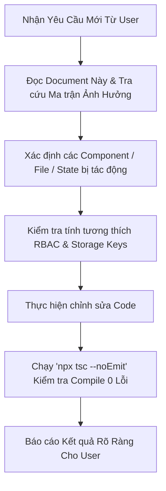

# 📘 HƯỚNG DẪN KIẾN TRÚC HỆ THỐNG, DANH MỤC TÍNH NĂNG & MA TRẬN PHÂN TÍCH PHẠM VI ẢNH HƯỞNG (IMPACT ANALYSIS)
> **Hệ thống**: MB UX Request Portal & Task Management System  
> **Dành cho**: AI Assistant & Kỹ sư phát triển (Developer)  
> **Mục đích**: Tài liệu chuẩn hóa toàn diện giúp AI/Dev khi nhận task mới có thể đọc hiểu nhanh chóng, nắm rõ kiến trúc luồng dữ liệu, các ràng buộc phân quyền và phân tích chính xác **Phạm vi ảnh hưởng (Scope of Impact)** trước khi chỉnh sửa mã nguồn, đảm bảo không bị lỗi sót hoặc gãy vỡ tính năng liên đới.

---

## 📑 MỤC LỤC
1. [Quy trình tiếp nhận Task & Phân tích phạm vi ảnh hưởng dành cho AI](#1-quy-trình-tiếp-nhận-task--phân-tích-phạm-vi-ảnh-hưởng-dành-cho-ai)
2. [Tổng quan Kiến trúc & Tech Stack](#2-tổng-quan-kiến-trúc--tech-stack)
3. [Cấu trúc Phân quyền (RBAC) & Navigation Reordering](#3-cấu-trúc-phân-quyền-rbac--navigation-reordering)
4. [Danh mục Tính năng Chi tiết (Feature Catalog)](#4-danh-mục-tính-năng-chi-tiết-feature-catalog)
5. [Cấu trúc Dữ liệu, Mô hình Task & Storage Map](#5-cấu-trúc-dữ-liệu-mô-hình-task--storage-map)
6. [Ma trận Phạm vi Ảnh hưởng (Impact Analysis Matrix)](#6-ma-trận-phạm-vi-ảnh-hưởng-impact-analysis-matrix)
7. [Các quy tắc sống còn & "Bẫy kỹ thuật" cần tránh (Gotchas & Best Practices)](#7-các-quy-tắc-sống-còn--bẫy-kỹ-thuật-cần-tránh-gotchas--best-practices)

---

## 1. QUY TRÌNH TIẾP NHẬN TASK & PHÂN TÍCH PHẠM VI ẢNH HƯỞNG DÀNH CHO AI

Trước khi viết bất kỳ dòng mã nào, AI **BẮT BUỘC** thực hiện 4 bước sau:



### Checklist Đánh Giá Phạm Vi Ảnh Hưởng (Impact Checklist):
- [ ] **Giao diện (UI/Layout)**: Thay đổi có làm vỡ layout Sidebar desktop (`md:ml-60`), responsive mobile, hay cắt thẻ Kanban không?
- [ ] **Phân quyền (RBAC)**: Tính năng này áp dụng cho Role nào (`Admin`, `Design Owner`, `Designer`, `PO`)? Các Role khác có bị chặn hoặc thấy sai giao diện không?
- [ ] **State & Storage**: Có thay đổi cấu trúc `localStorage`, `sessionStorage`, hoặc schema JSON không? Đã có fallback giá trị mặc định chưa?
- [ ] **Sự kiện Đồng bộ (Custom Events)**: Có cần phát sự kiện (`nav_visibility_changed`, `auth_session_changed`, `storage`) để các component khác tự cập nhật realtime không?
- [ ] **Backend Google Apps Script**: Thay đổi có yêu cầu thêm API endpoint trong `google-apps-script-backend.js` không? Nếu có, phải nhắc User "Triển khai phiên bản mới (Deploy New Version)".

---

## 2. TỔNG QUAN KIẾN TRÚC & TECH STACK

```
┌─────────────────────────────────────────────────────────────────────────────┐
│                          FRONTEND APPLICATION (SPA)                         │
│  React 18 + TypeScript + Vite + Tailwind CSS + Lucide Icons + Framer Motion  │
└──────────────────────────────────────┬──────────────────────────────────────┘
                                       │ HTTPS REST / JSON Payload
                                       ▼
┌─────────────────────────────────────────────────────────────────────────────┐
│                       GOOGLE APPS SCRIPT WEB APP API                        │
│             (google-apps-script-backend.js - Chạy trên Cloud Google)        │
└───────────────────┬─────────────────────────────────────┬───────────────────┘
                    │                                     │
                    ▼                                     ▼
┌──────────────────────────────────────┐ ┌────────────────────────────────────┐
│      GOOGLE SHEET CORE DATABASE      │ │      GOOGLE DRIVE ASSET STORAGE    │
│  - RAW_REQUESTS (Core JSON storage)  │ │  - UX_Portal_Avatars (Ảnh đại diện)│
│  - RAW_SETTINGS (Cấu hình hệ thống)  │ │  - UX_Portal_Attachments (Tài liệu)│
│  - Requests_View / Users_View        │ └────────────────────────────────────┘
└──────────────────────────────────────┘
```

### Các Module & Thư Mục Cốt Lõi:
- `src/App.tsx`: App Shell, điều phối Routing (Hash `#login`, `#overview`, `#track`, `#create`, `#manage`), bảo vệ phiên đăng nhập OTP và điều khiển Layout Sidebar chung.
- `src/components/Sidebar.tsx`: Sidebar điều hướng phân quyền, hiển thị menu động theo thứ tự tùy biến (`Platform` & `Resources`), hồ sơ người dùng, đổi avatar Drive và đăng xuất.
- `src/components/kanban/`: Bảng Kanban trực quan, kéo thả chuyển khâu, thẻ task hiển thị ngày tháng & % tiến độ.
- `src/components/track/`: Bộ xem Task đa chế độ (Kanban, List, Grid, Table), Bộ lọc đa chiều, và Modal chi tiết Task 6 nhóm trường (`RequestDetail.tsx`).
- `src/pages/QuanLyPage.tsx`: Trang Admin Setting toàn diện (5 Tab: Phân quyền & Nav Matrix, Quy trình Khâu UX, Master Data Squads & Products, Tích hợp Apps Script/Teams, Audit Logs).
- `src/services/googleSheetService.ts`: Tầng giao tiếp API với Google Sheet & Google Drive.
- `src/services/otpAuthService.ts`: Tầng xác thực OTP Teams Webhook & quản lý Session 8 tiếng.
- `src/config/navVisibilityConfig.ts`: Cấu hình Bật/Tắt & Thứ tự Menu theo từng Role.

---

## 3. CẤU TRÚC PHÂN QUYỀN (RBAC) & NAVIGATION REORDERING

### 3.1 Ma trận Phân quyền 4 Vai trò (Role Matrix)

| Vai trò (Role) | Mô tả & Nhiệm vụ chính | Quyền Mặc Định |
| :--- | :--- | :--- |
| **Admin** | Quản trị viên tối cao của hệ thống UX Portal | Toàn quyền xem & sửa tất cả Task, Quản lý Nhân sự, Cấu hình Quy trình, Master Data, Menu Matrix, Tích hợp Google Sheet & Teams Webhook. |
| **Design Owner** | Trưởng nhóm UX / Lead Designer | Phân bổ Task cho Designer, Duyệt yêu cầu từ PO, Xem Dashboard KPI toàn hệ thống, Không truy cập cấu hình kỹ thuật Admin. |
| **Designer** | UX/UI Designer thực thi | Xem & cập nhật tiến độ Task được giao trong Squad, Đăng nhật ký khâu UX (`task_updates`), Đổi ảnh đại diện, Nén ảnh. |
| **PO (Product Owner)** | Đại diện Khối Nghiệp vụ / Sản phẩm | Tạo yêu cầu UX mới thuộc Sản phẩm được phân quyền, Theo dõi tiến độ Task của mình, Xem bảng Kanban, Không sửa cấu hình hệ thống. |

### 3.2 Cơ chế Quản lý & Sắp xếp Thứ tự Menu (Navigation Dynamic Order)
- Menu Sidebar chia làm 2 nhóm rõ ràng:
  1. **PLATFORM** (`overview`, `track`, `create`): Quản lý công việc cốt lõi.
  2. **RESOURCES** (`compressor`): Công cụ & tiện ích hỗ trợ.
- Trong **Admin Setting ➔ Tab 1**, Admin có thể:
  - Bật/Tắt hiển thị từng mục menu cho từng Role bằng **Toggle Switch**.
  - **Kéo thả (`GripVertical`)** hoặc bấm **`⬆️`/`⬇️`** để đổi thứ tự các mục menu trong từng nhóm.
  - Cấu hình lưu trữ tại `localStorage` (`ux_portal_nav_visibility` và `ux_portal_nav_order`) và tự động bắn event `nav_visibility_changed` để Sidebar cập nhật tức thì.

---

## 4. DANH MỤC TÍNH NĂNG CHI TIẾT (FEATURE CATALOG)

### 4.1 Màn hình Đăng nhập & Xác thực OTP (`OtpLoginForm.tsx` & `otpAuthService.ts`)
- **Chế độ Demo Quick Login**: 4 nút chọn nhanh tài khoản đại diện cho 4 Role.
- **Xác thực OTP qua Email Teams**:
  - Gửi mã OTP 6 số ngẫu nhiên tới Email Teams qua Teams Webhook / Google Apps Script.
  - Thời hạn mã OTP: 3 phút (180 giây) kèm bộ đếm ngược.
  - Giới hạn 5 lần nhập sai mã.
- **Quản lý Phiên (Session Management)**:
  - Phiên làm việc kéo dài tối đa 8 giờ (`SESSION_DURATION_SECONDS = 28800`).
  - Đồng bộ giữa `sessionStorage` và `localStorage` (`ux_portal_session_auth` / `ux_portal_session`).
  - Nút **Đăng xuất** dọn sạch toàn bộ session trên cả 2 storage và điều hướng về `#login`.

### 4.2 Màn hình Tổng quan (`OverviewPage.tsx`)
- Thống kê KPI: Tổng task, Đang thực hiện, Hoàn thành, Quá hạn SLA, Hiệu suất tải việc.
- Biểu đồ phân bổ task theo từng UX Squad và Sản phẩm.
- Danh sách task cần ưu tiên xử lý trong ngày.

### 4.3 Màn hình Task của tôi & Bảng Kanban (`TrackRequestPage.tsx` & `KanbanBoard.tsx`)
- **4 Chế độ hiển thị**:
  1. `Kanban`: Kéo thả chuyển khâu, thẻ task hiển thị **ngày hoàn thành** (không hiện giờ), tag priority, % tiến độ, avatar assignee.
  2. `Table`: Dạng bảng danh sách chi tiết có phân trang, sắp xếp cột.
  3. `Grid`: Thẻ lưới hiện đại với hiệu ứng Spotlight.
  4. `List`: Dạng danh sách tóm tắt nhanh.
- **Bộ lọc đa chiều (Filter Popover)**: Lọc theo Squad, Trạng thái khâu, Mức độ ưu tiên, Người phụ trách, và ô tìm kiếm tức thì.
- **Modal Chi tiết Task (`RequestDetail.tsx`)**:
  - Nhóm 1: Thông tin chung (Mã task, Tiêu đề, Squad, Sản phẩm, Độ ưu tiên).
  - Nhóm 2: Tiến độ & Khâu UX hiện tại (Dropdown chuyển khâu, Thanh tiến độ %, Ghi chú nhật ký).
  - Nhóm 3: Thông tin Nghiệp vụ & PO (Người yêu cầu, Email PO, Mục tiêu kinh doanh, Lý do chọn deadline).
  - Nhóm 4: Phân công UX (Designer phụ trách, Reviewer, Ngày bắt đầu, Deadline cam kết).
  - Nhóm 5: Tài liệu bàn giao & Figma Link (Link Figma file, Tài liệu PRD/Spec, File đính kèm Drive).
  - Nhóm 6: Lịch sử cập nhật khâu (`task_updates` timeline log).

### 4.4 Màn hình Tạo Task mới (`RequestForm.tsx`)
- Phân quyền theo Role: PO chỉ được chọn các Sản phẩm thuộc quyền quản lý của mình.
- Đính kèm tệp đa định dạng: Tự động tải lên Google Drive (Folder `UX_Portal_Attachments`).
- Đồng bộ dữ liệu 2 chiều lên Google Sheet Core JSON ngay khi tạo thành công.

### 4.5 Màn hình Admin Setting (`QuanLyPage.tsx`)
- **Tab 1: Nhân sự & Phân quyền**:
  - Danh sách thành viên UX & PO với đầy đủ Avatar, Email Teams, Role, Đa-Squad và Đa-Sản phẩm.
  - Tải ảnh đại diện trực tiếp lên Google Drive (`UX_Portal_Avatars`) và cập nhật `Users_View`.
  - Bảng Ma trận Phân quyền Menu & Kéo thả sắp xếp thứ tự Sidebar.
- **Tab 2: Quy trình & Khâu UX (SLA & Deliverables)**:
  - Hiển thị danh sách dọc tuần tự từ trên xuống dưới.
  - Kéo thả thẻ hoặc bấm nút `⬆️`/`⬇️` để đổi thứ tự bước (tự động cập nhật số thứ tự tròn `1, 2, 3...`).
  - Nút **`➕ Thêm bước mới`** (Modal nhập Tên khâu, SLA ngày, % Tiến độ, Mô tả, Tài liệu bàn giao).
  - Nút **`✏️ Sửa`** và **`🗑️ Xóa khâu`** (đảm bảo tối thiểu 2 khâu).
  - Nút **`🔄 Khôi phục mặc định`** về 6 khâu UX chuẩn ban đầu.
- **Tab 3: Danh mục Squads & Products (Master Data)**:
  - Quản lý UX Squads: Tên, Mã code, Hạn mức task tối đa (Đã loại bỏ trường Lead PO/Designer để tối giản).
  - Quản lý danh mục Sản phẩm / Phân hệ nghiệp vụ.
- **Tab 4: Tích hợp Hệ thống (Integrations)**:
  - Cấu hình Web App URL Google Apps Script.
  - Cấu hình Teams Webhook URL nhận thông báo.
  - Nút kiểm tra kết nối realtime (Ping Test).
- **Tab 5: Nhật ký Kiểm toán (Audit Logs)**:
  - Ghi log chi tiết mọi thao tác thay đổi nhân sự, quy trình, squad, tích hợp của Admin.

### 4.6 Built-in Tool: Nén ảnh (`ImageCompressorModal.tsx`)
- Công cụ nén ảnh chất lượng cao chạy 100% trên Client Browser (Canvas API).
- Tùy chỉnh chất lượng nén, kích thước tối đa, xem trước dung lượng trước/sau khi nén và tải về nhanh.

---

## 5. CẤU TRÚC DỮ LIỆU, MÔ HÌNH TASK & STORAGE MAP

### 5.1 Storage Map (Local & Session Storage)

| Storage Key | Kiểu Dữ Liệu | Mục Đích & Thành Phần Sử Dụng |
| :--- | :--- | :--- |
| `ux_portal_session_auth` | `UserSession` (JSON) | Phiên đăng nhập chính thức (Token, Email, Role, Squads, Products, Avatar). |
| `ux_portal_session` | `UserSession` (JSON) | Khóa dự phòng hỗ trợ đồng bộ phiên giữa các tab. |
| `ux_portal_nav_visibility` | `RoleNavConfig` (JSON) | Ma trận Bật/Tắt Menu cho 4 Role (`Admin`, `Design Owner`, `Designer`, `PO`). |
| `ux_portal_nav_order` | `NavOrderConfig` (JSON) | Thứ tự hiển thị các mục menu trong `Platform` và `Resources`. |
| `mbbank_admin_phases` | `UxPhaseSetting[]` | Danh sách các khâu trong quy trình UX và SLA. |
| `mbbank_admin_squads` | `SquadSetting[]` | Danh sách UX Squads và hạn mức tải việc. |
| `mbbank_admin_products` | `ProductSetting[]` | Danh mục Sản phẩm & Phân hệ. |
| `mbbank_team_members` | `TeamMember[]` | Danh sách nhân sự nội bộ kèm phân bổ Đa-Squad/Đa-Sản phẩm. |
| `ux_portal_google_sheet_config` | `GoogleSheetConfig` | URL Google Apps Script Web App và cấu hình autoSync. |
| `mbbank_audit_logs` | `AuditLogItem[]` | Lịch sử vết hoạt động của Admin. |

### 5.2 Schema Đối Tượng Task Chi Tiết (`UXRequest`)

```typescript
export interface UXRequest {
  request_id: string                 // Mã định danh task (VD: UXMB-2026-088)
  title: string                      // Tên / Tiêu đề công việc
  squad: string                      // Tên Squad thụ hưởng
  product: string                    // Tên Sản phẩm / Phân hệ trực thuộc
  request_type: string               // Loại yêu cầu (Thiết kế mới, Cải tiến, Sửa lỗi...)
  current_phase: string              // Tên khâu hiện tại (Phân loại, Discovery, User Flow, UI Design...)
  progress: number                   // Tiến độ thực tế (0 - 100%)
  priority: "High" | "Medium" | "Low" // Mức độ ưu tiên
  submitted_at: string               // Thời điểm tạo yêu cầu (DD/MM/YYYY)
  deadline: string                   // Hạn chót cam kết hoàn thành (DD/MM/YYYY)
  deadline_reason?: string           // Lý do chọn hạn chót (Sprint Dev, Release...)
  po_name: string                    // Họ tên PO tạo yêu cầu
  po_email: string                   // Email Teams của PO
  assigned_designer?: string         // Designer trực tiếp thực hiện
  reviewer?: string                  // Design Owner / Lead duyệt
  business_goal?: string             // Mục tiêu kinh doanh & Bài toán người dùng
  expected_output?: string           // Kết quả mong đợi (UI Kit, Flow, Prototype...)
  doc_links?: string[]               // Danh sách link tài liệu (PRD, Spec, Brief)
  figma_url?: string                 // Link file thiết kế Figma
  attachments?: Array<{              // File đính kèm lưu trên Google Drive
    name: string
    url: string
    size?: number
  }>
  task_updates?: TaskUpdateRecord[]  // Lịch sử chuyển khâu & cập nhật tiến độ
}
```

---

## 6. MA TRẬN PHẠM VI ẢNH HƯỞNG (IMPACT ANALYSIS MATRIX)

Bảng tra cứu bắt buộc trước khi chỉnh sửa bất kỳ module nào:

| Vùng Thay Đổi | Các File Liên Quan | Phạm Vi Ảnh Hưởng Cần Rà Soát |
| :--- | :--- | :--- |
| **Sửa Menu / Phân quyền Nav** | `src/config/navVisibilityConfig.ts`<br>`src/components/Sidebar.tsx`<br>`src/pages/QuanLyPage.tsx` | - Kiểm tra xem cả 4 Role có nhìn thấy đúng menu không.<br>- Kiểm tra tính năng kéo thả thứ tự có phản ánh đúng trên Sidebar không.<br>- Đảm bảo bắn sự kiện `nav_visibility_changed`. |
| **Sửa Quy trình Khâu UX & SLA** | `src/pages/QuanLyPage.tsx`<br>`src/components/kanban/KanbanBoard.tsx`<br>`src/components/track/RequestDetail.tsx`<br>`src/data/mockData.ts` | - Cập nhật danh sách khâu trong dropdown chuyển khâu của `RequestDetail`.<br>- Các cột trên bảng `KanbanBoard` phải lấy động theo `uxPhases` (hoặc map đúng thứ tự step).<br>- Đồng bộ lưu `localStorage` key `mbbank_admin_phases`. |
| **Sửa Đăng nhập / Đăng xuất / Session** | `src/services/otpAuthService.ts`<br>`src/components/auth/OtpLoginForm.tsx`<br>`src/components/Sidebar.tsx`<br>`src/App.tsx` | - Hàm `clearSession()` phải xóa sạch cả `sessionStorage` VÀ `localStorage`.<br>- Kiểm tra timeout 8h không bị kick văng giữa chừng.<br>- Đảm bảo bắn sự kiện `auth_session_changed` và `storage`. |
| **Sửa Layout / Shell / Header** | `src/App.tsx`<br>`src/components/Sidebar.tsx` | - Tất cả các trang desktop **BẮT BUỘC** có khoảng thụt lề `md:ml-60` để không bị đè lên Sidebar.<br>- Bảng Kanban không dùng `snap-x` để tránh bị cắt thẻ ở mép trái. |
| **Sửa Tải File / Avatar lên Google Drive** | `src/services/googleSheetService.ts`<br>`google-apps-script-backend.js`<br>`src/components/Sidebar.tsx`<br>`src/pages/QuanLyPage.tsx` | - Hàm `fileToBase64` phải tách header `data:...;base64,`.<br>- Backend Apps Script phải có endpoint `upload_avatar` và `upload_file`.<br>- Cần thông báo User "Deploy New Version" trong Google Apps Script. |
| **Sửa Master Data Squads / Products** | `src/pages/QuanLyPage.tsx`<br>`src/data/mockData.ts`<br>`src/components/create/RequestForm.tsx`<br>`src/components/track/FilterPopover.tsx` | - Squad không còn phụ thuộc vào `leadPo` và `leadDesigner`.<br>- Các dropdown chọn Squad/Sản phẩm trong Form tạo task và Bộ lọc phải đồng bộ dữ liệu. |

---

## 7. CÁC QUY TẮC SỐNG CÒN & "BẪY KỸ THUẬT" CẦN TRÁNH (GOTCHAS)

1. **Sidebar Desktop Offset**:
   - Sidebar cố định ở bên trái với độ rộng `w-60` (`240px`). Khung nội dung chính của toàn bộ trang (Overview, Track, Create, Manage) luôn phải có class `md:ml-60`. Nếu thiếu, giao diện sẽ bị Sidebar che mất một phần!
2. **Xóa Sạch Session khi Logout**:
   - Không được chỉ xóa `sessionStorage`. Phải gọi `clearSession()` để xóa đồng thời cả `sessionStorage.removeItem("ux_portal_session_auth")`, `localStorage.removeItem("ux_portal_session_auth")` và `localStorage.removeItem("ux_portal_session")`.
3. **Đồng bộ Realtime giữa các Component**:
   - Khi thay đổi dữ liệu cấu hình hoặc avatar, luôn phát sự kiện toàn cục:
     ```typescript
     window.dispatchEvent(new Event("storage"))
     window.dispatchEvent(new Event("nav_visibility_changed"))
     window.dispatchEvent(new Event("auth_session_changed"))
     ```
4. **Backend Google Apps Script là Cloud-Hosted**:
   - Khi chỉnh sửa file `google-apps-script-backend.js` trong thư mục dự án, code trên Google Cloud của khách hàng **chưa tự động đổi**. Luôn hướng dẫn khách hàng: *Mở Apps Script ➔ Paste code mới ➔ Deploy New Version*.
5. **Đảm bảo TypeScript Compilation (0 Errors)**:
   - Luôn chạy `npx tsc --noEmit` trước khi hoàn tất task để đảm bảo không phát sinh lỗi kiểu dữ liệu ngầm.

---
*Tài liệu này là nguồn tham chiếu chuẩn xác nhất (Single Source of Truth) cho toàn bộ hệ thống MB UX Request Portal.*
