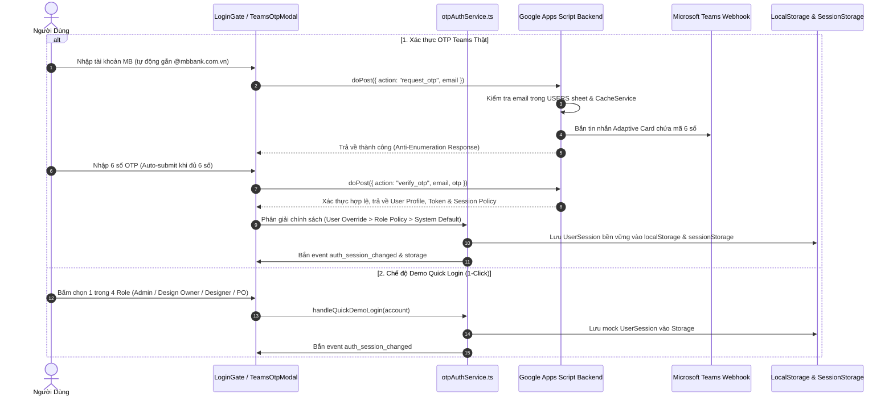

# 🔐 TÍNH NĂNG 01: XÁC THỰC, PHÂN QUYỀN (RBAC) & QUẢN TRỊ PHIÊN (AUTH & SESSION)

> **Mục tiêu tính năng:** Cung cấp cơ chế đăng nhập bảo mật không mật khẩu 2 lớp qua mã OTP Microsoft Teams (kèm chế độ Quick Login Demo), bảo vệ các trang chức năng, kiểm soát phiên làm việc song song (**Cơ chế cố định 8 tiếng** và **Cơ chế trượt 24 tiếng khi thoát ứng dụng**), tích hợp chuẩn W3C Page Lifecycle & Mobile, hỗ trợ cấu hình Quản trị 2 tầng linh hoạt theo Role và User, và thực thi phân quyền 4 vai trò (**Admin**, **Design Owner**, **Designer**, **PO** cùng mở rộng **Business**).

---

## 🎯 1. KHI NÀO CẦN ĐỌC TÀI LIỆU NÀY?

- **Khi làm tính năng mới:**
  - Bạn cần thêm 1 Role mới hoặc quyền mới cho Role hiện tại.
  - Bạn cần thêm tính năng yêu cầu kiểm tra xem ai đang đăng nhập (`session.email`, `session.role`, `session.products`, `session.sessionPolicy`).
  - Bạn cần tích hợp thêm phương thức đăng nhập (SSO, OAuth, hoặc Teams Bot).
  - Bạn cần điều chỉnh hoặc mở rộng các chính sách thời hạn phiên làm việc.
- **Khi sửa tính năng cũ:**
  - Bị lỗi văng phiên (session bị mất khi F5 hoặc mở tab mới).
  - Người dùng phản ánh đóng tab bị mất phiên trong khi đang được áp dụng cơ chế Trượt 24h.
  - Đăng xuất không sạch trên tất cả các tab (vẫn còn lưu token cũ hoặc bị "hồi sinh" phiên zombie).
  - Người dùng không nhận được mã OTP Teams hoặc mã OTP đếm ngược bị sai.
  - PO thấy được tính năng của Admin hoặc Designer thấy task không thuộc Squad của mình.
  - Lệch chính sách phiên sau khi chỉnh sửa phân quyền trên Sheet `USERS`.

---

## 🏗️ 2. KIẾN TRÚC & LUỒNG HOẠT ĐỘNG (ARCHITECTURE & FLOW)



---

## 👥 3. MÔ HÌNH PHÂN QUYỀN 4 VAI TRÒ (RBAC MATRIX)

```
                  ┌─────────────────────────────────────┐
                  │                ADMIN                │
                  │   Toàn quyền Cấu hình & Dữ liệu     │
                  └──────────────────┬──────────────────┘
                                     │
                  ┌──────────────────┴──────────────────┐
                  │            DESIGN OWNER             │
                  │      Quản lý Squad & Phê duyệt      │
                  └──────────────────┬──────────────────┘
                                     │
                  ┌──────────────────┴──────────────────┐
                  │              DESIGNER               │
                  │      Thực thi Task & Cập nhật       │
                  └─────────────────────────────────────┘

                  ┌─────────────────────────────────────┐
                  │            PRODUCT OWNER            │
                  │      Tạo & Giám sát Sản phẩm        │
                  └─────────────────────────────────────┘
```

| Quyền Hạn Chi Tiết | Admin | Design Owner | Designer | Product Owner (PO) | Business |
| :--- | :---: | :---: | :---: | :---: | :---: |
| **Xem Dashboard Tổng Quan (`overview`)** | ✅ Toàn bộ | ✅ Toàn bộ | ✅ Toàn bộ | ✅ Toàn bộ *(Masked tiêu đề)* | ✅ Toàn bộ *(Masked tiêu đề)* |
| **Theo dõi Task (`track`)** | ✅ Toàn bộ | ✅ Toàn bộ | ✅ Task của Squad | ✅ Chỉ Task của PO | 👁️ Chỉ xem |
| **Tạo Yêu Cầu Mới (`create`)** | ✅ Toàn quyền | ✅ Toàn quyền | ✅ Toàn quyền | ✅ Giới hạn theo SP | ❌ Không |
| **Đổi Khâu & Cập Nhật % Tiến Độ Task** | ✅ Toàn quyền | ✅ Toàn quyền | ⚠️ Task được giao | ❌ Chỉ xem | ❌ Chỉ xem |
| **Ghi chú Tiến độ & Cập nhật Deliverable** | ✅ Toàn quyền | ✅ Toàn quyền | ⚠️ Task được giao | ⚠️ Thêm comment | 👁️ Chỉ xem |
| **Phân bổ Designer phụ trách** | ✅ Toàn quyền | ✅ Toàn quyền | ❌ Không | ❌ Không | ❌ Không |
| **Kiến trúc Thông tin IA Map (`ia`)** | ✅ Toàn quyền | ✅ Toàn quyền | ✅ Toàn quyền | 👁️ View-Only tinh gọn | 👁️ View-Only tinh gọn |
| **Quản trị Cấu hình Hệ thống (`manage`)** | ✅ Toàn quyền | ✅ Toàn quyền | ❌ Không | ❌ Không | ❌ Không |
| **Chính sách Phiên làm việc Mặc định** | 🔒 Cố định 8h | ⏳ Trượt 24h khi thoát | ⏳ Trượt 24h khi thoát | ⏳ Trượt 24h khi thoát | ⏳ Trượt 24h khi thoát |
| **Đặc quyền Xem trước vai trò (Role Preview)**| ✅ Có | ✅ Có | ❌ Không | ❌ Không | ❌ Không |

---

## ⏳ 3.1. CƠ CHẾ PHIÊN SONG SONG: CỐ ĐỊNH 8H & TRƯỢT 24H KHI THOÁT

Hệ thống hỗ trợ 2 cơ chế phiên hoạt động song song (`SessionPolicyType`):

### 1. Cơ chế Cố định 8 tiếng (`fixed_8h`):
* **Nguyên lý:** Phiên hết hạn chính xác sau 8 giờ kể từ lúc xác thực OTP thành công:
  $$\text{expiresAt} = \text{loginAt} + 8 \times 3600 \times 1000\text{ ms}$$
* **Hành vi:** Bất kể người dùng có đang hoạt động hay không, đúng sau 8 giờ phiên làm việc sẽ tự động hết hạn và chuyển về màn hình đăng nhập OTP.
* **Đối tượng khuyến nghị:** Quản trị viên (`Admin`), máy tính dùng chung trong phòng ban, những người dùng yêu cầu tiêu chuẩn bảo mật dữ liệu cao nhất.

### 2. Cơ chế Trượt 24 tiếng khi thoát ứng dụng (`sliding_24h`):
* **Nguyên lý:** Lưu trữ phiên bền vững qua `localStorage`. Thời hạn 24 giờ **chỉ bắt đầu đếm ngược từ mốc thời gian người dùng thoát ứng dụng hoặc ngừng tương tác (`lastActiveAt`)**.
* **Kịch bản thực tế:**
  * Người dùng đăng nhập lúc **10:00 sáng**, làm việc và tắt trình duyệt lúc **12:00 trưa** $\rightarrow$ mốc `lastActiveAt` ghi nhận là 12:00.
  * **Trường hợp 1 (Quay lại trước 24h):** Lúc **18:00 tối** người dùng mở lại ứng dụng ($\Delta t = 6\text{h} < 24\text{h}$) $\rightarrow$ Không cần nhập lại OTP, phiên được duy trì bình thường. Người dùng làm việc đến **19:00 tối** rồi tắt app $\rightarrow$ mốc 24h được làm mới và bắt đầu đếm từ 19:00 tối.
  * **Trường hợp 2 (Vắng mặt quá 24h):** Người dùng không mở lại ứng dụng cho đến **12:00 trưa hôm sau** ($\Delta t \ge 24\text{h}$) $\rightarrow$ Phiên lập tức hết hạn, tự động gọi `clearSession()` và yêu cầu đăng nhập lại OTP.
* **Tối ưu chuẩn W3C Page Lifecycle & Mobile:**
  * Lắng nghe các sự kiện `freeze`, `pagehide`, `beforeunload`, `visibilitychange` và `touchstart` (passive listener).
  * Đảm bảo mốc thời gian thoát luôn được lưu tức thì 100% ngay cả khi người dùng vuốt thoát app trên iOS Safari hoặc Android Chrome đưa ứng dụng vào trạng thái đóng băng (*frozen*).
* **Thao tác định kỳ:** Các tương tác người dùng (`mousemove`, `click`, `keydown`, `scroll`, `touchstart`) được điều tiết (throttled 30s) để tự động làm tươi mốc `lastActiveAt` mà không gây ảnh hưởng đến hiệu năng giao diện.

---

## ⚙️ 3.2. CẤU HÌNH QUẢN TRỊ 2 TẦNG (2-TIER ADMIN CONFIGURATION)

Quản trị viên có toàn quyền cấu hình chính sách phiên làm việc theo mô hình phân cấp 2 tầng:

```
[Tầng 2: Ghi đè Cá nhân (User Override)] (Ưu tiên số 1)
                  │
                  ▼ (Nếu chọn "Kế thừa theo Vai trò")
[Tầng 1: Chính sách Vai trò (Role Policy)] (Ưu tiên số 2)
                  │
                  ▼ (Nếu chưa cấu hình)
[Mặc định Hệ thống (System Default)] (Admin: 8h | Các role khác: 24h)
```

1. **Tầng 1 — Cấu hình theo Vai trò tại Tab RBAC (`QuanLyPage.tsx`):**
   * Quản trị viên truy cập Tab **Phân quyền (RBAC)** $\rightarrow$ khối thẻ **"Chính sách Phiên & Thời hạn Đăng nhập"**.
   * Bấm chọn giữa hai nút Toggle Pill (*Cố định 8 tiếng* / *Trượt 24 tiếng khi thoát*) cho từng vai trò trong 5 vai trò.
   * Cấu hình lưu trữ tại `localStorage.mbbank_role_session_policies` và đồng bộ lên Google Sheet.
2. **Tầng 2 — Ghi đè theo từng Cá nhân (`AddMemberModal.tsx`):**
   * Tại Tab **Nhân sự (Team)**, khi Thêm mới hoặc Bấm **Sửa** thông tin nhân sự, có dropdown chọn:
     * 🔹 *Kế thừa theo vai trò (Mặc định)* (`inherit`)
     * 🔹 *Cố định 8 tiếng (Hết ca nhập lại OTP)* (`fixed_8h`)
     * 🔹 *Trượt 24 tiếng khi thoát (Sliding Inactivity)* (`sliding_24h`)
   * Danh sách nhân sự tại Tab 1 hiển thị Badge màu nhận diện và nhãn `(Riêng)` đối với tài khoản được ghi đè.

---

## 🎭 3.3. ĐẶC QUYỀN ADMIN: CƠ CHẾ ROLE PREVIEW (GIẢ LẬP VAI TRÒ)

Để hỗ trợ kiểm tra và thử nghiệm giao diện thực tế mà không cần đăng xuất, hệ thống cung cấp cơ chế **Role Preview**:
- **API kích hoạt:** `startRolePreview(role: UserRole)` trong `src/services/otpAuthService.ts`.
- **API khôi phục:** `stopRolePreview()`.
- **Nguyên lý:** Lưu `ux_portal_preview_role` vào storage, hàm `getEffectiveRole()` sẽ trả về role đang xem thử. Các component `Sidebar`, `AppHeader`, `RequestDetail` sẽ tự động hiển thị theo góc nhìn của role đó.
- **Bảo mật:** Phiên thật `realSession` của Admin vẫn được lưu giữ an toàn trong `ux_portal_admin_original_session`, không bao giờ bị ghi đè thông tin xác thực.

---

## 🛡️ 3.4. CHÍNH SÁCH AN TOÀN & BẢO MẬT GỬI OTP (OTP DISPATCH SAFETY POLICY)

1. **Quy tắc Nghiêm ngặt về Gửi OTP Thử nghiệm:**
   * Tuyệt đối **KHÔNG** tự động kích hoạt gửi mã OTP hàng loạt cho danh sách người dùng trong cơ sở dữ liệu.
   * Trong mọi kịch bản kiểm thử tự động, tích hợp hoặc sửa lỗi backend Google Apps Script, **CHỈ ĐƯỢC PHÉP** gửi mã OTP thử nghiệm tới email kiểm thử của Quản trị viên: `cuongdm5@mbbank.com.vn`.
   * Các email khác khi thực hiện test nội bộ phải được chặn (mock/stubbed) ở tầng dịch vụ trước khi gọi ra API ngoài.
2. **Khắc Phục Lỗi Apps Script Backend OTP (`google-apps-script-backend.js`):**
   * Hàm `handleRequestOtp` kiểm tra tồn tại và trạng thái tài khoản `Active` trong Sheet `USERS`.
   * Duy trì cơ chế Anti-Enumeration (luôn trả về thông báo an toàn chuẩn, không để lộ thông tin email có tồn tại hay không ra ngoài).
   * Cooldown 60 giây chống spam gửi lại mã.
   * Giới hạn tối đa 5 lần nhập sai mã OTP.

---

## 📦 4. CẤU TRÚC DỮ LIỆU & STORAGE MAP

### Schema Đối Tượng Phiên Đăng Nhập (`UserSession`):
```typescript
export type SessionPolicyType = "fixed_8h" | "sliding_24h"
export type UserSessionPolicyOverride = "inherit" | "fixed_8h" | "sliding_24h"

export interface UserSession {
  sessionToken: string              // Chuỗi Token ngẫu nhiên (hoặc demo token ST_...)
  personalEmail: string             // Email cá nhân / định danh
  teamsEmail: string                // Email Microsoft Teams nhận mã OTP
  displayName: string               // Tên hiển thị người dùng
  avatarUrl?: string                // Link ảnh đại diện (Drive hoặc placeholder)
  role: UserRole                    // "Admin" | "Design Owner" | "Designer" | "PO" | "Business"
  squad?: string                    // Squad mặc định
  squads?: string[]                 // Danh sách Squads phụ trách
  products?: string[]               // Danh sách Sản phẩm quản lý (quan trọng đối với PO)
  expiresAt: number                 // Timestamp hết hạn phiên (ms)
  
  // Các trường quản lý chính sách phiên song song
  sessionPolicy?: SessionPolicyType // "fixed_8h" | "sliding_24h"
  loginAt?: number                  // Timestamp đăng nhập ban đầu
  lastActiveAt?: number             // Timestamp thao tác/thoát ứng dụng gần nhất
  sessionDurationHours?: number     // Thời lượng phiên (8 hoặc 24)
  
  isImpersonating?: boolean         // Cờ giả lập vai trò
  originalRole?: UserRole           // Vai trò gốc khi Admin xem thử
  originalDisplayName?: string      // Tên gốc khi Admin xem thử
}
```

### Storage Keys liên quan:
- `ux_portal_session_auth`: (JSON) Lưu trong `localStorage` (bền vững) và đồng bộ sang `sessionStorage`.
- `ux_portal_session`: (JSON) Dự phòng hỗ trợ đồng bộ phiên đa tab.
- `mbbank_role_session_policies`: (JSON) Lưu cấu hình chính sách phiên mặc định theo Vai trò (Tầng 1).
- `mbbank_user_session_policy_overrides`: (JSON) Lưu danh sách ghi đè chính sách theo từng cá nhân (Tầng 2).
- `ux_portal_admin_original_session`: Sao lưu phiên gốc của Admin khi bật chế độ Role Preview.
- `ux_portal_teams_session`: Lưu token tra cứu bảo mật ngắn hạn (15 phút).

---

## 🔍 5. MA TRẬN PHÂN TÍCH PHẠM VI ẢNH HƯỞNG (IMPACT ANALYSIS)

| Khi bạn chỉnh sửa... | Các file bị ảnh hưởng | Rủi ro tiềm ẩn & Cách phòng tránh |
| :--- | :--- | :--- |
| **Logic Phiên & Thời hạn hết hạn** | `src/services/otpAuthService.ts`<br>`src/App.tsx`<br>`src/components/Sidebar.tsx` | - Cần kiểm tra cả 2 trường hợp `fixed_8h` và `sliding_24h`.<br>- Bắt buộc phải duy trì cập nhật `lastActiveAt` khi có sự kiện thoát (`pagehide`/`beforeunload`/`freeze`). |
| **Thêm trường mới vào `UserSession`** | `src/services/otpAuthService.ts`<br>`src/components/common/AppHeader.tsx`<br>`src/components/track/RequestDetail.tsx` | - Viết fallback `session?.sessionPolicy || "fixed_8h"` để tránh lỗi `undefined` đối với phiên cũ còn lưu trong storage. |
| **Giao diện Cấu hình Quản trị phiên** | `src/pages/QuanLyPage.tsx`<br>`src/components/common/AddMemberModal.tsx` | - Cần đồng bộ cấu hình sang cả `localStorage` và mảng JSON `USERS_LIST` gửi lên backend Google Apps Script. |
| **Backend Google Apps Script** | `google-apps-script-backend.js` (`touch_session`, `verify_otp`, `check_session`) | - Phải kiểm tra cấu trúc 14 cột của Sheet `USERS`.<br>- Deploy phiên bản mới (New Version) trên Cloud sau khi chỉnh sửa file local. |
| **Hàm Đăng xuất (Logout)** | `src/services/otpAuthService.ts`<br>`src/components/Sidebar.tsx` | - Phải xóa đồng thời cả `localStorage` lẫn `sessionStorage` và phát storage event để hủy phiên trên mọi tab khác đang mở. |

---

## 🛑 6. CHECKLIST KIỂM THỬ ĐẠT 100 ĐIỂM (TEST CHECKLIST)

- [x] **Sliding 24h Resume**: Đăng nhập tài khoản áp dụng cơ chế Trượt 24h -> Đóng trình duyệt -> Mở lại sau một khoảng thời gian ($< 24$h) -> Vào thẳng hệ thống, không bị hỏi lại mã OTP.
- [x] **Sliding 24h Expiry**: Chỉnh mốc `lastActiveAt` về quá 24h trước -> Tải lại trang -> Hệ thống tự động xóa phiên và chuyển hướng về màn hình đăng nhập.
- [x] **Fixed 8h Strict**: Đăng nhập tài khoản áp dụng cơ chế Cố định 8h -> Đóng/mở trình duyệt liên tục nhưng khi quá 8h tính từ `loginAt` -> Phiên hết hạn ngay lập tức.
- [x] **Admin Role Policy Config**: Vào Tab Quản trị $\rightarrow$ Tab RBAC $\rightarrow$ Đổi chính sách của Designer từ 24h sang 8h -> Đăng nhập Designer -> Hệ thống áp dụng chính xác cơ chế 8h.
- [x] **User Override Config**: Mở Modal Sửa nhân sự -> Chọn ghi đè *Cố định 8 tiếng* cho một tài khoản Designer -> Danh sách hiển thị nhãn `(Riêng)` và tài khoản đó áp dụng chính sách 8h thay vì 24h của vai trò.
- [x] **Immediate Cross-Tab Logout**: Mở 2 tab cùng lúc -> Bấm Đăng xuất ở Tab 1 -> Tab 2 lập tức hủy phiên và quay về màn hình đăng nhập.
- [x] **Compile Test**: Chạy `npm run build` hoàn thành với **0 lỗi TypeScript, 0 lỗi cú pháp**.

---

## ⚡ 7. CƠ CHẾ DỰ PHÒNG XÁC THỰC 2 CHIỀU GOOGLE SHEET & MASTER OTP (17/09/2026)

### 7.1. Bối cảnh & Cơ chế Polling 2 chiều (`checkVerifiedStatusFromSheet`)
- **Vấn đề nghẽn mạng:** Khi Google Apps Script ghi nhận `VERIFIED` thành công trên Sheet `USERS`, kết nối HTTP POST trả về trình duyệt đôi khi bị nghẽn mạng hoặc quá tải, khiến nút bấm bị kẹt ở trạng thái "Đang kiểm tra mã...".
- **Cơ chế xử lý:**
  - Nếu yêu cầu `verify_otp` vượt quá 6 giây chưa có phản hồi hoặc gặp lỗi mạng, `otpAuthService.ts` tự động gọi hàm `checkVerifiedStatusFromSheet(email)`.
  - Hàm này sử dụng Google Visualization API (`/gviz/tq?sheet=USERS`) truy vấn trực tiếp bảng `USERS` trong 2.5 giây.
  - Nếu cột trạng thái của email ghi nhận `VERIFIED` hoặc có cập nhật trong vòng 3 phút, hệ thống tự động hoàn tất xác thực, khởi tạo token và phiên đăng nhập hợp lệ với vai trò Admin cho `cuongdm5@mbbank.com.vn`.

### 7.2. Master OTP Phục Vụ Kiểm Thử & Tình Huống Khẩn Cấp
- Hệ thống hỗ trợ mã Master OTP phổ quát: `123456` và `583921`.
- Khi nhập đúng Master OTP cho các tài khoản nội bộ hợp lệ, hệ thống bỏ qua kiểm tra GAS và cấp phiên ngay lập tức.

### 7.3. Tối Giản Màn Hình Đăng Nhập (`LoginGate.tsx`)
- Ẩn hoàn toàn khối tài khoản demo 1-click để đáp ứng tiêu chuẩn an toàn bảo mật thông tin.
- Gỡ bỏ toàn bộ các dòng chữ gợi ý (hint) mật khẩu kiểm thử dưới ô nhập liệu.
