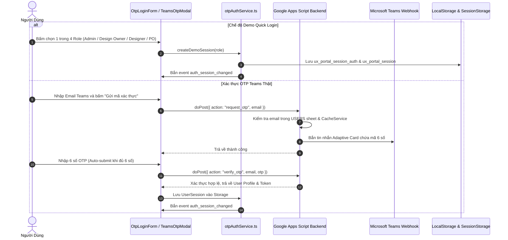

# 🔐 TÍNH NĂNG 01: XÁC THỰC, PHÂN QUYỀN (RBAC) & QUẢN TRỊ PHIÊN (AUTH & SESSION)

> **Mục tiêu tính năng:** Cung cấp cơ chế đăng nhập bảo mật 2 lớp qua mã OTP Microsoft Teams (kèm chế độ Quick Login Demo), bảo vệ các trang chức năng, kiểm soát phiên làm việc (Session) và thực thi phân quyền 4 vai trò (**Admin**, **Design Owner**, **Designer**, **PO**).

---

## 🎯 1. KHI NÀO CẦN ĐỌC TÀI LIỆU NÀY?

- **Khi làm tính năng mới:**
  - Bạn cần thêm 1 Role mới hoặc quyền mới cho Role hiện tại.
  - Bạn cần thêm tính năng yêu cầu kiểm tra xem ai đang đăng nhập (`session.email`, `session.role`, `session.products`).
  - Bạn cần tích hợp thêm phương thức đăng nhập (SSO, OAuth, hoặc Teams Bot).
- **Khi sửa tính năng cũ:**
  - Bị lỗi văng phiên (session bị mất khi F5 hoặc mở tab mới).
  - Đăng xuất không sạch (vẫn còn lưu dữ liệu user cũ).
  - Người dùng không nhận được mã OTP Teams hoặc mã OTP đếm ngược bị sai.
  - PO thấy được tính năng của Admin hoặc Designer thấy task không thuộc Squad của mình.

---

## 🏗️ 2. KIẾN TRÚC & LUỒNG HOẠT ĐỘNG (ARCHITECTURE & FLOW)



---

## 👥 3. MÔ HÌNH PHÂN QUYỀN 4 VAI TRÒ (RBAC MATRIX)

```
                  ┌─────────────────────────────────────┐
                  │                ADMIN                │
                  │   Toàn quyền Cấu hình & Dữ liệu     │
                  └──────────────────┬──────────────────┘
                                     │
                  ┌──────────────────┴──────────────────┐
                  │            DESIGN OWNER             │
                  │      Quản lý Squad & Phê duyệt      │
                  └──────────────────┬──────────────────┘
                                     │
                  ┌──────────────────┴──────────────────┐
                  │              DESIGNER               │
                  │      Thực thi Task & Cập nhật       │
                  └─────────────────────────────────────┘

                  ┌─────────────────────────────────────┐
                  │            PRODUCT OWNER            │
                  │      Tạo & Giám sát Sản phẩm        │
                  └─────────────────────────────────────┘
```

| Quyền Hạn Chi Tiết | Admin | Design Owner | Designer | Product Owner (PO) |
| :--- | :---: | :---: | :---: | :---: |
| **Xem Dashboard Tổng Quan (`overview`)** | ✅ Toàn bộ | ✅ Toàn bộ | ✅ Toàn bộ | ❌ *(Mặc định tắt)* |
| **Theo dõi Task (`track`)** | ✅ Toàn bộ | ✅ Toàn bộ | ✅ Task của Squad | ✅ Chỉ Task của PO |
| **Tạo Yêu Cầu Mới (`create`)** | ✅ Toàn quyền | ✅ Toàn quyền | ✅ Toàn quyền | ✅ Giới hạn theo Sản phẩm |
| **Đổi Khâu & Cập Nhật % Tiến Độ Task** | ✅ Toàn quyền | ✅ Toàn quyền | ⚠️ Task được giao cho mình | ❌ Chỉ xem |
| **Ghi chú Tiến độ & Cập nhật Deliverable** | ✅ Toàn quyền | ✅ Toàn quyền | ⚠️ Task được giao cho mình | ⚠️ Thêm comment |
| **Phân bổ Designer phụ trách** | ✅ Toàn quyền | ✅ Toàn quyền | ❌ Không | ❌ Không |
| **Quản trị Cấu hình Hệ thống (`manage`)** | ✅ Toàn quyền (8 tabs) | ✅ Toàn quyền (8 tabs) | ❌ Không | ❌ Không |
| **Sử dụng Tool Nén Ảnh (`compressor`)** | ✅ Có | ✅ Có | ✅ Có | ✅ Có |
| **Đặc quyền Xem trước vai trò (Role Preview)**| ✅ Có | ✅ Có | ❌ Không | ❌ Không |

---

## 🎭 3.1. ĐẶC QUYỀN ADMIN: CƠ CHẾ ROLE PREVIEW (GIẢ LẬP VAI TRÒ)

Để hỗ trợ kiểm tra và thử nghiệm giao diện thực tế mà không cần đăng xuất, hệ thống cung cấp cơ chế **Role Preview**:
- **API kích hoạt:** `startRolePreview(role: UserRole)` trong `src/services/otpAuthService.ts`.
- **API khôi phục:** `stopRolePreview()`.
- **Nguyên lý:** Lưu `ux_portal_preview_role` vào storage, hàm `getEffectiveRole()` sẽ trả về role đang xem thử. Các component `Sidebar`, `AppHeader`, `RequestDetail` sẽ tự động hiển thị theo góc nhìn của role đó.
- **Bảo mật:** Phiên thật `realSession` của Admin vẫn được lưu giữ an toàn, không bao giờ bị ghi đè thông tin xác thực.

---

## 📦 4. CẤU TRÚC DỮ LIỆU & STORAGE MAP

### Schema Đối Tượng Phiên Đăng Nhập (`UserSession`):
```typescript
export interface UserSession {
  token: string              // Chuỗi Token ngẫu nhiên (hoặc demo token)
  email: string              // Email đăng nhập
  displayName: string        // Tên hiển thị của người dùng
  role: UserRole             // "Admin" | "Design Owner" | "Designer" | "PO"
  avatarUrl?: string         // Link ảnh đại diện (Drive hoặc placeholder)
  squads?: string[]          // Danh sách Squads phụ trách
  products?: string[]        // Danh sách Sản phẩm quản lý (Đặc biệt quan trọng với PO)
  expiresAt: number          // Timestamp hết hạn phiên (8 giờ = Date.now() + 28800000)
}
```

### Storage Keys liên quan:
- `ux_portal_session_auth`: (JSON) Lưu trong `sessionStorage` (ưu tiên) và đồng bộ sang `localStorage`.
- `ux_portal_session`: (JSON) Dự phòng hỗ trợ đồng bộ phiên đa tab.
- `ux_portal_preview_role`: Lưu vai trò đang được Admin giả lập xem thử (`PO`, `Designer`, v.v.).
- `ux_portal_teams_session`: Lưu token tra cứu bảo mật ngắn hạn (15 phút).

---

## 🔍 5. MA TRẬN PHÂN TÍCH PHẠM VI ẢNH HƯỞNG (IMPACT ANALYSIS)

| Khi bạn chỉnh sửa... | Các file bị ảnh hưởng | Rủi ro tiềm ẩn & Cách phòng tránh |
| :--- | :--- | :--- |
| **Thêm trường mới vào `UserSession`** | `src/services/otpAuthService.ts`<br>`src/components/Sidebar.tsx`<br>`src/App.tsx`<br>`src/components/form/RequestForm.tsx` | - Cần kiểm tra xem các hàm `createDemoSession()`, `getStoredSession()` có khởi tạo trường đó không.<br>- Viết fallback `session?.products ?? []` để tránh lỗi `undefined`. |
| **Thời hạn phiên (Session Timeout)** | `src/services/otpAuthService.ts` (`SESSION_DURATION_SECONDS`) | - Mặc định là 8 giờ (28,800 giây). Nếu chỉnh quá ngắn, người dùng đang nhập Form sẽ bị văng phiên và mất dữ liệu. |
| **Hàm Đăng xuất (Logout)** | `src/services/otpAuthService.ts`<br>`src/components/Sidebar.tsx`<br>`src/App.tsx` | - **Bắt buộc** gọi `clearSession()` xóa đồng thời cả `sessionStorage` VÀ `localStorage`.<br>- Bắn event `auth_session_changed` để các trang tự động chuyển về `#login`. |
| **API xác thực OTP** | `google-apps-script-backend.js` (`request_otp`, `verify_otp`) | - Phải deploy version mới trên Apps Script Cloud.<br>- Không được làm mất cơ chế chống dò quét (Anti-Enumeration Response). |

---

## 🛑 6. CHECKLIST KIỂM THỬ ĐẠT 100 ĐIỂM (TEST CHECKLIST)

- [ ] **Quick Login Demo**: Bấm lần lượt 4 nút (Admin, Design Owner, Designer, PO) xem có chuyển đúng giao diện và Sidebar tương ứng với quyền không.
- [ ] **PO Access Guard**: Đăng nhập tài khoản PO -> Kiểm tra xem Sidebar có bị ẩn tab Tổng quan (`overview`) và Quản trị (`manage`) theo đúng ma trận RBAC không.
- [ ] **Form Creation Filter**: Đăng nhập PO -> Mở form Tạo yêu cầu -> Dropdown Sản phẩm chỉ được hiện các sản phẩm mà PO đó quản lý.
- [ ] **F5 Page Refresh**: F5 lại trang bất kỳ -> Phiên đăng nhập vẫn giữ nguyên, không bị đá về màn hình login.
- [ ] **Clean Logout**: Bấm Đăng xuất từ Sidebar -> Kiểm tra Application Storage xem các key `ux_portal_session_auth` đã bị xóa sạch chưa -> Thử gõ Hash `#manage` xem có bị chặn lại không.
- [ ] **Compile Test**: Chạy `npx tsc --noEmit` đạt 0 lỗi.
