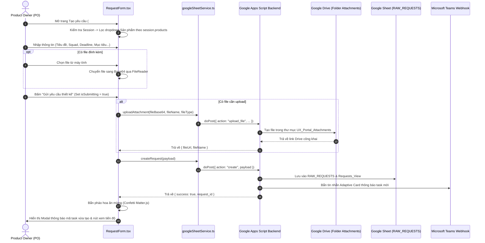

# 📝 TÍNH NĂNG 03: QUY TRÌNH TẠO YÊU CẦU THIẾT KẾ UX (REQUEST CREATION FLOW)

> **Mục tiêu tính năng:** Cung cấp biểu mẫu chuẩn hóa để Product Owner (PO) hoặc các bên liên quan gửi yêu cầu thiết kế UX/UI cho UX Squad, bao gồm tự động kiểm tra tải việc (Squad Capacity), đính kèm tài liệu đẩy lên Google Drive, hiệu ứng chúc mừng (Confetti Matter.js) và đồng bộ trực tiếp vào cơ sở dữ liệu Google Sheet.

---

## 🎯 1. KHI NÀO CẦN ĐỌC TÀI LIỆU NÀY?

- **Khi làm tính năng mới:**
  - Bổ sung trường thông tin mới trong form gửi yêu cầu (ví dụ: Loại nền tảng Web/App, Độ ưu tiên mong muốn, Dự kiến ngày Go-live).
  - Tích hợp thêm nguồn đính kèm tài liệu (Figma link preview, OneDrive/SharePoint).
  - Bổ sung quy trình duyệt trước khi tiếp nhận bài toán (Approval workflow).
- **Khi sửa tính năng cũ:**
  - Lỗi không tải được file đính kèm lên Google Drive hoặc link file bị lỗi quyền truy cập.
  - PO không chọn được sản phẩm của mình hoặc chọn sai Squad phụ trách.
  - Form bị đơ/lag khi bấm nút "Gửi yêu cầu" hoặc gửi trùng lặp nhiều lần (Double submission).
  - Hiệu ứng pháo hoa chúc mừng (Confetti) gây tràn bộ nhớ hoặc lỗi thư viện Matter.js.

---

## 🏗️ 2. KIẾN TRÚC & LUỒNG XỬ LÝ DỮ LIỆU (FLOWCHART)

---

## 📋 3. CÁC TRƯỜNG DỮ LIỆU BẮT BUỘC TRONG FORM

| Tên trường | Kiểu nhập liệu | Ràng buộc nghiệp vụ |
| :--- | :--- | :--- |
| **Tiêu đề yêu cầu** | Text Input | Bắt buộc, tối thiểu 10 ký tự, mô tả rõ tính năng. |
| **Sản phẩm / Phân hệ** | Dropdown | Bắt buộc. Nếu user là `PO`, chỉ hiển thị các sản phẩm mà PO được cấp quyền. |
| **UX Squad tiếp nhận** | Dropdown | Bắt buộc. Hiển thị kèm Badge trạng thái tải việc của Squad (`Sẵn sàng`, `Bình thường`, `Quá tải`). |
| **Hạn chót kỳ vọng (Deadline)** | Date Picker | Bắt buộc, không được chọn ngày trong quá khứ. |
| **Lý do chọn hạn chót** | Textarea | Bắt buộc (Ví dụ: Khớp Sprint 14 của Tech, Cam kết với Ngân hàng Nhà nước). |
| **Mục tiêu kinh doanh & Bài toán** | Textarea | Bắt buộc, mô tả vấn đề của khách hàng và kỳ vọng chỉ số. |
| **Tài liệu đính kèm / PRD Link** | File / URL | Không bắt buộc, hỗ trợ tải file lên Google Drive hoặc dán link Confluence/Jira. |

---

## 🔍 4. MA TRẬN PHÂN TÍCH PHẠM VI ẢNH HƯỞNG (IMPACT ANALYSIS)

| Khi bạn chỉnh sửa... | Các file bị ảnh hưởng | Rủi ro tiềm ẩn & Cách phòng tránh |
| :--- | :--- | :--- |
| **Form Tạo Yêu Cầu (`RequestForm.tsx`)** | `src/components/form/RequestForm.tsx` `src/pages/CreateRequestPage.tsx` | - Phải kiểm tra trạng thái đăng nhập (`session`). Nếu chưa đăng nhập, phải điều hướng về trang Login. - Ngăn chặn bấm đúp nút Submit bằng `disabled={isSubmitting}`. - Kiểm tra tương thích giao diện: Responsive mobile không được tràn các trường nhập liệu ra ngoài màn hình. |
| **Xử lý Upload Tệp lên Google Drive** | `src/services/googleSheetService.ts` `google-apps-script-backend.js` | - Chuỗi Base64 gửi sang backend **bắt buộc** phải loại bỏ phần header `data:...;base64,` trước khi decode. - File kích thước tối đa nên giới hạn ở mức 10MB để tránh timeout của Google Apps Script (giới hạn 30 giây của GAS). |
| **Hiệu ứng Chúc mừng Matter.js** | `src/components/form/RequestForm.tsx` (hoặc Confetti component) | - Khi Modal chúc mừng đóng lại hoặc người dùng rời trang (`unmount`), **bắt buộc** phải giải phóng tài nguyên của Matter.js Canvas (`Matter.Engine.clear()`) để tránh rò rỉ bộ nhớ (Memory Leak). |
| **Tạo Task vào Database** | `src/services/googleSheetService.ts` `src/data/mockData.ts` | - Schema Task gửi lên Google Sheet phải khớp 100% với `UXRequest`. Mã ID sinh ra phải theo định dạng chuẩn: `UXMB-YYYY-XXX` để không bị trùng lặp Index. |

---

## 🛑 5. CHECKLIST KIỂM THỬ ĐẠT 100 ĐIỂM (TEST CHECKLIST)

- [ ] **Ràng buộc PO Product**: Đăng nhập tài khoản PO của Sản phẩm X -> Mở Form -> Kiểm tra xem dropdown Sản phẩm có bị khóa cứng hoặc chỉ hiển thị Sản phẩm X không.
- [ ] **Validation Form**: Bấm "Gửi yêu cầu" khi chưa điền tiêu đề hoặc deadline -> Hệ thống phải báo lỗi đỏ tại ô nhập tương ứng, không được gửi API rỗng.
- [ ] **Upload File Drive**: Thử đính kèm 1 file PDF/PNG dung lượng 2MB -> Bấm gửi -> Kiểm tra xem file có lưu vào Google Drive và link trả về có mở xem được không.
- [ ] **Double Click Prevention**: Bấm nút Submit liên tục 3 lần xem có bị sinh ra 3 task trùng nhau không (Nút phải chuyển thành spinner loading và bị disable ngay lượt bấm đầu).
- [ ] **Confetti & Chuyển trang**: Gửi thành công -> Hiệu ứng pháo hoa xuất hiện -> Bấm nút "Theo dõi tiến độ ngay" -> Điều hướng mượt mà sang trang `#track` và thấy task mới xuất hiện ở cột đầu tiên (`1. Tiếp nhận & Phân loại`).
- [ ] **Compile Test**: Chạy `npx tsc --noEmit` đạt 0 lỗi.
