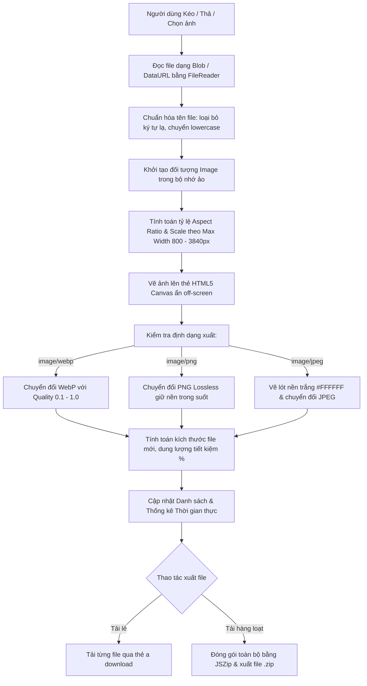

# 🛠️ TÍNH NĂNG 08: BỘ CÔNG CỤ TÍCH HỢP & TIỆN ÍCH HỖ TRỢ (BUILT-IN TOOLS)
## CÔNG CỤ NÉN & TỐI ƯU ẢNH CHUYÊN DỤNG (IMAGE COMPRESSOR)

> **Mục tiêu tính năng:** Cung cấp bộ công cụ tiện ích tích hợp sẵn trong ứng dụng phục vụ trực tiếp cho tác nghiệp hàng ngày của UX Designer và PO, trong đó trọng tâm là **Bộ Nén & Tối Ưu Hóa Ảnh Đa Định Dạng (Client-Side Image Compressor)** hoạt động dưới 2 hình thức: **Trang độc lập chuyên sâu (`ImageCompressorPage.tsx`)** và **Hộp thoại thao tác nhanh (`ImageCompressorModal.tsx`)**. Toàn bộ quá trình xử lý diễn ra 100% trên trình duyệt người dùng qua HTML5 Canvas API, đảm bảo tốc độ tức thì, tối đa bảo mật và bảo vệ quyền riêng tư tuyệt đối cho tài liệu ngân hàng.

---

## 🎯 1. KHI NÀO CẦN ĐỌC TÀI LIỆU NÀY?

- **Khi làm tính năng mới:**
  - Bạn muốn mở rộng công cụ nén ảnh (ví dụ: hỗ trợ định dạng AVIF, SVG optimizer, cắt cúp tự động theo tỷ lệ màn hình ngân hàng 16:9, 9:16).
  - Tích hợp thêm các công cụ mới vào nhóm **RESOURCES** trên Sidebar (ví dụ: Công cụ chuyển đổi đơn vị px sang rem, Bộ tạo bảng màu Palette Generator chuẩn MBBank, Công cụ kiểm tra độ tương phản màu WCAG Contrast Checker).
  - Tích hợp tính năng nén ảnh tự động ngay khi Designer đính kèm ảnh vào mục bình luận hoặc phiếu bàn giao nghiệm thu.
- **Khi sửa / bảo trì tính năng cũ:**
  - Gặp sự cố nén ảnh kích thước siêu lớn (>20MB - 50MB) gây chậm hoặc tràn bộ nhớ trình duyệt (Out of Memory).
  - Ảnh xuất ra bị méo tỷ lệ co giãn (Aspect Ratio) hoặc bị sai lệch không gian màu (Color Space sRGB/P3).
  - Xuất file nén ZIP bằng `JSZip` bị lỗi tên file tiếng Việt có dấu hoặc ký tự đặc biệt.
  - Lỗi điều hướng Hash URL `#compressor` không mở đúng trang hoặc bị lỗi hiển thị trên Sidebar.

---

## 🏗️ 2. KIẾN TRÚC & NGUYÊN LÝ HOẠT ĐỘNG (CLIENT-SIDE ENGINE)

Hệ thống nén ảnh hoạt động hoàn toàn ở phía Frontend, không gửi bất kỳ byte dữ liệu hình ảnh nào về máy chủ hay Google Drive:

### 🌟 Các Ưu Điểm Cốt Lõi:
1. **Bảo mật Ngân hàng Tuyệt Đối (Zero Server Upload):** Toàn bộ ảnh prototype, giao diện ứng dụng nhạy cảm không bao giờ rời khỏi thiết bị của người dùng.
2. **Không Tốn Băng Thông Cloud:** Không tốn tài nguyên Google Apps Script hay Google Drive.
3. **Hiệu Suất Vượt Trội:** Tận dụng khả năng tăng tốc phần cứng WebGL / 2D Canvas của trình duyệt, nén 20 ảnh trong vòng dưới 2 giây.
4. **Hỗ Trợ Định Dạng WebP Tiên Tiến:** Chuẩn hóa theo khuyến nghị hiện đại của Google, giảm 60% - 90% dung lượng so với PNG gốc mà vẫn giữ nguyên độ chi tiết giao diện UX/UI.

---

## 🖥️ 3. PHÂN HỆ CHI TIẾT

### 3.1. Trang Nén Ảnh Chuyên Sâu (`src/pages/ImageCompressorPage.tsx`)
Trang chuyên dụng toàn màn hình được thiết kế theo chuẩn **ReUI Frame System**:
- **Đường dẫn URL:** `#compressor` (được bảo vệ bởi hệ thống Router và Role Matrix).
- **Thanh Công Cụ Toàn Cục (Global Settings Bar):**
  - **Định dạng đầu ra chuẩn:** Dropdown chọn `WebP (Khuyên dùng)`, `PNG (Lossless)`, `JPEG (Phổ thông)`.
  - **Thanh trượt Chất lượng (Quality Slider):** Tùy chỉnh từ 10% đến 100% (Mặc định 80%).
  - **Giới hạn Chiều rộng (Max Resolution Limit):** Giới hạn tối đa từ 800px đến 3840px (4K) để tối ưu ảnh chụp Retina 2x/3x từ Figma.
- **Bảng Thống Kê Nhanh (Metric Counters):**
  - Tổng số ảnh nạp vào.
  - Tổng dung lượng gốc (Original Size) vs. Tổng dung lượng sau nén (Compressed Size).
  - Tỷ lệ giảm dung lượng trung bình (`% Saved`).
- **Chế Độ Hiển Thị Linh Hoạt (View Modes):**
  - **Dạng Bảng (Table View):** Xem danh sách có đầy đủ thông số kích thước, % tiết kiệm, định dạng và thao tác nhanh.
  - **Dạng Lưới (Grid Cards View):** Xem trực quan thumbnail, kéo thanh trượt trước/sau (Split Comparison Slider).
- **Tải Xuất Hàng Loạt Với `JSZip`:**
  - Tích hợp thư viện `jszip` đóng gói toàn bộ danh sách ảnh đã nén thành 1 file ZIP duy nhất: `UX_MB_Optimized_Images_[Timestamp].zip`.

### 3.2. Hộp Thoại Nhanh (`src/components/tools/ImageCompressorModal.tsx`)
- Phù hợp cho Designer cần nén nhanh 1-2 ảnh giao diện để gửi phản hồi hoặc chèn vào phiếu yêu cầu.
- Mở nhanh từ thanh công cụ hoặc phím tắt.

---

## ⚙️ 4. BẢNG THAM SỐ CẤU HÌNH & LỰA CHỌN ĐỊNH DẠNG

| Định dạng | MIME Type | Đặc điểm kỹ thuật | Khuyến nghị sử dụng tại MBBank |
| :--- | :--- | :--- | :--- |
| **WebP** | `image/webp` | Nén có tổn hao/không tổn hao thế hệ mới, hỗ trợ kênh Alpha (nền trong suốt), kích thước nhỏ hơn JPEG/PNG từ 30-80%. | **Khuyên dùng hàng đầu** cho toàn bộ Web Portal, App MBBank và tài liệu trình chiếu. |
| **PNG** | `image/png` | Nén không tổn hao (Lossless), bảo toàn 100% pixel gốc, giữ độ nét icon vector và nền trong suốt. | Dùng cho Asset đồ họa, Icon, Logo cần nền trong suốt tuyệt đối. |
| **JPEG** | `image/jpeg` | Nén phổ thông, tương thích 100% thiết bị cũ. Tự động lót nền trắng `#FFFFFF` nếu ảnh gốc có nền trong suốt. | Dùng cho văn bản, ảnh chụp ngoại cảnh, banner email marketing. |

---

## 🔍 5. MA TRẬN PHÂN TÍCH PHẠM VI ẢNH HƯỞNG (IMPACT MATRIX)

| Vùng Chỉnh Sửa | Các File Liên Quan | Rủi Ro Tiềm Ẩn & Biện Pháp Kiểm Soát |
| :--- | :--- | :--- |
| **`ImageCompressorPage.tsx`** | `src/pages/ImageCompressorPage.tsx` `src/App.tsx` `src/components/Sidebar.tsx` | - Trang sử dụng Lazy Loading (`React.lazy`), đảm bảo không làm phình kích thước bundle ban đầu. - Luôn thu hồi URL bộ nhớ (`URL.revokeObjectURL()`) khi người dùng xóa ảnh hoặc chuyển trang. |
| **Đóng gói ZIP (`JSZip`)** | `package.json` `src/pages/ImageCompressorPage.tsx` | - Cần bắt lỗi ngoại lệ `try...catch` khi nén tệp zip lớn để tránh treo ứng dụng. - Hiển thị trạng thái Loading và thông báo Toast khi hoàn tất. |
| **Sidebar Navigation** | `src/config/navVisibilityConfig.ts` `src/components/Sidebar.tsx` | - Mục `compressor` nằm trong nhóm `resources`. Khi Admin điều chỉnh quyền hạn tại Tab 1 Quản trị, menu phải ẩn/hiện chính xác theo vai trò. |

---

## 🛑 6. CHECKLIST KIỂM THỬ ĐẠT 100 ĐIỂM (TEST CHECKLIST)

- [x] **Truy cập trang nén ảnh:** Bấm vào "Nén ảnh" tại nhóm RESOURCES trên Sidebar -> URL cập nhật thành `#compressor`, trang load mượt mà qua Lazy Load.
- [x] **Kéo thả nhiều ảnh cùng lúc:** Kéo 5-10 ảnh hỗn hợp (PNG, JPEG dung lượng 2MB - 10MB) vào khu vực Dropzone -> Toàn bộ ảnh được nhận diện, chuẩn hóa tên và hiển thị tỷ lệ nén ngay lập tức.
- [x] **Chuyển đổi định dạng:** Chọn đầu ra `WebP` -> Kiểm tra dung lượng giảm mạnh (>60-80%), ảnh xem trước hiển thị sắc nét.
- [x] **Thanh trượt so sánh:** Mở chế độ xem chi tiết -> Di chuyển thanh trượt so sánh Trước / Sau để kiểm tra độ bảo toàn chi tiết giao diện.
- [x] **Xuất file ZIP hàng loạt:** Bấm nút "Tải toàn bộ (.ZIP)" -> File ZIP tải về máy, giải nén ra đầy đủ ảnh với tên file chuẩn sạch.
- [x] **Giải phóng bộ nhớ:** Nén nhiều lượt ảnh -> Kiểm tra bộ nhớ RAM trình duyệt không bị rò rỉ (No memory leak).
- [x] **Compile & Build:** Chạy `npm run build` đạt 0 lỗi, bundle được tách nhỏ độc lập (`ImageCompressorPage-*.js`).
