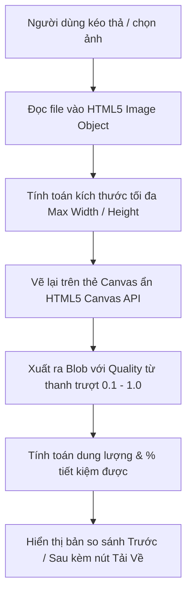

# 🛠️ TÍNH NĂNG 08: BỘ CÔNG CỤ TÍCH HỢP & TIỆN ÍCH HỖ TRỢ (BUILT-IN TOOLS)

> **Mục tiêu tính năng:** Cung cấp các công cụ tiện ích tích hợp sẵn trong ứng dụng phục vụ trực tiếp cho công việc hàng ngày của UX Designer và PO, trong đó công cụ trọng tâm là **Bộ Nén & Tối Ưu Ảnh Chất Lượng Cao (`ImageCompressorModal.tsx`)** hoạt động 100% trên trình duyệt người dùng (Client-side Canvas), đảm bảo tốc độ tức thì và bảo mật tuyệt đối.

---

## 🎯 1. KHI NÀO CẦN ĐỌC TÀI LIỆU NÀY?

- **Khi làm tính năng mới:**
  - Bạn muốn thêm một công cụ mới vào nhóm **RESOURCES** trên Sidebar (ví dụ: Công cụ chuyển đổi đơn vị px sang rem, Bộ tạo bảng màu Palette Generator, Công cụ kiểm tra độ tương phản màu WCAG Contrast Checker).
  - Tích hợp thêm tính năng nén ảnh hàng loạt (Batch compression) hoặc chuyển đổi định dạng ảnh (WebP, AVIF, PNG, JPEG).
- **Khi sửa tính năng cũ:**
  - Công cụ nén ảnh bị lỗi khi nén ảnh dung lượng quá lớn (>20MB) gây đơ trình duyệt.
  - Ảnh sau khi nén bị méo tỷ lệ (Aspect ratio) hoặc bị sai màu sắc.
  - Nút tải ảnh về không hoạt động trên một số trình duyệt di động hoặc Safari.

---

## 🏗️ 2. KIẾN TRÚC & NGUYÊN LÝ HOẠT ĐỘNG CỦA TOOL NÉN ẢNH

### Ưu điểm vượt trội:
1. **Bảo mật 100%:** Ảnh không bao giờ bị tải lên bất kỳ máy chủ nào; toàn bộ quá trình nén diễn ra ngay trên CPU/GPU của máy người dùng.
2. **Không tốn băng thông Server:** Không phát sinh chi phí hoặc độ trễ mạng.
3. **Phản hồi tức thì:** Điều chỉnh thanh trượt chất lượng (Quality slider) là thấy ngay dung lượng và chất lượng ảnh thay đổi theo thời gian thực.

---

## ⚙️ 3. CÁC THÔNG SỐ CẤU HÌNH TRONG `ImageCompressorModal.tsx`

| Thông số | Giá trị mặc định | Phạm vi điều chỉnh | Mục đích |
| :--- | :---: | :---: | :--- |
| **Độ nén (Quality)** | `0.8` (80%) | `0.1` đến `1.0` | Cân bằng giữa dung lượng file và độ sắc nét |
| **Chiều rộng tối đa (Max Width)** | `1920px` | `800px` - `3840px` (4K) | Giảm kích thước vật lý của ảnh chụp màn hình độ phân giải siêu cao |
| **Định dạng xuất (Output Format)**| `image/jpeg` | `image/jpeg`, `image/webp`, `image/png` | Lựa chọn định dạng tối ưu cho website/app |

---

## 🔍 4. MA TRẬN PHÂN TÍCH PHẠM VI ẢNH HƯỞNG (IMPACT ANALYSIS)

| Khi bạn chỉnh sửa... | Các file bị ảnh hưởng | Rủi ro tiềm ẩn & Cách phòng tránh |
| :--- | :--- | :--- |
| **`ImageCompressorModal.tsx`** | `src/components/tools/ImageCompressorModal.tsx` `src/components/Sidebar.tsx` | - Modal phải có nút đóng và hỗ trợ phím `Escape` để thoát. - Khi đóng Modal, cần giải phóng bộ nhớ URL đối tượng (`URL.revokeObjectURL()`) để tránh chiếm dụng RAM trình duyệt khi nén nhiều ảnh. |
| **Thêm Tool Mới vào Sidebar** | `src/components/Sidebar.tsx` `src/config/navVisibilityConfig.ts` `src/pages/QuanLyPage.tsx` | - Tool mới phải được đăng ký vào nhóm `Resources` trong `navVisibilityConfig.ts`. - Phải cập nhật Ma trận phân quyền tại Tab 1 Quản trị để Admin có thể bật/tắt hoặc đổi thứ tự của Tool mới này. |

---

## 🛑 5. CHECKLIST KIỂM THỬ ĐẠT 100 ĐIỂM (TEST CHECKLIST)

- [ ] **Mở Tool từ Sidebar**: Bấm vào mục "Nén ảnh" ở nhóm RESOURCES trên Sidebar -> Modal công cụ phải bung mở mượt mà kèm hiệu ứng làm mờ hậu cảnh (Backdrop blur).
- [ ] **Kéo thả ảnh thực tế**: Kéo 1 file ảnh PNG nặng 5MB vào vùng thả ảnh -> Kiểm tra ảnh có nạp thành công không -> Kéo thanh trượt chất lượng xuống 70% -> Dung lượng giảm rõ rệt (ví dụ còn dưới 500KB, tiết kiệm >80%).
- [ ] **Tải về thành công**: Bấm nút "Tải ảnh đã nén" -> File tải về máy tính mở được, hình ảnh sắc nét, không bị vỡ hoặc đổi màu.
- [ ] **Dọn dẹp RAM**: Nén thử 5 ảnh liên tiếp -> Kiểm tra Task Manager của trình duyệt không bị tăng RAM đột biến.
- [ ] **Compile Test**: Chạy `npx tsc --noEmit` đạt 0 lỗi.
