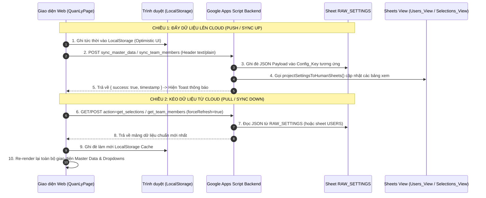

# 🔄 TÍNH NĂNG 09: CẤU HÌNH DỮ LIỆU CHỦ (MASTER DATA), PHÂN BỔ SQUAD (PO / BUSINESS / DESIGNER) & ĐỒNG BỘ 2 CHIỀU GOOGLE SHEETS

> **Mục tiêu tính năng:** Cung cấp giải pháp quản trị Dữ liệu chủ (Master Data) gồm **UX Squads**, **Sản phẩm số MBBank**, **Khâu quy trình UX**, **Nhân sự & Phân quyền**, cùng cơ chế **Đồng bộ 2 chiều (Two-Way Sync)** tự động và tức thời giữa Web App và Google Sheets (`RAW_SETTINGS`), tích hợp cơ chế chống trùng lặp hoạt động (Activity Comment Deduplication).

---

## 🎯 1. KHI NÀO CẦN ĐỌC TÀI LIỆU NÀY?

- **Khi làm tính năng mới:**
  - Thêm một phân hệ Master Data mới (ví dụ: Danh mục Đơn vị kinh doanh/Khối, Danh mục Vendor đối tác).
  - Mở rộng vai trò phụ trách trong Squad (ví dụ: thêm Tech Lead, Scrum Master, QA phụ trách).
  - Tích hợp thêm trường cấu hình vào `RAW_SETTINGS` trên Google Sheets.
  - Xây dựng tính năng đồng bộ tự động theo thời gian thực (Real-time polling / WebSocket / Sheet Webhook).
- **Khi bảo trì / sửa lỗi tính năng cũ:**
  - Squad hoặc Sản phẩm số thêm/sửa/xóa trên UI nhưng không lưu lên Google Sheets hoặc bị mất khi tải lại trang.
  - Nhân sự chọn vào Squad bị sai vai trò (ví dụ: nhầm lẫn giữa chức danh Title và vai trò Role hệ thống).
  - Chat/Ghi chú tiến độ (Activity Comments) bị nhân đôi (hiện 2 comment khi vừa gửi, F5 tải lại chỉ còn 1).
  - Dữ liệu chỉnh sửa trực tiếp trên Google Sheet không kéo về được ứng dụng Web (`Pull` thất bại).
  - Bị lỗi CORS Preflight khi gọi API đồng bộ sang Google Apps Script.

---

## 🏗️ 2. KIẾN TRÚC DỮ LIỆU CHỦ (MASTER DATA ARCHITECTURE)

Hệ thống Master Data liên kết chặt chẽ 3 thực thể cốt lõi: **Sản phẩm số (Products)**, **Squads (Đội ngũ tác nghiệp)**, và **Nhân sự theo Role (Users)**:

```
┌─────────────────────────────────────────────────────────────────────────┐
│                       SẢN PHẨM SỐ (PRODUCTS)                            │
│  - App MBBank, Biz MBBank, Lending, Cards, BaaS, Design System...       │
└────────────────────────────────────┬────────────────────────────────────┘
                                     │ 1 Sản phẩm có thể thuộc nhiều Squads
                                     ▼
┌─────────────────────────────────────────────────────────────────────────┐
│                          UX SQUADS (ĐỘI TÁC NGHIỆP)                     │
│  - Mã Squad, Tên Squad, Hạn mức Tasks, Trạng thái hoạt động             │
│  - Phân bổ nhân sự trực tiếp theo VAI TRÒ CHUẨN (Role-Based Pickers):  │
│    ├── 👔 Product Owner (PO phụ trách chính)                            │
│    ├── 💼 Business (Cán bộ phụ trách nghiệp vụ / BA kinh doanh)         │
│    └── 🎨 UX/UI Designers (Các thiết kế viên phụ trách squad)           │
└────────────────────────────────────┬────────────────────────────────────┘
                                     │
                                     ▼
┌─────────────────────────────────────────────────────────────────────────┐
│                       NHÂN SỰ HỆ THỐNG (TEAM MEMBERS)                  │
│  - Role chuẩn: Admin | Design Owner | Designer | PO | Business          │
│  - Email @mbbank.com.vn, Avatar Drive, Task Limit, Chuyên môn           │
└─────────────────────────────────────────────────────────────────────────┘
```

### 2.1 Quy Chuẩn Lựa Chọn Theo Vai Trò (Role-based vs Title-based)
- **Trước đây:** Chọn nhân sự dựa trên ô chức danh tự do (Title) dẫn đến việc người có title "UI Designer" lại bị gán nhầm làm Business hoặc PO.
- **Quy chuẩn mới:** 
  - Ô chọn **PO** chỉ lọc danh sách nhân sự có `role === "PO"`.
  - Ô chọn **Business** lọc nhân sự có `role === "Business"` hoặc `role === "PO"`.
  - Ô chọn **Designers** (Multi-select) lọc danh sách nhân sự có `role === "Designer"` hoặc `role === "Design Owner"`.

### 2.2 Giao Diện Quản Trị Trực Quan (Card Grid View)
- Thay thế danh sách phẳng dài khó theo dõi bằng hệ thống **Card Lưới (Grid Responsive)**:
  - Header thẻ hiển thị Avatar màu sắc ngẫu nhiên theo mã định danh, Badge số lượng Sản phẩm và Công tắc Bật/Tắt trạng thái hoạt động.
  - Phân vùng nhân sự rõ ràng: Avatar nhóm PO, Business và Designer với tooltip tên đầy đủ.
  - Thanh tìm kiếm và bộ lọc nhanh trạng thái (Tất cả / Đang hoạt động / Tạm dừng).

---

## ⚡ 3. CƠ CHẾ ĐỒNG BỘ 2 CHIỀU GOOGLE SHEETS (TWO-WAY SYNC)

Hệ thống kết hợp mô hình **Fast Path JSON Core (`RAW_SETTINGS`)** cùng cơ chế **Human-Readable Views Projection** trên Google Sheets.



### 3.1 Bảng Cấu Hình Lưu Trữ Trên Sheet `RAW_SETTINGS`

| Config_Key | Kiểu Dữ Liệu | Nội Dung Lưu Trữ | Nguồn Sử Dụng Trong App |
| :--- | :--- | :--- | :--- |
| **`SQUADS_CONFIG`** | `SquadSetting[]` | Danh sách Squads, mã Code, PO phụ trách, Business phụ trách, Designer phụ trách, hạn mức task, sản phẩm liên kết | Trang Quản lý, Form tạo task, Bộ lọc Kanban |
| **`PRODUCTS_CONFIG`** | `ProductSetting[]` | Danh mục Sản phẩm số MB, trạng thái hoạt động, mô tả phân hệ | Form tạo task, Danh mục Master Data |
| **`USERS_LIST`** | `TeamMember[]` | Toàn bộ nhân sự, vai trò chuẩn (RBAC), Avatar URL Drive, Task Limit, Squads/Products phân bổ | Phân quyền, Gán task Kanban, Header User |
| **`PHASES_CONFIG`** | `UxPhaseSetting[]` | 6 Khâu quy trình chuẩn UX, % tiến độ, SLA cam kết số ngày, Deliverables bắt buộc | Kanban Board, Timeline Gantt, Chi tiết task |
| **`SELECTIONS_CONFIG`** | `DropdownConfig` | Danh mục tùy chọn: Loại yêu cầu, Kết quả bàn giao mong muốn, Lý do deadline khẩn | Form tạo yêu cầu (`RequestForm.tsx`) |

### 3.2 Kỹ Thuật Vượt Giới Hạn CORS của Google Apps Script
- Khi gọi `fetch()` từ trình duyệt sang Apps Script với header `application/json`, trình duyệt bắt buộc gửi một preflight `OPTIONS` request. Google Apps Script **không hỗ trợ** xử lý `OPTIONS` header dẫn đến lỗi `CORS error / Failed to fetch`.
- **Giải pháp:** Sử dụng `Content-Type: text/plain;charset=utf-8`. Trình duyệt coi đây là Simple Request, không gửi OPTIONS request, và Google Apps Script vẫn parse chuỗi `e.postData.contents` thành JSON chuẩn xác 100%.

```typescript
// src/services/googleSheetService.ts
export async function syncMasterDataToSheet(masterData: {
  squads?: SquadSetting[];
  products?: ProductSetting[];
  phases?: UxPhaseSetting[];
  selections?: any;
}): Promise<boolean> {
  const response = await fetch(GOOGLE_SCRIPT_URL, {
    method: "POST",
    headers: { "Content-Type": "text/plain;charset=utf-8" },
    body: JSON.stringify({
      action: "sync_master_data",
      ...masterData,
    }),
  });
  const data = await response.json();
  return data.success === true;
}
```

---

## 💬 4. CƠ CHẾ CHỐNG TRÙNG LẶP HOẠT ĐỘNG (COMMENT DEDUPLICATION)

### 4.1 Hiện Tượng Trước Khi Tối Ưu
Khi người dùng gõ comment/chat trong Task Detail:
1. Giao diện thêm comment mới vào danh sách hiển thị ngay (Optimistic UI) với timestamp tạo tại Client.
2. Giao diện gửi request lên Google Apps Script để lưu vào Sheet `RAW_REQUESTS`.
3. Khi nhận response hoặc tải lại từ cache, do ID hoặc timestamp giữa Client và Server không đồng bộ hoàn toàn, danh sách bị chèn thêm 1 bản ghi tương tự ➔ **Nhảy 2 comment trên màn hình**. Khi F5 thoát ra vào lại thì Sheet chỉ có 1 bản ghi nên chỉ hiện 1.

### 4.2 Cơ Chế Xử Lý Triệt Để (Deduplication Engine)
1. **Khởi tạo Định Danh Duy Nhất (Deterministic Unique ID):**
   - Mỗi comment/update sinh ra một ID cố định: `upd_${Date.now()}_${Math.random().toString(36).slice(2, 7)}`.
2. **Hàm Lọc Trùng (Deduplicate Pipeline) Trước Khi Render & Trước Khi Lưu:**
   ```typescript
   function deduplicateUpdates(updates: TaskUpdate[]): TaskUpdate[] {
     const seen = new Set<string>();
     return updates.filter(item => {
       // Khóa nhận diện: ưu tiên ID; nếu không có ID dùng timestamp + author + content
       const key = item.id || `${item.timestamp}_${item.author}_${item.content || item.comment || ""}`;
       if (seen.has(key)) return false;
       seen.add(key);
       return true;
     });
   }
   ```
3. **Phản hồi tức thì không chờ đợi (Optimistic Update với Safe State):**
   - Đảm bảo danh sách `task_updates` trong state React và trong `localStorage` luôn đi qua bộ lọc `deduplicateUpdates()`.

---

## 📦 5. STORAGE KEYS & API ENDPOINTS LIÊN QUAN

### Client Storage Keys (`localStorage`):
- `mbbank_admin_squads`: Danh sách cấu hình Squads (PO, Business, Designers, Max Tasks).
- `mbbank_admin_products`: Danh sách cấu hình Sản phẩm số MB.
- `mbbank_admin_team`: Danh sách nhân sự nội bộ UX.
- `ux_portal_selections_cache`: Cache các lựa chọn dropdowns.

### Google Apps Script Action Endpoints:
- `action: "sync_master_data"`: POST lưu `squads`, `products`, `phases`, `selections` vào `RAW_SETTINGS`.
- `action: "sync_team_members"`: POST lưu danh sách nhân sự vào `RAW_SETTINGS` và sheet `USERS`.
- `action: "get_selections"`: GET/POST lấy toàn bộ cấu hình dropdowns và master data.
- `action: "get_team_members"`: GET/POST lấy danh sách nhân sự chuẩn nhất.

---

## 🔍 6. MA TRẬN PHẠM VI ẢNH HƯỞNG (IMPACT ANALYSIS)

| Vùng Chỉnh Sửa | File Bị Ảnh Hưởng | Điểm Cần Chú Ý Sống Còn |
| :--- | :--- | :--- |
| **Sửa Squads / Products** | `QuanLyPage.tsx`<br>`googleSheetService.ts`<br>`RequestForm.tsx` | Đảm bảo mảng `products`, `lead_designers` luôn là mảng (`string[]`). Luôn gọi `syncMasterDataToSheet` sau khi cập nhật state. |
| **Chọn Role thay vì Title** | `QuanLyPage.tsx` | Không được so sánh chuỗi `title` tự do. Phải lọc theo trường chuẩn `role === "PO"`, `role === "Business"`, `role === "Designer"`. |
| **Comment / Task Updates** | `RequestDetail.tsx`<br>`googleSheetService.ts` | Bắt buộc gán `id` duy nhất cho mỗi update và bọc qua hàm khử trùng lặp `deduplicateUpdates` trước khi setState. |
| **Backend Apps Script** | `google-apps-script-backend.js` | Sau khi sửa code, bắt buộc **Deploy New Version** trên Google Apps Script Console để thay đổi có hiệu lực. |

---

## 🛑 7. CHECKLIST KIỂM THỬ ĐẠT 100 ĐIỂM (TEST CHECKLIST)

- [ ] **Thêm Squad mới:** Điền Tên, Mã, chọn PO, chọn Business, chọn Designers -> Bấm "Lưu" -> Card mới xuất hiện ngay trên giao diện -> Mở tab mạng (Network) thấy request `sync_master_data` thành công -> Mở Google Sheet `RAW_SETTINGS` kiểm tra key `SQUADS_CONFIG` có dữ liệu mới.
- [ ] **Lọc Role chuẩn:** Mở modal sửa Squad -> Ô chọn PO không được xuất hiện nhân sự có role Designer -> Ô chọn Designers không được xuất hiện nhân sự chỉ có role PO.
- [ ] **Chat/Comment không bị nhảy 2:** Mở chi tiết 1 bài toán -> Nhập ghi chú thảo luận -> Bấm gửi -> Comment xuất hiện ngay 1 bản ghi duy nhất, không bị nhân đôi sau 1-2 giây -> Thoát modal vào lại vẫn hiển thị chuẩn 1 comment.
- [ ] **Pull dữ liệu từ Sheet (Kéo về):** Thay đổi trực tiếp 1 giá trị trên Google Sheet -> Mở ứng dụng bấm "Tải từ Sheet" -> Dữ liệu trên ứng dụng tự cập nhật theo Sheet mà không cần xóa cache trình duyệt.
- [ ] **TypeScript Compile:** Chạy `npx tsc --noEmit` đạt 0 lỗi.
