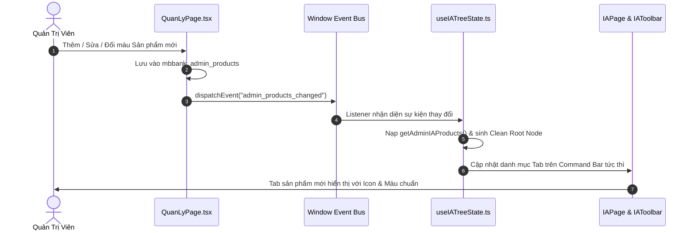

# 🗺️ TÍNH NĂNG 10: KIẾN TRÚC THÔNG TIN & SƠ ĐỒ TƯ DUY (INFORMATION ARCHITECTURE & MINDMAP)

> **Mục tiêu tính năng:** Cung cấp khung vẽ sơ đồ tư duy (Interactive Mindmap Canvas) trực quan hóa cấu trúc sản phẩm số của MBBank theo phân cấp 4 tầng chuẩn mực. Hỗ trợ điều khiển mượt mà (Pan, Zoom, Căn giữa Fit-to-view, Auto-align), liên kết với các bài toán thiết kế thực tế (`UXRequest`), tích hợp phân quyền vai trò (RBAC), tự động đồng bộ danh mục Sản phẩm từ Quản trị hệ thống và hỗ trợ tùy biến cấu trúc cây linh hoạt.

---

## 🎯 1. KHI NÀO CẦN ĐỌC TÀI LIỆU NÀY?

- **Khi làm tính năng mới:**
  - Cần bổ sung tầng phân cấp mới hoặc mở rộng thuộc tính cho node cây IA (`IANode`).
  - Cần tích hợp thêm thao tác khung vẽ (thước đo tỷ lệ, mini-map, xuất ảnh SVG/PNG, xuất tài liệu IA).
  - Cần liên kết thêm các luồng nghiệp vụ mới từ Task hoặc Design System vào sơ đồ IA.
- **Khi sửa tính năng cũ:**
  - Cần chỉnh sửa quy tắc phân quyền Xem / Sửa cấu trúc IA (`cap-ia-view`, `cap-ia-edit`).
  - Cần tinh chỉnh thuật toán tính toán tọa độ phân cấp cây (`useIATreeState.ts` - Top-down Layout Engine).
  - Sửa đổi các tab sản phẩm đồng bộ từ Quản trị hệ thống (`mbbank_admin_products`).
  - Tinh chỉnh giao diện `PageHeader`, thanh điều khiển `IAToolbar` hoặc thẻ `IATreeNodeCard`.

---

## 🏗️ 2. MÔ HÌNH PHÂN CẤP 4 TẦNG KIẾN TRÚC (4-TIER HIERARCHY)

Hệ thống cấu trúc toàn bộ ngân hàng số MBBank theo 4 cấp độ nghiêm ngặt:

```
[ CẤP 1: SẢN PHẨM (Product Root) ]
           │
           ├── [ CẤP 2: PHÂN HỆ / MODULE NGHIỆP VỤ (Domain / Module) ]
           │              │
           │              ├── [ CẤP 3: LUỒNG TÍNH NĂNG (Feature Journey) ]
           │              │              │
           │              │              └── [ CẤP 4: MÀN HÌNH & ĐIỂM CHẠM (Screen & Touchpoint) ]
```

| Cấp Độ | Tên Gọi | Mô Tả Nghiệp Vụ | Màu Sắc Nhận Diện | Thuộc Tính Đặc Trưng |
| :---: | :--- | :--- | :--- | :--- |
| **Tier 1** | **Sản phẩm (Product Root)** | Gốc cao nhất của sản phẩm số (App MB, Biz MB, Web Portal, BaaS,...) | Theo màu cấu hình Sản phẩm | `code`, `iconName`, `description` |
| **Tier 2** | **Phân hệ / Module (Domain)** | Nhóm nghiệp vụ lớn (Thanh toán & Chuyển tiền, Tiết kiệm, Tín dụng số, Quản trị thẻ,...) | Xanh dương / Chàm (`blue`/`indigo`) | `squadName`, `domainBadge` |
| **Tier 3** | **Luồng tính năng (Journey)** | Chuỗi hành trình khách hàng (Chuyển nhanh Napas 247, Mở thẻ tín dụng Online, Gửi tiết kiệm,...) | Tím / Xanh ngọc (`purple`/`teal`) | `journeySteps`, `isCriticalPath` |
| **Tier 4** | **Màn hình & Điểm chạm (Screen)** | Giao diện hiển thị cụ thể hoặc điểm chạm người dùng (Nhập số tài khoản, Xác thực Face/OTP, Thành công,...) | Xanh lá / Hổ phách (`emerald`/`amber`) | `screenCode`, `touchpointType`, `figmaUrl`, `requestId` |

---

## 🧭 3. KIẾN TRÚC THÀNH PHẦN & TỔ CHỨC MÃ NGUỒN

Toàn bộ phân hệ Information Architecture được đóng gói module hóa sạch sẽ tại `src/components/ia/` và `src/hooks/`:

```
src/
├── pages/
│   └── IAPage.tsx                       # Màn hình chính, tích hợp PageHeader, Gate RBAC & Drawer
│
├── components/ia/
│   ├── IAToolbar.tsx                    # Thanh Command Bar: Product Switcher Pills & Quick Search Input
│   ├── IACanvasViewport.tsx             # Khung nhìn tương tác, quản lý Drag/Pan/Zoom/AutoAlign
│   ├── IATreeNodeCard.tsx               # Thẻ node đại diện phân cấp (Tier 1-4, resize, status badge)
│   ├── IABezierConnectors.tsx           # SVG đường nối Bezier mượt mà giữa các node
│   └── IANodeEditorModal.tsx            # Modal Thêm / Sửa / Xóa / Xác nhận khôi phục node
│
├── hooks/
│   ├── useIATreeState.ts                # State Engine: Quản lý cây, Top-down Layout, Search, Admin Sync
│   └── useCanvasTransform.ts            # Transform Engine: Pan kéo, Zoom, Căn giữa Fit to View
│
├── types/
│   └── ia.ts                            # Định nghĩa Interfaces, Types và Enums chuẩn
│
└── data/
    └── iaMockData.ts                    # Dữ liệu gốc khởi tạo và hàm trích xuất Admin Products
```

---

## ⚡ 4. ĐỘNG CƠ BỐ TRÍ CÂY TỰ ĐỘNG (TOP-DOWN LAYOUT & ALIGN ENGINE)

Khung vẽ sử dụng thuật toán tính toán layout phân cấp từ trên xuống (Top-down Tree Layout) kết hợp khả năng tùy biến vị trí tự do của người dùng:

1. **Tính toán kích thước hộp con (Subtree Extents):**
   - Đệ quy từ lá lên gốc để xác định chiều rộng bao phủ của từng nhánh.
   - Khoảng cách chiều dọc giữa các tầng: `VERTICAL_GAP = 96px`.
   - Khoảng cách chiều ngang tối thiểu giữa các node con: `HORIZONTAL_GAP = 40px`.
2. **Neo vị trí tùy biến (Custom Coordinates Persistence):**
   - Khi người dùng kéo thả di chuyển node (`onNodeDragEnd`), tọa độ `x, y` tương đối của node được lưu bền vững.
   - Khi người dùng bấm nút **Tự động căn chỉnh (Auto Align)**, hệ thống tái thiết lập cây về vị trí cân đối hoàn hảo dựa trên cấu trúc phả hệ.
3. **Đường nối Bezier động (Dynamic Cubic Bezier Wiring):**
   - Tính toán cổng xuất (Source Port: Top/Bottom/Left/Right) sang cổng nhập (Target Port).
   - Đường cong Bézier bậc ba mượt mà với hiệu ứng phát sáng (glow) khi đường truyền dẫn tới node khớp kết quả tìm kiếm.

---

## 🔄 5. ĐỒNG BỘ ĐỘNG SẢN PHẨM & SQUADS TỪ QUẢN TRỊ (DYNAMIC SYNC)

Trang IA không sử dụng danh sách sản phẩm tĩnh mà được **kết nối thời gian thực 2 chiều** với phân hệ Quản trị hệ thống:



- **`getAdminIAProducts()`**: Nạp danh sách sản phẩm `Active` từ `mbbank_admin_products` (và `ux_portal_products_v2`).
- **`createCleanRootNodeForProduct(prod)`**: Khi Quản trị viên thêm sản phẩm mới (ví dụ: *Thẻ tín dụng số*, *Bảo hiểm số*), hệ thống tự động sinh một Clean Root Node Tier 1 với tiêu đề và mô tả tương ứng.
- **Tích hợp Danh mục Squad động:** Dropdown chọn Squad trong `IANodeEditorModal` nạp trực tiếp danh sách Squads thực tế của MBBank từ Quản trị (`getAdminSquadsList()`).

---

## 🛡️ 6. MA TRẬN PHÂN QUYỀN RBAC CHO INFORMATION ARCHITECTURE

Để đảm bảo tính toàn vẹn của cấu trúc thông tin ngân hàng, hệ thống thiết lập 2 năng lực (Capabilities) độc lập được quản lý tại Tab RBAC của Quản trị:

| Capability ID | Tên Năng Lực | Mô Tả Quyền Hạn | Admin | Design Owner | Designer | Product Owner (PO) | Business |
| :--- | :--- | :--- | :---: | :---: | :---: | :---: | :---: | :---: |
| **`cap-ia-view`** | **Xem Kiến trúc Thông tin (IA)** | Truy cập màn hình IA, xem sơ đồ cây, zoom/pan, tra cứu tìm kiếm, mở xem chi tiết task liên kết. | ✅ Có | ✅ Có | ✅ Có | ✅ Có | ✅ Có |
| **`cap-ia-edit`** | **Biên tập Cấu trúc IA** | Thêm node con, sửa tên/mô tả node, xóa node, kéo di chuyển, co giãn kích thước, kéo nối dây bezier, khôi phục mặc định. | ✅ Có | ✅ Có | ✅ Có | ❌ Chế độ chỉ xem | ❌ Chế độ chỉ xem |

### Hành vi ở Chế độ chỉ xem (Read-Only Mode):
- **Huy hiệu đầu trang:** Thay vì huy hiệu `● Live Sync`, hệ thống hiển thị huy hiệu `👁 Chế độ chỉ xem` màu vàng hổ phách (`data-testid="ia-readonly-badge"`).
- **Ẩn các công cụ sửa đổi:**
  - Ẩn nút **"Khôi phục mặc định"** trên PageHeader Actions.
  - Ẩn các nút hành động thêm con (`+`), chỉnh sửa bút chì và xóa rác trên từng thẻ node.
  - Ẩn các cổng kéo nối dây Bezier (Ports).
  - Vô hiệu hóa tính năng kéo thả thay đổi vị trí (`onNodeDrag`) và co giãn kích thước node (`onNodeResize`).
- **Giữ trọn trải nghiệm tra cứu:** Người dùng chỉ xem vẫn thoải mái Pan khung vẽ, Zoom in/out, Căn giữa sơ đồ, Tìm kiếm từ khóa, và nhấp vào node để mở Slide-over Drawer xem chi tiết bài toán liên kết.

---

## 🎨 7. QUY CHUẨN GIAO DIỆN HEADER ĐỒNG BỘ VỚI HỆ THỐNG

Giao diện đầu trang Information Architecture được chuẩn hóa 100% theo phong cách **Track Task** thông qua component chuẩn `PageHeader`:

```
┌────────────────────────────────────────────────────────────────────────────────────────────────────────┐
│ Platform > Information Architecture                                                                    │
│                                                                                                        │
│ Information Architecture   ● Live Sync                                      [ ⤢ Căn giữa ] [ ↺ Mặc định ]
│ Phân hệ 4 │ Luồng 12 │ Màn hình 36 │ Trọng yếu 8 │ App MBBank: Ứng dụng Ngân hàng số Khách hàng Cá nhân│
└────────────────────────────────────────────────────────────────────────────────────────────────────────┘
┌────────────────────────────────────────────────────────────────────────────────────────────────────────┐
│ [📱 App MBBank] [🏢 Biz MB] [🌐 Web Portal] [⚙️ BaaS Open API]          [ 🔍 Tìm màn hình, task... 1/3]│
└────────────────────────────────────────────────────────────────────────────────────────────────────────┘
```

1. **PageHeader:**
   - **Breadcrumb:** `Platform > Information Architecture`.
   - **Tiêu đề lớn:** `Information Architecture` (font `text-2xl sm:text-[28px] font-semibold text-slate-900`).
   - **Badge trạng thái:** `Live Sync` (emerald pulse) hoặc `Chế độ chỉ xem` (amber lock/eye).
   - **Subtitle dạng Metric Chips:** Bộ 4 chip thống kê số lượng (`Phân hệ`, `Luồng`, `Màn hình`, `Trọng yếu`) kèm tên và mô tả sản phẩm đang chọn.
   - **Actions bên phải:** Nút **Căn giữa** (`ia-fit-view-btn`) và nút **Khôi phục mặc định** (`ia-reset-default-btn`).
2. **Command Bar (`IAToolbar`):**
   - Nằm ngay phía dưới PageHeader với bo góc chuẩn `rounded-2xl border border-slate-200/90 shadow-2xs`.
   - **Bên trái:** Cụm tab chọn sản phẩm với hiệu ứng viên thuốc trượt mượt mà (`layoutId="ia-product-active-pill"`).
   - **Bên phải:** Ô tìm kiếm nhanh với bộ đếm kết quả (`1/3`), nút chuyển kết quả Trước / Kế tiếp và tự động lia camera căn giữa node kết quả tìm được.

---

## 💾 8. CƠ CHẾ LƯU TRỮ ĐA TẦNG VÀ ĐỒNG BỘ ĐÁM MÂY (CLOUD PERSISTENCE & LOCALSTORAGE)

Hệ thống triển khai cơ chế lưu trữ kết hợp bền vững giữa Client (LocalStorage) và Serverless Cloud (Google Sheets via Apps Script):

1. **Khóa lưu trữ LocalStorage:** `ux_portal_ia_tree_data_v4`.
   - Lưu trữ tức thì (zero-latency) mỗi khi có thay đổi trên canvas (di chuyển node, co giãn, thêm/sửa/xóa).
   - Đảm bảo trạng thái công việc được giữ nguyên ngay cả khi tải lại trang hoặc mất kết nối mạng.
2. **Đồng bộ Đám mây qua Google Sheets Backend (`saveIATreeData` / `getIATreeData`):**
   - **Mã nguồn:** `google-apps-script-backend.js`, `src/services/googleSheetService.ts`, `src/hooks/useIATreeState.ts`.
   - **Hành động "Lưu lên Cloud":** Đóng gói toàn bộ cây sơ đồ IA của các sản phẩm, gửi request lên Google Apps Script để ghi bền vững vào sheet `ux_ia_tree_data`.
   - **Hành động "Tải từ Cloud":** Cho phép kéo dữ liệu chuẩn mới nhất từ Cloud về client và đồng bộ lại vào cây sơ đồ hiện tại.
   - **Chỉ báo trạng thái trực quan:** Nút lưu hiển thị trạng thái đang đồng bộ (`Loader2` spinner), gửi Toast thông báo thành công hoặc cảnh báo lỗi chi tiết.
3. **Khôi phục mặc định theo sản phẩm (Isolated Reset):** Khi người dùng bấm "Khôi phục mặc định", hệ thống chỉ tái thiết lập cây của sản phẩm đang chọn, tuyệt đối không làm ảnh hưởng đến cấu trúc cây của các sản phẩm khác.

---

## 📐 9. TINH CHỈNH TRẢI NGHIỆM THẺ NODE (NODE CARD ERGONOMICS)

Thẻ phân cấp cây (`IATreeNodeCard.tsx`) được thiết kế lại tối ưu cho hiển thị thông tin ngân hàng và thao tác kéo giãn:

1. **Kéo giãn thẻ đơn trục theo chiều ngang (Width-only Resizing):**
   - **Vị trí tay cầm kéo:** Đặt tinh tế ở giữa mép phải thẻ (`cursor-ew-resize`), thay thế hoàn toàn cho tay cầm góc chéo cũ.
   - **Bảo toàn chiều cao tự nhiên:** Khi kéo sang trái/phải, hệ thống chỉ cập nhật chiều rộng (`customWidth: 180px - 700px`). Chiều cao thẻ hoàn toàn tự động co giãn (`height: auto`) theo số dòng văn bản và các task chip bên trong, ngăn chặn triệt để hiện tượng vỡ bố cục, thừa khoảng trắng dọc hoặc bị che khuất nội dung.
2. **Badge thu gọn nhánh tinh gọn (Streamlined Branch Badge):**
   - Tối giản hóa nội dung badge thu gọn: chỉ hiển thị số lượng nhánh con (ví dụ: `4 ˅`), loại bỏ chữ "nhánh" để tiết kiệm diện tích và tăng tính cô đọng.
3. **Thân thẻ trực quan — Trọng tâm Track Task:**
   - Loại bỏ dòng thông tin Squad/Chưa giao rườm rà dưới tiêu đề thẻ.
   - Đi thẳng vào khu vực **Track task**: hiển thị thanh tiến độ %, tỷ lệ hoàn thành (`x/y tasks`) và các chip bài toán thiết kế liên kết với màu sắc trạng thái tương ứng.

---

## ⚡ 10. TỐI ƯU HÓA ĐƯỜNG NỐI BÉZIER & HIỆU NĂNG CANVAS

1. **Khớp nối chuẩn xác & Triệt tiêu gạch thừa (`IABezierConnectors.tsx`):**
   - **Khắc phục điểm khớp thụt:** Tọa độ neo của đường nối được khớp nối chính xác đến từng pixel với cổng kết nối của thẻ node, loại bỏ hoàn toàn lỗi dây bị thụt sâu vào trong nền thẻ.
   - **Xóa bỏ gạch trên thừa:** Chuẩn hóa thuật toán phân nhánh cáp: loại bỏ đoạn gạch ngang/dọc dư thừa nhô ra bên ngoài nhánh cha, tạo đường cong Bézier mềm mại, liền mạch từ gốc đến ngọn.
   - **Loại bỏ cụm nối rối:** Triệt tiêu các đoạn connector stubs trung gian gây rối mắt, giữ sơ đồ luôn thoáng đãng và thanh lịch.
2. **Tối ưu hóa độ trễ khi kéo thả (`IACanvasViewport.tsx`):**
   - Triệt tiêu hiện tượng các node con và đường dây chạy theo chuột bị trễ nhịp ("đi sau chuột chậm").
   - Vô hiệu hóa transition trễ trong suốt thời gian kéo thả con trỏ (`pointer-events: none` trên SVG connectors và tắt hiệu ứng animation transition của layout frame khi drag), mang lại cảm giác phản hồi 1:1 tức thì ở tần số quét 60+ FPS.

---

## 🎨 11. ĐỒNG NHẤT HỆ THỐNG NÚT BẤM THEO REUI DESIGN SYSTEM & QUY HOẠCH TOOLBAR

1. **Chuẩn hóa toàn diện với ReUI `Button` Component:**
   - Thay thế toàn bộ thẻ nút bấm tự chế bằng component `@/components/ui/button` chuẩn của hệ thống TrackTask:
     - Nút hành động chính: `variant="blue" size="sm"` (`#1057FB`) cho thao tác *"Lưu lên Cloud"*.
     - Nút thứ cấp: `variant="outline" size="sm"` cho *"Tải từ Cloud"*, *"Cài đặt sơ đồ"*, các bộ chọn preset layout.
     - Nút cảnh báo: `variant="destructive" size="sm"` cho *"Xóa node"*.
     - Nút phụ trợ: `variant="ghost" size="sm"` cho các thao tác phụ.
   - Kích thước icon chuẩn hóa `w-3.5 h-3.5 text-slate-500` đồng bộ toàn trang.
2. **Quy hoạch phân tách ranh giới công cụ (Separation of Concerns):**
   - **Thanh công cụ Canvas Dock (Nổi dưới chân màn hình):** Tập trung 100% vào điều hướng khung nhìn: Chế độ Chọn (`V`) / Pan (`H`), Căn chuẩn sơ đồ (`LayoutGrid`), Căn giữa Fit-to-view (`Maximize2`), Zoom In/Out và Zoom Reset.
   - **Thanh công cụ PageHeader (Trên cùng):** Chuyên trách quản lý dữ liệu & cấu hình: `Tải từ Cloud`, `Lưu lên Cloud`, `Cài đặt sơ đồ` (mở modal cấu hình khoảng cách và dạng dây `IASettingsModal.tsx`), và menu hành động mở rộng `...` (chứa `Khôi phục sơ đồ mặc định` có xác nhận).
   - **Loại bỏ nút dư thừa:** Bỏ nút `Thêm Cấp 1` trên header theo yêu cầu người dùng để tránh tạo node cấp 1 bừa bãi ngoài quy hoạch sản phẩm.

---

## 🧪 12. BỘ KIỂM THỬ TỰ ĐỘNG & ĐẢM BẢO CHẤT LƯỢNG (QA & TEST SUITE)

Hệ thống cung cấp kịch bản kiểm thử toàn diện:
- Kiểm tra toàn bộ mã nguồn với TypeScript: `npx tsc --noEmit` đạt 0 lỗi.
- Kiểm thử E2E giao diện Header và Navigation: `node scratch/test-ia-header-style.mjs`.
- Kiểm thử đồng bộ động sản phẩm Quản trị: `node scratch/test-ia-admin-products-sync.mjs`.
- Unit test suite: `npm test` đạt 19/19 test cases passed.
- Production Build: `npm run build` hoàn thành xuất sắc trong < 500ms.
