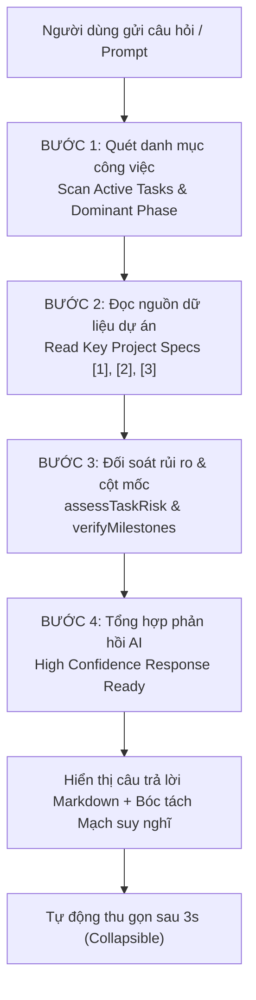

# 🤖 TÍNH NĂNG 14: AI CHATS & TRỢ LÝ ĐIỀU HÀNH THIẾT KẾ (UX COPILOT)
## (AGENT ACTIVITY TRACE, REASONING STREAM, SLASH COMMANDS, RICH CONTENT & ARTIFACTS MANAGEMENT)

> **Mục tiêu tính năng:** Cung cấp hệ sinh thái Trợ lý Trí tuệ Nhân tạo (AI Chats / UX Copilot) chuyên sâu cho đội ngũ Designer và Quản lý tại UX MBBank. Module kết hợp khả năng kết nối mô hình ngôn ngữ lớn (LLM) qua OpenRouter/AI Gateway, tích hợp ngữ cảnh dữ liệu dự án thời gian thực (Real-time Project & Task Context), hiển thị minh bạch mạch tư duy qua **Agent Activity Trace** (kế thừa từ Executive Summary), quản lý hạn mức sử dụng theo ngày chuẩn ngân hàng, hỗ trợ bộ **Slash Commands (`/`)** tiện dụng phong cách ReUI đơn sắc, hỗ trợ xuất đa định dạng (Rich Assistant Content) và kho lưu trữ tài liệu sáng tạo (**UX Artifacts**) với khung tải lên chuẩn ReUI `c-file-upload-10`.

---

## 🎯 1. KHI NÀO CẦN ĐỌC TÀI LIỆU NÀY?

- **Khi phát triển tính năng mới:**
  - Cần tích hợp thêm các mô hình AI mới (GPT-4o, Claude 3.5 Sonnet, Gemini 1.5 Pro, DeepSeek R1, Qwen 2.5...).
  - Cần mở rộng hoặc tùy biến bộ lệnh gõ tắt (Slash Commands: `/tiendo`, `/po`, `/deepwork`, `/quychuan`, `/checklist`...).
  - Cần nâng cấp kiến trúc xử lý tài liệu đính kèm (File attachments, Figma link parsing, OCR hình ảnh giao diện, drag & drop, clipboard paste).
  - Cần tinh chỉnh System Prompt hoặc bổ sung dữ liệu ngữ cảnh nghiệp vụ ngân hàng (Banking UX Knowledge Base).
  - Cần mở rộng hoặc điều chỉnh chính sách hạn mức AI (`AIDailyUsage`, số lượt dùng/ngày, cơ chế làm mới lúc 00:00).
- **Khi bảo trì / kiểm tra lỗi (Troubleshooting):**
  - AI không phản hồi, báo lỗi kết nối OpenRouter hoặc lỗi Proxy Vercel Gateway (`/api/ai-gateway`).
  - Mạch suy nghĩ (`<think>`) bị rò rỉ vào nội dung tin nhắn trả về thay vì nằm trong khối Thinking/Process.
  - Khối `AgentActivityTrace` không tự động mở khi stream hoặc không tự thu gọn sau khi hoàn thành.
  - Lịch sử chat (Threads), thống kê lượt dùng trong ngày hoặc kho sản phẩm AI (Artifacts) không lưu vào `localStorage`.
  - Phân quyền trang AI Chats (`canUseAi`) hoặc cấu hình API Key trong Quản trị hệ thống (`QuanLyPage`).

---

## 🏗️ 2. CẤU TRÚC KIẾN TRÚC & CÁC THÀNH PHẦN (COMPONENTS BREAKDOWN)

```
src/
├── services/
│   ├── aiService.ts                  <-- CORE GATEWAY: Kết nối OpenRouter, stream completion (SSE), bóc tách <think> reasoning, quản lý hạn mức AI ngày (getDailyAIUsage, recordAIRequestUsage)
│   └── aiArtifactsService.ts         <-- ARTIFACT STORAGE: CRUD tài liệu AI tạo ra (Specs, Checklist, Code), LocalStorage cache & seed artifacts
│
├── config/
│   ├── aiPrompts.ts                  <-- PROMPT SYSTEM: UX_MB_SYSTEM_PROMPT, bộ quy chuẩn 7 khâu, prompt templates
│   └── navVisibilityConfig.ts        <-- NAVIGATION RBAC: Khai báo mục 'aichat' (AI Chats) trên Sidebar điều hướng
│
├── components/
│   ├── planner/
│   │   ├── AgentActivityTrace.tsx    <-- TRACE ENGINE: 4 bước trực quan hóa quy trình đối soát dữ liệu (Step 1-4)
│   │   └── AIChatCopilot.tsx         <-- MINI COPILOT: Widget chat nổi tại các trang nghiệp vụ
│   ├── admin/
│   │   └── OpenRouterSettingsCard.tsx<-- ADMIN CONFIG: Cấu hình API Key, Default Model, Gateway Endpoint
│   ├── reui/
│   │   ├── c-icon-stack-2.tsx        <-- REUI COMPONENT: Minh họa 3D Icon Stack thẻ kính xếp chồng (IconStackLarge)
│   │   └── icon-stack.tsx            <-- REUI PRIMITIVE: Lớp nền thẻ kính đa tầng
│   └── track/
│       └── RequestDetail.tsx         <-- TASK INSPECTION: Modal chi tiết task khi click vào nguồn dự án tại Trace
│
├── pages/
│   ├── AIChatPage.tsx                <-- TRANG CHÍNH: Full-bleed AI Workspace, Sidebar Threads/Artifacts, Composer, Rich Formats, Dropzone
│   └── QuanLyPage.tsx                <-- ADMIN PORTAL: Tích hợp tab cấu hình OpenRouter & chính sách AI
│
└── api/
    └── ai-gateway.ts                 <-- SERVERLESS PROXY: Vercel Serverless Function bảo vệ API Key & phòng chống CORS
```

---

## 🎨 3. THIẾT KẾ GIAO DIỆN & TRẢI NGHIỆM NGƯỜI DÙNG (UX/UI)

Giao diện **AI Chats** được xây dựng chuẩn mực theo [UI_DESIGN_SYSTEM.md](file:///d:/AI%20dev/MBBank/UXMBTaskRequest-main/UXMBTaskRequest-main/doc/UI_DESIGN_SYSTEM.md) và [motion-guidelines.md](file:///d:/AI%20dev/MBBank/UXMBTaskRequest-main/UXMBTaskRequest-main/doc/motion-guidelines.md):

### 3.1. Cột Trái: Sidebar Quản lý Đa năng (252px)
- **Top Header:**
  - Logo Trợ lý AI (`/ai-default.png`), tiêu đề **"Trợ lý UX MB"**, nút Tìm kiếm đoạn chat/tài liệu và nút Thu gọn sidebar (`PanelLeft`).
  - Nút hành động nổi bật: **`+ Tạo đoạn chat mới`** (ở tab Chats) hoặc **`Tải lên tài liệu`** & **`+`** (ở tab Artifacts).
- **Vùng Nội dung Cuộn (Scrollable):**
  - Nhóm **Đã ghim (Pinned)** với Accordion đóng/mở linh hoạt.
  - Nhóm **Gần đây (Recent)** sắp xếp theo thứ tự thời gian.
  - Mỗi đoạn chat hỗ trợ: Ghim/Bỏ ghim, Đổi tên nhanh, Xuất Markdown (`.md`), Xóa an toàn.
- **Thanh chuyển đổi Tab Dưới Cùng (Bottom Tab Switcher):**
  - Cố định ở đáy sidebar (`shrink-0 border-t border-border p-2 bg-sidebar/80`), không bị cuộn mất khi danh sách dài.
  - Gồm 2 tab: **`[ 💬 Chats ]`** và **`[ 📄 Artifacts ]`** với hiệu ứng chuyển đổi mượt mà.

### 3.2. Không gian Chat Trung tâm (Main Chat Area)
- **Top Header:**
  - Nút mở sidebar khi đang đóng.
  - Tiêu đề đoạn hội thoại hiện tại.
  - Nút Ghim nhanh (`Bookmark`).
  - Bộ chọn mô hình AI (`DropdownMenu`): Claude 3.5 Sonnet, GPT-4o, DeepSeek R1, Gemini 1.5 Pro, Qwen 2.5 Coder.
  - Nút quay lại **MB Portal** điều hướng nhanh.
- **Hàng tin nhắn Người dùng (User Message):**
  - Căn phải, bo góc mềm mại `rounded-2xl rounded-br-xs bg-muted/70`.
  - Hiển thị Avatar cá nhân chuẩn MB Design System.
- **Hàng tin nhắn Trợ lý AI (Assistant Message) & Rich Output:**
  - Căn trái kèm avatar logo tròn MB AI (`/ai-default.png`).
  - **Khối Agent Activity Trace:** 4 bước kiểm tra dữ liệu minh bạch.
  - **Bảng dữ liệu Markdown chuyên nghiệp:** Hỗ trợ cột header có ký hiệu sắp xếp `↕`, viền bảng mảnh `border-border/60`, hàng xen kẽ tinh tế.
  - **Khối Hành động Xác nhận (Action Confirmation Cards):** Hiển thị thẻ xác nhận trực quan cho các tác vụ điều phối công việc hoặc thay đổi trạng thái bài toán.
  - **Khối Tài liệu Sinh ra (Artifact Blocks):** Header chứa icon tài liệu, tên file (`.md`, `.json`, `.tsx`), badge loại tệp và nút mở xem/tải về.
  - **Thẻ Tài liệu Tham chiếu (Referenced Documents):** Chip tài liệu đính kèm dạng `@quy-trinh-7-khau.md`.
  - **Gợi ý Câu hỏi Tiếp theo (Follow-up Prompts):** Dải chip câu hỏi mở rộng với biểu tượng mũi tên chuyển hướng (`Shorten to two lines ↳`).

### 3.3. Thanh Hạn Mức Sử Dụng AI Trong Ngày (Real-time MBBank Daily AI Usage Bar)
- Vị trí: Đặt ngay phía trên thanh Composer dock, hiển thị trực quan hạn mức của nhân sự.
- Định dạng tiêu đề chuẩn xác:
  **`Đã dùng {used}/{total} lượt AI hôm nay (Còn lại {remaining} lượt) • Tự động làm mới lúc 00:00`**
- Thanh tiến trình thực tế:
  - Tỷ lệ phần trăm tính theo thời gian thực: `Math.round((used / total) * 100)%`.
  - Dải thanh chạy đen/trắng tối giản kèm hoa văn sọc xiên tinh tế.
  - Tự động cộng dồn số lượt sau mỗi câu hỏi và đồng bộ tức thì qua event `ux_mb_ai_usage_changed`.
  - Hỗ trợ nút Accordion thu gọn (`ChevronUp` / `ChevronDown`) và nút đóng tạm thời (`X`).
  - Cơ chế tự động reset về 0 vào thời điểm **00:00** ngày mới (theo local date `en-CA`).

### 3.4. Khung Soạn thảo Liền mạch (Seamless Composer Dock)
- **Menu Slash Commands Đơn Sắc (ReUI Minimal Monochrome Style):**
  - Kích hoạt khi gõ `/`.
  - Thiết kế đơn sắc theo chuẩn ReUI: nền `bg-popover/95`, viền mờ `border-border`, phím tắt badge `font-mono border border-border/80`, loại bỏ hoàn toàn các màu mè gây phân tâm.
  - Hỗ trợ bàn phím: Mũi tên Lên/Xuống để điều hướng, `Enter` hoặc `Tab` để chọn lệnh, `Esc` để đóng.
- **Đính kèm & Tải tài liệu:**
  - Nút tải lên tài liệu nhanh (`Paperclip` / `Upload`) tích hợp sẵn trên Composer bar.
- **Phím tắt:** `Enter` để gửi, `Shift + Enter` để xuống dòng. Nút `Dừng` (`Square`) ngắt kết nối stream ngay lập tức.

---

## ⚡ 4. QUY TRÌNH MINH BẠCH HÓA TƯ DUY (AGENT ACTIVITY TRACE)

Kế thừa thiết kế từ **Executive Summary** trên trang *Planner*, khối `AgentActivityTrace` mang lại độ tin cậy tuyệt đối cho Designer qua 4 bước đối soát:



### Chi tiết 4 bước:
1. **Bước 1 — Quét danh mục công việc (`Quét danh mục công việc`):**
   - Đọc số lượng task active của người dùng (`Yêu cầu UX: X task active`).
   - Xác định giai đoạn chiếm ưu thế (`khảo sát nghiệp vụ & định nghĩa đầu bài (Define)` hoặc `thiết kế UI/UX`).
2. **Bước 2 — Đọc nguồn dữ liệu dự án (`Đọc nguồn dữ liệu dự án`):**
   - Liệt kê tối đa 3 dự án/yêu cầu trọng điểm đang thực hiện dạng `[1]`, `[2]`, `[3]`.
   - **Tương tác trực tiếp:** Designer có thể bấm vào từng dự án để mở ngay modal [RequestDetail](file:///d:/AI%20dev/MBBank/UXMBTaskRequest-main/UXMBTaskRequest-main/src/components/track/RequestDetail.tsx) xem chi tiết đề bài mà không phải rời trang chat.
3. **Bước 3 — Đối soát rủi ro & cột mốc (`Đối soát rủi ro & cột mốc`):**
   - `assessTaskRisk()`: Kiểm tra các task cận hạn hoặc quá hạn cần đôn đốc.
   - `verifyMilestones()`: Kiểm tra kế hoạch Go-Live và đợt nghiệm thu UI dev trong tuần.
4. **Bước 4 — Tổng hợp phản hồi (`Tổng hợp phản hồi AI`):**
   - Gắn nhãn `Độ tin cậy cao`.
   - Hiển thị khối **Mạch suy nghĩ chi tiết (Reasoning)** nếu mô hình (như DeepSeek R1) có luồng suy nghĩ logic.
5. **Cơ chế đóng/mở thông minh (Collapsible UX):**
   - Trong lúc stream: Mở sẵn để người dùng nhìn thấy tiến độ thực tế.
   - Khi hoàn thành: Giữ mở 3 giây cho người dùng quan sát, sau đó tự động thu gọn về thanh trạng thái:
     `✓ Đã đọc 3 nguồn dự án và đối soát 2 tiêu chí (X.Xs)  4/4  Xem chi tiết ⌵`.
   - Người dùng có thể click mở lại hoặc đóng bất cứ lúc nào.

---

## ⌨️ 5. HỆ THỐNG SLASH COMMANDS & PROMPTS CHUYÊN BIỆT

Bộ lệnh được định nghĩa tại `AI_COMMAND_LIST` trong [AIChatPage.tsx](file:///d:/AI%20dev/MBBank/UXMBTaskRequest-main/UXMBTaskRequest-main/src/pages/AIChatPage.tsx) và cấu hình tại [aiPrompts.ts](file:///d:/AI%20dev/MBBank/UXMBTaskRequest-main/UXMBTaskRequest-main/src/config/aiPrompts.ts):

| Slash Command | Tên hiển thị | Prompt thực thi thực tế | Mục đích nghiệp vụ |
| :--- | :--- | :--- | :--- |
| **`/tiendo`** | Tiến độ bài toán | `Tổng hợp các bài toán ưu tiên Lv1/Lv2 và deadline hôm nay` | Lọc các task quan trọng nhất cần giải quyết ngay trong ca làm việc. |
| **`/po`** | Rà soát PO | `Kiểm tra các bài toán đang PO Pending quá 24h cần đôn đốc` | Phát hiện điểm nghẽn phê duyệt từ phía Product Owner để đẩy nhanh tiến độ. |
| **`/deepwork`** | Năng suất & Họp | `Hôm nay tôi có bao nhiêu giờ Deep Work và lịch họp thế nào?` | Phân tích lịch trình Planner/Calendar để tối ưu quỹ thời gian sáng tạo thiết kế. |
| **`/quychuan`** | Quy chuẩn bàn giao | `Tóm tắt checklist chuẩn bị tài liệu bàn giao thiết kế (Ready for Dev) cho tôi` | Chuẩn hóa hồ sơ bàn giao sang kỹ sư phát triển phần mềm (Dev handover). |
| **`/checklist`** | Checklist khâu 7 | `Checklist chi tiết bàn giao Figma khâu 7 cho Dev và kiểm thử UAT` | Kiểm tra độ phủ Design Tokens, Figma specs, responsive breakpoints trước khi nghiệm thu. |

---

## 📦 6. KHO LƯU TRỮ ARTIFACTS & KHUNG TẢI LÊN CHUẨN REUI

Kho Artifacts lưu trữ các tài liệu đặc tả, bảng checklist, tiêu chuẩn thiết kế và tài liệu người dùng tải lên.

### 6.1. Khung Tải lên chuẩn ReUI `c-file-upload-10` (Giống Compress Images)
- **Tỷ lệ hiển thị rộng 21:9:** Bo góc mềm `rounded-2xl`, viền nét đứt `border-2 border-dashed border-slate-200/90 dark:border-border`.
- **Minh họa 3D Icon Stack (`IconStackLarge`):** Sử dụng component chuẩn `@/components/reui/c-icon-stack-2`, các lớp thẻ kính xếp chồng chuyển màu xanh khi hover.
- **Tiêu đề & Action Link:**
  `Drag and drop an image, or Browse` (chữ `Browse` liên kết màu xanh `#1057FB` gạch chân nổi bật, click mở file picker).
- **Dòng hướng dẫn:**
  *Hỗ trợ PNG, JPG, JPEG, WebP • Dán trực tiếp (Ctrl + V) từ Clipboard • Không giới hạn số lượng ảnh*.
- **Danh mục tính năng 2 cột ReUI:**
  - `High resolution images (png, jpg, webp)` & `Tự động nhận diện thẻ .priority`.
  - `Nén ảnh hàng loạt & tải ZIP nhanh` & `100% Offline, bảo mật an toàn MB`.
- **Khả năng tương tác:**
  - Kéo và thả nhiều tệp cùng lúc (multi-file drop).
  - Dán tệp/ảnh nhanh qua Clipboard (**Ctrl + V**).
  - Tự động nạp vào thư viện Artifacts và đồng bộ vào bộ nhớ `localStorage`.

### 6.2. Bộ tài liệu Seed chuẩn ban đầu
Hệ thống cung cấp sẵn 4 tài liệu hạt nhân của UX MBBank:
1. `Quy-trinh-7-khau-UX-MBBank.md`: Quy trình 7 khâu chính thức từ Tiếp nhận đến UAT.
2. `Tieu-chuan-Design-Handoff-MB.md`: Bộ tiêu chuẩn nghiệm thu thiết kế Ready for Dev.
3. `Chinh-sach-SLA-va-PO-Pending.md`: Quy định thời gian phản hồi và xử lý bài toán nghẽn PO.
4. `MBBank-Design-System-Tokens.json`: Bảng mã màu, kiểu chữ và tokens giao diện MB.

---

## 🔐 7. BẢO MẬT, HẠN MỨC & PHÂN QUYỀN (SECURITY, QUOTA & RBAC)

### 7.1. Phân quyền Vai trò (RBAC Permission: `canUseAi`)
- Khai báo tại [accessControl.ts](file:///d:/AI%20dev/MBBank/UXMBTaskRequest-main/UXMBTaskRequest-main/src/lib/accessControl.ts):
  ```typescript
  export function canUseAiChat(session: AuthSession | null): boolean {
    if (!session) return false
    if (session.role === "Admin") return true
    if (["Designer", "Design Owner"].includes(session.role)) return true
    return Boolean(session.permissions?.includes("cap-ai-use"))
  }
  ```
- **Navigation RBAC:** [navVisibilityConfig.ts](file:///d:/AI%20dev/MBBank/UXMBTaskRequest-main/UXMBTaskRequest-main/src/config/navVisibilityConfig.ts) tự động ẩn mục **AI Chats** trên Sidebar chính đối với vai trò chưa được phân quyền.
- **Route Guard:** Nếu người dùng truy cập trực tiếp `#aichat` khi chưa có quyền, giao diện hiển thị màn hình thông báo thân thiện: *"Chưa được cấp quyền sử dụng AI Chats — Vui lòng liên hệ Admin để kích hoạt."*

### 7.2. Chính sách Hạn mức Lượt dùng AI (Daily Quota Policy)
- Quy tắc: Mỗi API Key tương ứng với **50 lượt request/ngày**.
- Tổng hạn mức: `Số API Keys khả dụng * 50`.
- Bộ đếm tự động ghi nhận số lượt thực tế, cảnh báo khi chạm trần và tự động làm mới vào lúc **00:00** hàng ngày.

### 7.3. Bảo vệ Khóa API qua Serverless Gateway Proxy
- Trong môi trường Production (Vercel), các yêu cầu gọi AI được điều hướng qua Serverless Function `/api/ai-gateway`.
- Ẩn toàn bộ API Key ở phía Server, phòng chống rò rỉ trên Client và khắc phục triệt để lỗi CORS.

---

## 🧪 8. KIỂM THỬ & ĐẢM BẢO CHẤT LƯỢNG (TESTING & VALIDATION)

1. **Kiểm thử Luồng Stream Phản hồi & Rich Content:**
   - Đảm bảo token hiển thị mượt mà không bị giật lag.
   - Bảng biểu Markdown, Action Cards, Artifact Blocks và Follow-up Chips render chính xác.
2. **Kiểm thử Mạch suy nghĩ (Reasoning Extraction):**
   - Regex bóc tách chuẩn xác thẻ `<think>...</think>`, không làm lộ nội dung nháp ra câu trả lời chính.
3. **Kiểm thử Hạn mức & Bộ đếm:**
   - Khởi tạo chuẩn 14/50 lượt (còn lại 36 lượt), thanh progress bar hiển thị 28%.
   - Sau mỗi lượt gửi, số đếm tăng lên theo thời gian thực và lưu vào `localStorage`.
4. **Kiểm thử Drag & Drop và Clipboard Paste:**
   - Kéo thả file vào khung `c-file-upload-10` kích hoạt đúng hiệu ứng hover viền xanh.
   - Nhấn `Ctrl + V` dán tệp từ clipboard thành công và thông báo toast xác nhận.
5. **Kiểm thử Build Production:**
   - Lệnh `npm run build` vượt qua 100% không có lỗi Type hay rò rỉ mã nguồn.
