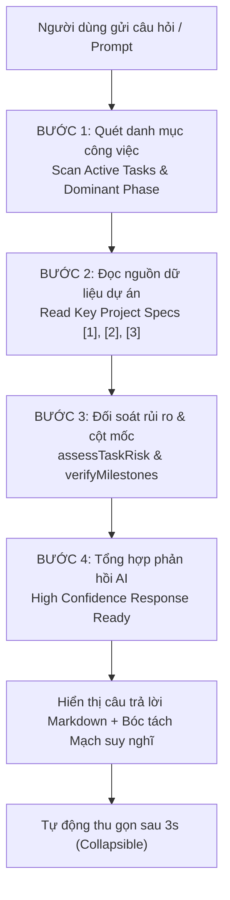
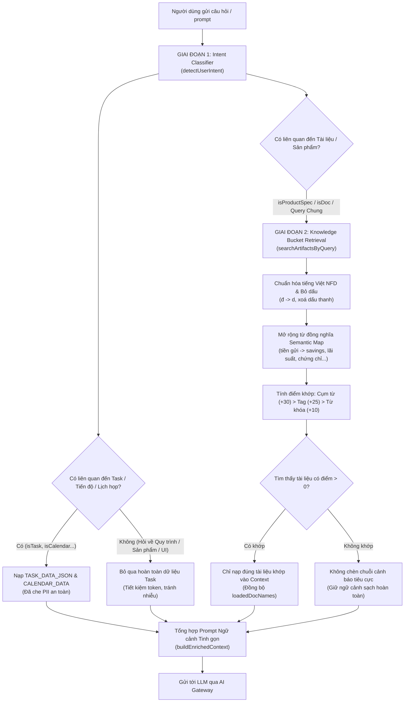
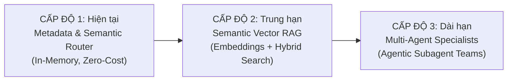

# 🤖 TÍNH NĂNG 14: AI CHATS & TRỢ LÝ ĐIỀU HÀNH THIẾT KẾ (UX COPILOT)
## (AGENT ACTIVITY TRACE, REASONING STREAM, SLASH COMMANDS, RICH CONTENT & ARTIFACTS MANAGEMENT)

> **Mục tiêu tính năng:** Cung cấp hệ sinh thái Trợ lý Trí tuệ Nhân tạo (AI Chats / UX Copilot) chuyên sâu cho đội ngũ Designer và Quản lý tại UX MBBank. Module kết hợp khả năng kết nối mô hình ngôn ngữ lớn (LLM) qua OpenRouter/AI Gateway, tích hợp ngữ cảnh dữ liệu dự án thời gian thực (Real-time Project & Task Context), hiển thị minh bạch mạch tư duy qua **Agent Activity Trace** (kế thừa từ Executive Summary), quản lý hạn mức sử dụng theo ngày chuẩn ngân hàng, hỗ trợ bộ **Slash Commands (`/`)** tiện dụng phong cách ReUI đơn sắc, hỗ trợ xuất đa định dạng (Rich Assistant Content) và kho lưu trữ tài liệu sáng tạo (**UX Artifacts**) với khung tải lên chuẩn ReUI `c-file-upload-10`.

---

## 🎯 1. KHI NÀO CẦN ĐỌC TÀI LIỆU NÀY?

- **Khi phát triển tính năng mới:**
  - Cần tích hợp thêm các mô hình AI mới (GPT-4o, Claude 3.5 Sonnet, Gemini 1.5 Pro, DeepSeek R1, Qwen 2.5...).
  - Cần mở rộng hoặc tùy biến bộ lệnh gõ tắt (Slash Commands: `/tiendo`, `/po`, `/deepwork`, `/quychuan`, `/checklist`...).
  - Cần nâng cấp kiến trúc xử lý tài liệu đính kèm (File attachments, Figma link parsing, OCR hình ảnh giao diện, drag & drop, clipboard paste).
  - Cần tinh chỉnh System Prompt hoặc bổ sung dữ liệu ngữ cảnh nghiệp vụ ngân hàng (Banking UX Knowledge Base).
  - Cần mở rộng hoặc điều chỉnh chính sách hạn mức AI (`AIDailyUsage`, số lượt dùng/ngày, cơ chế làm mới lúc 00:00).
- **Khi bảo trì / kiểm tra lỗi (Troubleshooting):**
  - AI không phản hồi, báo lỗi kết nối OpenRouter hoặc lỗi Proxy Vercel Gateway (`/api/ai-gateway`).
  - Mạch suy nghĩ (`<think>`) bị rò rỉ vào nội dung tin nhắn trả về thay vì nằm trong khối Thinking/Process.
  - Khối `AgentActivityTrace` không tự động mở khi stream hoặc không tự thu gọn sau khi hoàn thành.
  - Lịch sử chat (Threads), thống kê lượt dùng trong ngày hoặc kho sản phẩm AI (Artifacts) không lưu vào `localStorage`.
  - Phân quyền trang AI Chats (`canUseAi`) hoặc cấu hình API Key trong Quản trị hệ thống (`QuanLyPage`).

---

## 🏗️ 2. CẤU TRÚC KIẾN TRÚC & CÁC THÀNH PHẦN (COMPONENTS BREAKDOWN)

```
src/
├── services/
│   ├── aiService.ts                  <-- CORE GATEWAY: Kết nối OpenRouter, stream completion (SSE), bóc tách <think> reasoning, quản lý hạn mức AI ngày (getDailyAIUsage, recordAIRequestUsage)
│   └── aiArtifactsService.ts         <-- ARTIFACT STORAGE: CRUD tài liệu AI tạo ra (Specs, Checklist, Code), LocalStorage cache & seed artifacts
│
├── config/
│   ├── aiPrompts.ts                  <-- PROMPT SYSTEM: UX_MB_SYSTEM_PROMPT, bộ quy chuẩn 7 khâu, prompt templates
│   └── navVisibilityConfig.ts        <-- NAVIGATION RBAC: Khai báo mục 'aichat' (AI Chats) trên Sidebar điều hướng
│
├── components/
│   ├── planner/
│   │   ├── AgentActivityTrace.tsx    <-- TRACE ENGINE: 4 bước trực quan hóa quy trình đối soát dữ liệu (Step 1-4)
│   │   └── AIChatCopilot.tsx         <-- MINI COPILOT: Widget chat nổi tại các trang nghiệp vụ
│   ├── admin/
│   │   └── OpenRouterSettingsCard.tsx<-- ADMIN CONFIG: Cấu hình API Key, Default Model, Gateway Endpoint
│   ├── reui/
│   │   ├── c-icon-stack-2.tsx        <-- REUI COMPONENT: Minh họa 3D Icon Stack thẻ kính xếp chồng (IconStackLarge)
│   │   └── icon-stack.tsx            <-- REUI PRIMITIVE: Lớp nền thẻ kính đa tầng
│   └── track/
│       └── RequestDetail.tsx         <-- TASK INSPECTION: Modal chi tiết task khi click vào nguồn dự án tại Trace
│
├── pages/
│   ├── AIChatPage.tsx                <-- TRANG CHÍNH: Full-bleed AI Workspace, Sidebar Threads/Artifacts, Composer, Rich Formats, Dropzone
│   └── QuanLyPage.tsx                <-- ADMIN PORTAL: Tích hợp tab cấu hình OpenRouter & chính sách AI
│
└── api/
    └── ai-gateway.ts                 <-- SERVERLESS PROXY: Vercel Serverless Function bảo vệ API Key & phòng chống CORS
```

---

## 🎨 3. THIẾT KẾ GIAO DIỆN & TRẢI NGHIỆM NGƯỜI DÙNG (UX/UI)

Giao diện **AI Chats** được xây dựng chuẩn mực theo [UI_DESIGN_SYSTEM.md](file:///d:/AI%20dev/MBBank/UXMBTaskRequest-main/UXMBTaskRequest-main/doc/UI_DESIGN_SYSTEM.md) và [motion-guidelines.md](file:///d:/AI%20dev/MBBank/UXMBTaskRequest-main/UXMBTaskRequest-main/doc/motion-guidelines.md):

### 3.1. Cột Trái: Sidebar Quản lý Đa năng (252px)
- **Top Header:**
  - Logo Trợ lý AI (`/ai-default.png`), tiêu đề **"Trợ lý UX MB"**, nút Tìm kiếm đoạn chat/tài liệu và nút Thu gọn sidebar (`PanelLeft`).
  - Nút hành động nổi bật: **`+ Tạo đoạn chat mới`** (ở tab Chats) hoặc **`Tải lên tài liệu`** & **`+`** (ở tab Artifacts).
- **Vùng Nội dung Cuộn (Scrollable):**
  - Nhóm **Đã ghim (Pinned)** với Accordion đóng/mở linh hoạt.
  - Nhóm **Gần đây (Recent)** sắp xếp theo thứ tự thời gian.
  - Mỗi đoạn chat hỗ trợ: Ghim/Bỏ ghim, Đổi tên nhanh, Xuất Markdown (`.md`), Xóa an toàn.
- **Thanh chuyển đổi Tab Dưới Cùng (Bottom Tab Switcher):**
  - Cố định ở đáy sidebar (`shrink-0 border-t border-border p-2 bg-sidebar/80`), không bị cuộn mất khi danh sách dài.
  - Gồm 2 tab: **`[ 💬 Chats ]`** và **`[ 📄 Artifacts ]`** với hiệu ứng chuyển đổi mượt mà.

### 3.2. Không gian Chat Trung tâm (Main Chat Area)
- **Top Header:**
  - Nút mở sidebar khi đang đóng.
  - Tiêu đề đoạn hội thoại hiện tại.
  - Nút Ghim nhanh (`Bookmark`).
  - Bộ chọn mô hình AI (`DropdownMenu`): Claude 3.5 Sonnet, GPT-4o, DeepSeek R1, Gemini 1.5 Pro, Qwen 2.5 Coder.
  - Nút quay lại **MB Portal** điều hướng nhanh.
- **Hàng tin nhắn Người dùng (User Message):**
  - Căn phải, bo góc mềm mại `rounded-2xl rounded-br-xs bg-muted/70`.
  - Hiển thị Avatar cá nhân chuẩn MB Design System.
- **Hàng tin nhắn Trợ lý AI (Assistant Message) & Rich Output:**
  - Căn trái kèm avatar logo tròn MB AI (`/ai-default.png`).
  - **Khối Agent Activity Trace:** 4 bước kiểm tra dữ liệu minh bạch.
  - **Bảng dữ liệu Markdown chuyên nghiệp:** Hỗ trợ cột header có ký hiệu sắp xếp `↕`, viền bảng mảnh `border-border/60`, hàng xen kẽ tinh tế.
  - **Khối Hành động Xác nhận (Action Confirmation Cards):** Hiển thị thẻ xác nhận trực quan cho các tác vụ điều phối công việc hoặc thay đổi trạng thái bài toán.
  - **Khối Tài liệu Sinh ra (Artifact Blocks):** Header chứa icon tài liệu, tên file (`.md`, `.json`, `.tsx`), badge loại tệp và nút mở xem/tải về.
  - **Thẻ Tài liệu Tham chiếu (Referenced Documents):** Chip tài liệu đính kèm dạng `@quy-trinh-7-khau.md`.
  - **Gợi ý Câu hỏi Tiếp theo (Follow-up Prompts):** Dải chip câu hỏi mở rộng với biểu tượng mũi tên chuyển hướng (`Shorten to two lines ↳`).

### 3.3. Thanh Hạn Mức Sử Dụng AI Trong Ngày (Real-time MBBank Daily AI Usage Bar)
- Vị trí: Đặt ngay phía trên thanh Composer dock, hiển thị trực quan hạn mức của nhân sự.
- Định dạng tiêu đề chuẩn xác:
  **`Đã dùng {used}/{total} lượt AI hôm nay (Còn lại {remaining} lượt) • Tự động làm mới lúc 00:00`**
- Thanh tiến trình thực tế:
  - Tỷ lệ phần trăm tính theo thời gian thực: `Math.round((used / total) * 100)%`.
  - Dải thanh chạy đen/trắng tối giản kèm hoa văn sọc xiên tinh tế.
  - Tự động cộng dồn số lượt sau mỗi câu hỏi và đồng bộ tức thì qua event `ux_mb_ai_usage_changed`.
  - Hỗ trợ nút Accordion thu gọn (`ChevronUp` / `ChevronDown`) và nút đóng tạm thời (`X`).
  - Cơ chế tự động reset về 0 vào thời điểm **00:00** ngày mới (theo local date `en-CA`).

### 3.4. Khung Soạn thảo Liền mạch (Seamless Composer Dock)
- **Menu Slash Commands Đơn Sắc (ReUI Minimal Monochrome Style):**
  - Kích hoạt khi gõ `/`.
  - Thiết kế đơn sắc theo chuẩn ReUI: nền `bg-popover/95`, viền mờ `border-border`, phím tắt badge `font-mono border border-border/80`, loại bỏ hoàn toàn các màu mè gây phân tâm.
  - Hỗ trợ bàn phím: Mũi tên Lên/Xuống để điều hướng, `Enter` hoặc `Tab` để chọn lệnh, `Esc` để đóng.
- **Đính kèm & Tải tài liệu:**
  - Nút tải lên tài liệu nhanh (`Paperclip` / `Upload`) tích hợp sẵn trên Composer bar.
- **Phím tắt:** `Enter` để gửi, `Shift + Enter` để xuống dòng. Nút `Dừng` (`Square`) ngắt kết nối stream ngay lập tức.

---

## ⚡ 4. QUY TRÌNH MINH BẠCH HÓA TƯ DUY (AGENT ACTIVITY TRACE)

Kế thừa thiết kế từ **Executive Summary** trên trang *Planner*, khối `AgentActivityTrace` mang lại độ tin cậy tuyệt đối cho Designer qua 4 bước đối soát:



### Chi tiết 4 bước:
1. **Bước 1 — Quét danh mục công việc (`Quét danh mục công việc`):**
   - Đọc số lượng task active của người dùng (`Yêu cầu UX: X task active`).
   - Xác định giai đoạn chiếm ưu thế (`khảo sát nghiệp vụ & định nghĩa đầu bài (Define)` hoặc `thiết kế UI/UX`).
2. **Bước 2 — Đọc nguồn dữ liệu dự án (`Đọc nguồn dữ liệu dự án`):**
   - Liệt kê tối đa 3 dự án/yêu cầu trọng điểm đang thực hiện dạng `[1]`, `[2]`, `[3]`.
   - **Tương tác trực tiếp:** Designer có thể bấm vào từng dự án để mở ngay modal [RequestDetail](file:///d:/AI%20dev/MBBank/UXMBTaskRequest-main/UXMBTaskRequest-main/src/components/track/RequestDetail.tsx) xem chi tiết đề bài mà không phải rời trang chat.
3. **Bước 3 — Đối soát rủi ro & cột mốc (`Đối soát rủi ro & cột mốc`):**
   - `assessTaskRisk()`: Kiểm tra các task cận hạn hoặc quá hạn cần đôn đốc.
   - `verifyMilestones()`: Kiểm tra kế hoạch Go-Live và đợt nghiệm thu UI dev trong tuần.
4. **Bước 4 — Tổng hợp phản hồi (`Tổng hợp phản hồi AI`):**
   - Gắn nhãn `Độ tin cậy cao`.
   - Hiển thị khối **Mạch suy nghĩ chi tiết (Reasoning)** nếu mô hình (như DeepSeek R1) có luồng suy nghĩ logic.
5. **Cơ chế đóng/mở thông minh (Collapsible UX):**
   - Trong lúc stream: Mở sẵn để người dùng nhìn thấy tiến độ thực tế.
   - Khi hoàn thành: Giữ mở 3 giây cho người dùng quan sát, sau đó tự động thu gọn về thanh trạng thái:
     `✓ Đã đọc 3 nguồn dự án và đối soát 2 tiêu chí (X.Xs)  4/4  Xem chi tiết ⌵`.
   - Người dùng có thể click mở lại hoặc đóng bất cứ lúc nào.

---

## ⌨️ 5. HỆ THỐNG SLASH COMMANDS & PROMPTS CHUYÊN BIỆT

Bộ lệnh được định nghĩa tại `AI_COMMAND_LIST` trong [AIChatPage.tsx](file:///d:/AI%20dev/MBBank/UXMBTaskRequest-main/UXMBTaskRequest-main/src/pages/AIChatPage.tsx) và cấu hình tại [aiPrompts.ts](file:///d:/AI%20dev/MBBank/UXMBTaskRequest-main/UXMBTaskRequest-main/src/config/aiPrompts.ts):

| Slash Command | Tên hiển thị | Prompt thực thi thực tế | Mục đích nghiệp vụ |
| :--- | :--- | :--- | :--- |
| **`/tiendo`** | Tiến độ bài toán | `Tổng hợp các bài toán ưu tiên Lv1/Lv2 và deadline hôm nay` | Lọc các task quan trọng nhất cần giải quyết ngay trong ca làm việc. |
| **`/po`** | Rà soát PO | `Kiểm tra các bài toán đang PO Pending quá 24h cần đôn đốc` | Phát hiện điểm nghẽn phê duyệt từ phía Product Owner để đẩy nhanh tiến độ. |
| **`/deepwork`** | Năng suất & Họp | `Hôm nay tôi có bao nhiêu giờ Deep Work và lịch họp thế nào?` | Phân tích lịch trình Planner/Calendar để tối ưu quỹ thời gian sáng tạo thiết kế. |
| **`/quychuan`** | Quy chuẩn bàn giao | `Tóm tắt checklist chuẩn bị tài liệu bàn giao thiết kế (Ready for Dev) cho tôi` | Chuẩn hóa hồ sơ bàn giao sang kỹ sư phát triển phần mềm (Dev handover). |
| **`/checklist`** | Checklist khâu 7 | `Checklist chi tiết bàn giao Figma khâu 7 cho Dev và kiểm thử UAT` | Kiểm tra độ phủ Design Tokens, Figma specs, responsive breakpoints trước khi nghiệm thu. |

---

## 📦 6. KHO LƯU TRỮ ARTIFACTS & KHUNG TẢI LÊN CHUẨN REUI

Kho Artifacts lưu trữ các tài liệu đặc tả, bảng checklist, tiêu chuẩn thiết kế và tài liệu người dùng tải lên.

### 6.1. Khung Tải lên chuẩn ReUI `c-file-upload-10` (Giống Compress Images)
- **Tỷ lệ hiển thị rộng 21:9:** Bo góc mềm `rounded-2xl`, viền nét đứt `border-2 border-dashed border-slate-200/90 dark:border-border`.
- **Minh họa 3D Icon Stack (`IconStackLarge`):** Sử dụng component chuẩn `@/components/reui/c-icon-stack-2`, các lớp thẻ kính xếp chồng chuyển màu xanh khi hover.
- **Tiêu đề & Action Link:**
  `Drag and drop an image, or Browse` (chữ `Browse` liên kết màu xanh `#1057FB` gạch chân nổi bật, click mở file picker).
- **Dòng hướng dẫn:**
  *Hỗ trợ PNG, JPG, JPEG, WebP • Dán trực tiếp (Ctrl + V) từ Clipboard • Không giới hạn số lượng ảnh*.
- **Danh mục tính năng 2 cột ReUI:**
  - `High resolution images (png, jpg, webp)` & `Tự động nhận diện thẻ .priority`.
  - `Nén ảnh hàng loạt & tải ZIP nhanh` & `100% Offline, bảo mật an toàn MB`.
- **Khả năng tương tác:**
  - Kéo và thả nhiều tệp cùng lúc (multi-file drop).
  - Dán tệp/ảnh nhanh qua Clipboard (**Ctrl + V**).
  - Tự động nạp vào thư viện Artifacts và đồng bộ vào bộ nhớ `localStorage`.

### 6.2. Bộ tài liệu Seed chuẩn ban đầu
Hệ thống cung cấp sẵn các tài liệu hạt nhân của UX MBBank:
1. `Nhom-1-San-pham-tien-gui.md`: Đặc tả UX nhóm sản phẩm tiền gửi, lãi suất, tính chất sản phẩm.
2. `Huong-dan-lay-code-chay-local-va-Git.md`: Hướng dẫn đồng bộ Git, chạy local và quy trình làm việc.
3. `Quy-trinh-7-khau-UX-MBBank.md`: Quy trình 7 khâu chính thức từ Tiếp nhận đến UAT.
4. `Tieu-chuan-Design-Handoff-MB.md`: Bộ tiêu chuẩn nghiệm thu thiết kế Ready for Dev.
5. `Chinh-sach-SLA-va-PO-Pending.md`: Quy định thời gian phản hồi và xử lý bài toán nghẽn PO.
6. `MBBank-Design-System-Tokens.json`: Bảng mã màu, kiểu chữ và tokens giao diện MB.

### 6.3. Quy chuẩn định dạng Markdown hiển thị Notion-Style (EchoArtifactSplitViewer)
Để các tài liệu Markdown khi mở trên bảng xem tài liệu Split Viewer hoặc trong tin nhắn hiển thị đẹp, rõ ràng theo chuẩn Notion, nhân sự cần tuân thủ theo hướng dẫn chi tiết tại:
👉 **[AI_CHAT_ARTIFACT_FORMAT_GUIDE.md](../AI_CHAT_ARTIFACT_FORMAT_GUIDE.md)**

Tóm tắt các quy tắc cốt lõi:
- **Tiêu đề số tự động (Subheadings):** Viết `1.1. Tên mục` để hệ thống tự biến đổi thành tiêu đề font 18px đậm với khoảng đệm chuẩn.
- **Danh sách lồng 3 cấp:** Thụt lề 2 spaces chuyển bullet tròn đặc `•` thành tròn rỗng `◦`; thụt lề 4 spaces chuyển thành ô vuông `▪`.
- **Tự động in đậm tiền tố nhãn (Auto-bold Key-Value):** Cú pháp `Nhãn: Nội dung` tự động in đậm phần trước dấu hai chấm mà không cần gõ `**`.
- **Inline Code Tag:** Bọc trong dấu \` (backtick) để hiển thị chữ đỏ `#EB5757` trên nền xám nhạt bo góc Notion.
- **Khối Callout:** Dùng `> Nội dung` để hiển thị khung ghi chú bo góc có icon bóng đèn `💡`.

---

## 🔐 7. BẢO MẬT, HẠN MỨC & PHÂN QUYỀN (SECURITY, QUOTA & RBAC)

### 7.1. Phân quyền Vai trò (RBAC Permission: `canUseAi`)
- Khai báo tại [accessControl.ts](file:///d:/AI%20dev/MBBank/UXMBTaskRequest-main/UXMBTaskRequest-main/src/lib/accessControl.ts):
  ```typescript
  export function canUseAiChat(session: AuthSession | null): boolean {
    if (!session) return false
    if (session.role === "Admin") return true
    if (["Designer", "Design Owner"].includes(session.role)) return true
    return Boolean(session.permissions?.includes("cap-ai-use"))
  }
  ```
- **Navigation RBAC:** [navVisibilityConfig.ts](file:///d:/AI%20dev/MBBank/UXMBTaskRequest-main/UXMBTaskRequest-main/src/config/navVisibilityConfig.ts) tự động ẩn mục **AI Chats** trên Sidebar chính đối với vai trò chưa được phân quyền.
- **Route Guard:** Nếu người dùng truy cập trực tiếp `#aichat` khi chưa có quyền, giao diện hiển thị màn hình thông báo thân thiện: *"Chưa được cấp quyền sử dụng AI Chats — Vui lòng liên hệ Admin để kích hoạt."*

### 7.2. Chính sách Hạn mức Lượt dùng AI (Daily Quota Policy)
- Quy tắc: Mỗi API Key tương ứng với **50 lượt request/ngày**.
- Tổng hạn mức: `Số API Keys khả dụng * 50`.
- Bộ đếm tự động ghi nhận số lượt thực tế, cảnh báo khi chạm trần và tự động làm mới vào lúc **00:00** hàng ngày.

### 7.3. Bảo vệ Khóa API qua Serverless Gateway Proxy
- Trong môi trường Production (Vercel), các yêu cầu gọi AI được điều hướng qua Serverless Function `/api/ai-gateway`.
- Ẩn toàn bộ API Key ở phía Server, phòng chống rò rỉ trên Client và khắc phục triệt để lỗi CORS.

---

## 🧪 8. KIỂM THỬ & ĐẢM BẢO CHẤT LƯỢNG (TESTING & VALIDATION)

1. **Kiểm thử Luồng Stream Phản hồi & Rich Content:**
   - Đảm bảo token hiển thị mượt mà không bị giật lag.
   - Bảng biểu Markdown, Action Cards, Artifact Blocks và Follow-up Chips render chính xác.
2. **Kiểm thử Mạch suy nghĩ (Reasoning Extraction):**
   - Regex bóc tách chuẩn xác thẻ `<think>...</think>`, không làm lộ nội dung nháp ra câu trả lời chính.
3. **Kiểm thử Hạn mức & Bộ đếm:**
   - Khởi tạo chuẩn 14/50 lượt (còn lại 36 lượt), thanh progress bar hiển thị 28%.
   - Sau mỗi lượt gửi, số đếm tăng lên theo thời gian thực và lưu vào `localStorage`.
4. **Kiểm thử Drag & Drop và Clipboard Paste:**
   - Kéo thả file vào khung `c-file-upload-10` kích hoạt đúng hiệu ứng hover viền xanh.
   - Nhấn `Ctrl + V` dán tệp từ clipboard thành công và thông báo toast xác nhận.
5. **Kiểm thử Build Production:**
   - Lệnh `npm run build` vượt qua 100% không có lỗi Type hay rò rỉ mã nguồn.

---

## 📁 9. KIẾN TRÚC KHO LƯU TRỮ GOOGLE DRIVE ĐÁM MÂY (CLOUD STORAGE TAXONOMY)

Hệ thống tích hợp trực tiếp với Google Drive trung tâm tại thư mục gốc:  
- **Root URL:** `https://drive.google.com/drive/folders/1wgVKMhejp5b4G8efjXoIXpFaxQjzK69g`
- **Root Folder ID:** `1wgVKMhejp5b4G8efjXoIXpFaxQjzK69g`

Cấu trúc phân vùng 5 thư mục chuẩn hóa:
1. `01_AI_Chat_History`: Lưu trữ lịch sử hội thoại các phiên chat theo định dạng `chat_threads_<email>.json`.
2. `02_AI_Documents_Artifacts`: Chứa các tài liệu kỹ thuật, tiêu chuẩn bàn giao, checklist khâu 7 (.md, .pdf, .docx, .json).
3. `03_Event_Photos_Media`: Chứa hình ảnh sự kiện, bằng chứng timeline dự án (.jpg, .png, .webp).
4. `04_Task_Attachments`: Chứa tệp đính kèm đề bài yêu cầu và tài liệu nghiệp vụ (.pdf, .xlsx, .zip...).
5. `05_User_Avatars`: Chứa ảnh đại diện của nhân sự trong hệ thống (.jpg, .png, .webp).

Cơ chế backend Google Apps Script:
- Tự động tạo thư mục thông qua hàm `initDriveFolderStructure()`.
- Tự động phân luồng tệp thông qua hàm `getTargetDriveFolder(folderKeyOrName)`.
- Cấp quyền xem công khai (`ANYONE_WITH_LINK`, `VIEW`) tự động cho mọi tệp tải lên để hiển thị liền mạch trên giao diện.

---

## 🧠 10. BỘ ĐIỀU PHỐI PHẢN HỒI NGỮ NGHĨA ĐỘNG (DYNAMIC SEMANTIC FALLBACK ENGINE)

Nhằm đảm bảo trải nghiệm tương tác tự nhiên và sinh động ngay cả khi chưa kết nối API Key trực tiếp, `simulateSmartFallbackStream` trong `src/services/aiService.ts` phân tích câu hỏi của người dùng và điều hướng thông minh sang 7 kịch bản:
1. **Năng lực Trợ lý:** Trình bày 5 trụ cột chức năng và gợi ý prompt tương tác.
2. **Biểu đồ Trực quan:** Xuất cấu trúc JSON chuẩn Recharts hiển thị tiến độ và phân bổ bài toán theo dữ liệu task thật; ưu tiên nhóm theo Designer, Squad hoặc trạng thái đúng theo câu hỏi.
3. **Sơ đồ Quy trình:** Trực quan hóa quy trình 7 khâu UX bằng sơ đồ Mermaid tương tác.
4. **Rà soát Điểm nghẽn:** Phân tích các bài toán PO Pending quá hạn trong context được lọc theo role; không dùng mã task hoặc Action Card mẫu.
5. **Quy chuẩn Design System:** Tra cứu bảng mã màu MB Blue `#1057FB`, tokens và typography từ Artifacts được cung cấp.
6. **Lọc theo Squad/Designer:** Trích xuất bảng dữ liệu bài toán theo từng squad, Designer, trạng thái hoặc phạm vi quyền cụ thể.
7. **Đàm thoại Ngữ cảnh:** Tư vấn giải pháp thiết kế linh hoạt, loại bỏ phản hồi lặp và không bịa dữ liệu khi context không đủ.

### Nguyên tắc vận hành fallback

- Context task được truyền thêm dưới dạng `TASK_DATA_JSON` để tránh sai lệch khi phân tích chuỗi text.
- Nếu câu hỏi yêu cầu biểu đồ, hệ thống xử lý intent biểu đồ trước intent liệt kê task.
- Nếu không có dữ liệu trong phạm vi quyền, AI phải nói rõ chưa có dữ liệu; tuyệt đối không dùng số liệu, task, Designer hoặc tài liệu minh họa.
- Khi một Artifact được chọn, câu hỏi được gắn với đúng tên và nội dung Artifact đó.
- Activity Trace chỉ phản ánh trạng thái xử lý do ứng dụng xác định; không hiển thị chain-of-thought hoặc thẻ `<think>` của model.

---

## 🎯 11. BỘ ĐỊNH TUYẾN NGỮ CẢNH ĐỘNG AGENTIC (AGENTIC DYNAMIC CONTEXT ROUTER & RETRIEVAL)

### 11.1. Bối cảnh & Vấn đề của phương pháp cũ (Naive Context Dumping)
Trước bản nâng cấp ngày 04/10/2026, cơ chế nạp ngữ cảnh (`buildEnrichedContext`) hoạt động theo dạng **"nhồi toàn bộ" (Naive Context Dumping)**:
- Dù người dùng chỉ hỏi một câu ngắn về quy trình thiết kế hay sản phẩm số (ví dụ: *"tôi muốn tìm hiểu về sản phẩm tiền gửi"*), hệ thống vẫn tự động serialize toàn bộ danh sách 100+ bài toán (`TASK_DATA_JSON`), số liệu rủi ro phân bổ (`ExecutiveIntelligenceData`), danh sách sự kiện lịch họp và 197 điểm thảo luận.
- **Hệ quả tiêu cực:**
  1. *Lãng phí Token & Gây chậm trễ:* Chiếm dụng từ 3.000 đến 8.000 token vô nghĩa, làm tăng độ trễ mạng và chi phí suy luận.
  2. *Nhiễu loạn tư duy LLM (Context Distraction & Hallucination):* Mô hình bị phân tâm giữa dữ liệu task và câu hỏi chuyên môn, dễ bịa đặt hoặc trả lời nhầm lẫn giữa tiến độ công việc và tài liệu sản phẩm.
  3. *Lộ thông báo kỹ thuật tiêu cực:* Khi không tìm thấy tài liệu khớp với từ khóa, hệ thống lại tự động nhồi chuỗi `=== DOCUMENT_DATA === (Không tìm thấy tài liệu liên quan trong kho Artifacts...)`, khiến AI trả lời thanh minh kiểu máy móc: *"Hiện tại hệ thống chưa được cung cấp tài liệu nội bộ hoặc dữ liệu task (DOCUMENT_DATA / TASK_DATA)..."*.

### 11.2. Kiến trúc Định tuyến 2 Giai đoạn (2-Phase Agentic Routing)

Hệ thống đã chuyển đổi hoàn toàn sang **Kiến trúc Định tuyến Ngữ cảnh 2 Giai đoạn (2-Phase Context Router)**:



### 11.3. Chi tiết Giai đoạn 1 — Bộ phân loại ý định (Intent Classifier)
Hàm `detectUserIntent(query: string)` trong `src/config/aiPrompts.ts` phân tích cú pháp truy vấn thành các cờ nhị phân độc lập:
- `isTask`: Truy vấn liên quan đến bài toán, việc cần làm, tiến độ, phụ trách (`task`, `việc`, `tiến độ`, `deadline`, `backlog`, `done`...).
- `isCalendar`: Truy vấn liên quan đến lịch trình cá nhân (`họp`, `lịch`, `deep work`, `sự kiện`, `buổi sáng`, `buổi chiều`...).
- `isChart`: Yêu cầu biểu đồ trực quan (`biểu đồ`, `chart`, `thống kê`, `tổng hợp`...).
- `isFlow`: Yêu cầu sơ đồ luồng Mermaid (`flow`, `quy trình`, `luồng`, `sơ đồ`...).
- `isProductSpec` *(Mới nâng cấp)*: Nhận diện các nghiệp vụ & sản phẩm ngân hàng số: `tiền gửi`, `tiết kiệm`, `khoản vay`, `thẻ`, `tài khoản`, `sản phẩm`, `gói`, `lãi suất`, `chứng chỉ tiền gửi`, `ekyc`, `nfc`, `qr pay`, `bảo hiểm`...
- `isDoc`: Tra cứu tài liệu, tiêu chuẩn, cẩm nang, checklist (`tài liệu`, `quy chuẩn`, `checklist`, `handoff`, `guideline`, `nghiệm thu`...).

### 11.4. Chi tiết Giai đoạn 2 — Truy xuất Tài liệu Ngữ nghĩa (Knowledge Bucket Retrieval)
Hàm `searchArtifactsByQuery(query: string, artifacts: UXArtifact[])`:
1. **Chuẩn hóa tiếng Việt chuyên sâu:** Loại bỏ dấu tổ hợp NFD, chuyển `đ/Đ` thành `d`, đưa về dạng chữ thường.
2. **Mở rộng ngữ nghĩa ngân hàng (Semantic Expansion Map):**
   - `"tiền gửi"` / `"tiết kiệm"` / `"sản phẩm"` $\rightarrow$ mở rộng thành `tien-gui`, `savings`, `lãi suất`, `chứng chỉ`, `siêu lãi`... Khớp trực tiếp tài liệu hạt nhân `Nhom-1-San-pham-tien-gui.md`.
   - `"bàn giao"` / `"handoff"` / `"figma"` $\rightarrow$ mở rộng thành `handoff`, `tiêu chuẩn`, `dev`, `token`... Khớp tài liệu `Tieu-chuan-Design-Handoff-MB.md`.
   - `"quy trình"` / `"7 khâu"` $\rightarrow$ mở rộng thành `quy-trinh`, `7-khau`, `workflow`... Khớp tài liệu `Quy-trinh-7-khau-UX-MBBank.md`.
3. **Chấm điểm theo tầng ưu tiên:** Khớp nguyên cụm từ khóa (+30 điểm) > Khớp thẻ phân loại tags (+25 điểm) > Khớp tóm tắt summary (+15 điểm) > Khớp từ khóa đơn (+10 điểm).
4. **Không nạp rác:** Chỉ giữ lại tài liệu có `score > 0`. Nếu không tìm thấy, trả về mảng rỗng `[]` và **tuyệt đối không chèn câu thông báo kỹ thuật tiêu cực**.

---

## 🎨 12. CHUẨN MỰC PERSONA & TONE OF VOICE (SENIOR PRODUCT DESIGNER / UX WRITER)

### 12.1. Định vị Persona Chuyên gia
Trợ lý AI được định vị là **Senior Product Designer & UX Writer đồng nghiệp** tại MBBank:
- Có sự thấu hiểu sâu sắc về hệ thống tài chính số, quy chuẩn 7 khâu UX MB, các rào cản pháp lý/ngân hàng và ngôn ngữ thiết kế ReUI.
- Giọng văn: Điềm tĩnh, chuyên nghiệp, tự tin, hướng tới giải pháp thực tế, có cấu trúc tư duy thiết kế rõ ràng.

### 12.2. Ba Nguyên tắc Cốt tử về Ứng xử Hệ thống

| STT | Nguyên tắc cấm kỵ | Hành vi bị nghiêm cấm | Cách xử lý chuẩn xác của AI |
| :---: | :--- | :--- | :--- |
| **1** | **Chống rò rỉ biến kỹ thuật (Zero System Leakage)** | Nhắc đến tên biến: `DOCUMENT_DATA`, `TASK_DATA_JSON`, `CALENDAR_DATA`, `system prompt`, `context limit`, `token quota`... | Giao tiếp hoàn toàn bằng thuật ngữ thiết kế và nghiệp vụ ngân hàng. Coi dữ liệu nạp vào là kiến thức tự nhiên của chuyên gia. |
| **2** | **Chống bao biện kỹ thuật (No Defensive Excuse)** | Mở đầu bằng: *"Hiện tại hệ thống chưa được cung cấp tài liệu...", "Tôi không tìm thấy dữ liệu trong database...", "Theo TASK_DATA..."* | **Vào thẳng vấn đề!** Đưa ra câu trả lời trực diện, có tiêu đề và cấu trúc phân tích ngay từ dòng đầu tiên. |
| **3** | **Tư vấn cấu trúc trải nghiệm tốt nhất (Best-Practice Fallback)** | Im lặng hoặc từ chối trả lời khi chưa có file tài liệu quy chuẩn nội bộ cụ thể trong repo. | Đóng vai trò Senior UX Designer: Phân tích cấu trúc màn hình chuẩn ngân hàng số, gợi ý các trường dữ liệu (data fields), luồng thao tác (happy path & edge cases), và đề xuất microcopy/CTA chuẩn UX. |

### 12.3. Cấu trúc Phản hồi Chuẩn hóa cho Nhà thiết kế
Mỗi phản hồi về sản phẩm/tính năng số tuân thủ khung chuẩn mực:
1. **Tổng quan giải pháp & Phân nhóm nghiệp vụ:** Đặt tên rõ ràng các gói sản phẩm, hạn mức và nhóm đối tượng khách hàng mục tiêu.
2. **Cấu trúc trường thông tin (Data Fields) trên màn hình:** Phân định rõ trường nhập liệu, trường tự động tính toán, nhãn thông số và tooltip giải thích.
3. **Luồng thao tác (Screen Flow & Journey):** Liệt kê các bước từ Khởi tạo $\rightarrow$ Lựa chọn $\rightarrow$ Xác thực (OTP/Biometric) $\rightarrow$ Hoàn thành.
4. **Gợi ý Microcopy & Nút bấm (CTA):** Các đoạn thông điệp ngắn gọn, nhân văn, rõ ràng ngữ cảnh theo chuẩn MB Tone of Voice.
5. **Định dạng tối ưu cho Figma:** Ưu tiên bảng dữ liệu Markdown hoặc danh sách ngắn để Designer copy trực tiếp vào bản thiết kế mà không cần chỉnh sửa định dạng.

---

## 🔍 13. MINH BẠCH HÓA AGENT ACTIVITY TRACE TRUNG THỰC

### 13.1. Vấn đề Trace "ảo" trước đây
Trước đây, thanh chân trang của khối `AgentActivityTrace` hiển thị cố định:
- Dòng chữ `197 điểm thảo luận` xuất hiện ngay cả khi câu hỏi chỉ là hỏi đáp tài liệu hoặc quy trình chung.
- Badge tài liệu luôn hiển thị cứng `MB Design System & Handoff Specs` dù không hề có tài liệu nào được nạp vào prompt.

### 13.2. Cơ chế Đồng bộ Dữ liệu Thực tế (Honest Trace Architecture)
- Khai báo trường mới `loadedDocNames?: string[]` trong `ChatTraceData`.
- Tại `AIChatPage.tsx`: Khi người dùng gửi câu hỏi, hệ thống chạy router và lưu chính xác danh sách tài liệu khớp vào `loadedDocNames`.
- Tại `AgentActivityTrace.tsx`:
  - **Badge Tài liệu:** Chỉ render badge khi `loadedDocNames` có phần tử (`loadedDocNames.map(...)`). Nếu không có tài liệu nào được nạp, không hiển thị badge ảo.
  - **Điểm Thảo luận:** Chỉ hiển thị `discussionCount` khi câu hỏi thực sự liên quan đến danh mục bài toán (`activeTasks.length > 0`).

---

## 🚀 14. LỘ TRÌNH 3 CẤP ĐỘ MỞ RỘNG KHO TÀI LIỆU SẢN PHẨM & NGHIỆP VỤ SỐ (KNOWLEDGE BASE SCALING ROADMAP)

Khi đội ngũ UX phát triển và tích lũy hàng trăm tài liệu nghiệp vụ (Sản phẩm Tiền gửi, Khoản vay, Thẻ tín dụng, eKYC, Chuyển tiền quốc tế, Bảo hiểm số...), hệ thống được thiết kế theo lộ trình nâng cấp 3 cấp độ:



### Cấp độ 1: Metadata + Semantic Keyword Router (Đang vận hành — Đạt chuẩn xuất sắc cho < 50 tài liệu)
- **Cơ chế:** Phân loại bằng Taxonomy Tags, Title, Summary và Semantic Expansion Map viết bằng TypeScript.
- **Ưu điểm:** Độ trễ bằng 0ms (In-Memory), không tốn chi phí hạ tầng, không phụ thuộc thư viện ngoài, chạy hoàn hảo trên cả Localhost và Vercel Edge.
- **Phạm vi phù hợp:** Dưới 50 tài liệu chuẩn hóa của phòng UX.

### Cấp độ 2: Semantic Vector RAG & Hybrid Search (Kế hoạch Trung hạn — Dành cho 50 - 500 tài liệu)
- **Cơ chế:**
  - Cắt nhỏ tài liệu thành các phân đoạn logic (Chunking theo Heading 2, Heading 3 và Bảng nghiệp vụ).
  - Sử dụng mô hình tạo Vector nhúng gọn nhẹ (ví dụ: `text-embedding-3-small` hoặc mô hình nhúng cục bộ qua WebAssembly/ONNX).
  - Tìm kiếm kết hợp **Hybrid Search**: BM25 (khớp chính xác mã sản phẩm/tên gói) + Vector Cosine Similarity (khớp ý nghĩa ngữ cảnh).
  - Trích xuất Top 3 đoạn văn có độ tương đồng cao nhất để nhồi vào Prompt.
- **Ưu điểm:** Khả năng hiểu ngữ nghĩa sâu, tìm kiếm chuẩn xác ngay cả khi người dùng dùng từ lóng hoặc từ ngữ không có trong danh mục từ điển.

### Cấp độ 3: Kiến trúc Đa Đặc vụ Chuyên biệt (Multi-Agent Specialist Framework — Dành cho Hệ sinh thái Lớn)
- **Cơ chế:** Xây dựng các Subagent chuyên trách theo từng domain nghiệp vụ:
  1. *Design System Specialist Agent:* Chuyên tra cứu token, component specs, spacing và màu sắc.
  2. *Banking Product Spec Agent:* Chuyên phân tích điều khoản sản phẩm, biểu phí, hạn mức và quy tắc nghiệp vụ tài chính.
  3. *Design Ops & Workflow Agent:* Chuyên phân tích tiến độ 7 khâu, đôn đốc PO và đối soát SLA.
- **Orchestrator:** Một Supervisor Agent phân tích câu hỏi người dùng, quyết định triệu hồi đặc vụ nào giải quyết hoặc cho các đặc vụ phối hợp chéo trước khi trả kết quả cuối cùng cho Designer.


