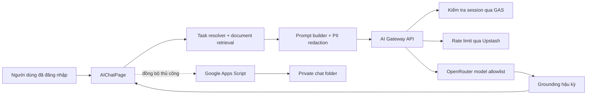

# 14 — AI Chats & Intelligent Copilot

> **Module/phạm vi:** Trợ lý tra cứu thông tin task và quy định/quy chuẩn UX MBBank
> **Owner:** UX Platform / Design Ops
> **Thời gian đọc mục tiêu:** 15 phút
> **Trạng thái:** Read-only, gateway-managed, fail-closed
> **Last Updated:** 2026-10-05

## 1. Tổng quan và kiến trúc

AI Chats phục vụ đúng hai nhu cầu:

1. Tra cứu task người dùng được phép xem: yêu cầu, trạng thái, khâu, người phụ trách, deadline, rủi ro và cập nhật gần nhất.
2. Tra cứu quy định/quy chuẩn từ tài liệu đã được duyệt.

AI Chats không cập nhật task, không phê duyệt, không gửi thông báo và không giả lập rằng một hành động đã được thực hiện.



### Nguyên tắc tin cậy

- Dữ liệu task được lọc theo session và vai trò trước khi đưa vào prompt.
- PII trong context được redaction một chiều.
- Context truy xuất được đóng vai trò dữ liệu tham chiếu, không phải chỉ thị.
- Mã task không tồn tại trong context bị thay bằng dấu hiệu chưa xác minh.
- Tài liệu upload tùy chỉnh chỉ được dùng như quy chuẩn chính thức khi `approvalStatus === "approved"`.
- Activity trace chỉ mô tả các bước ứng dụng đã thực hiện; không hiển thị chain-of-thought thô.

## 2. Bản đồ file và mã nguồn

| File | Trách nhiệm | Điểm cần chú ý |
|---|---|---|
| `src/pages/AIChatPage.tsx` | UI, thread, composer, task context, cloud sync | Chỉ hiển thị hai nhóm OP; cloud sync là opt-in |
| `src/config/aiPrompts.ts` | Phạm vi, prompt, metrics, retrieval tài liệu | Không đưa action/task-update schema vào prompt chat |
| `src/lib/aiConversation.ts` | Resolve task, memory, grounding | Không tự chọn task khi có nhiều ứng viên |
| `src/services/aiService.ts` | Streaming qua gateway và fallback an toàn | Không gọi trực tiếp provider từ browser |
| `src/services/aiArtifactsService.ts` | Kho artifact và metadata phê duyệt | Custom artifact chưa duyệt không phải nguồn quy chuẩn |
| `src/services/googleSheetService.ts` | Đồng bộ task đã xác thực | Cache task tách theo danh tính người dùng |
| `src/components/common/EchoChartsAndFlowcharts.tsx` | Chart và Mermaid | Mermaid strict + SVG sanitizer |
| `src/components/admin/OpenRouterSettingsCard.tsx` | Bật/tắt gateway, chọn model allowlist | Không nhập hoặc lưu provider key ở client |
| `api/ai-gateway.ts` | Auth, rate limit, model policy, proxy LLM | Production fail-closed |
| `google-apps-script-backend.js` | Session, task access, upload, chat cloud | Chat lưu trong thư mục Drive riêng tư |

## 3. Luồng dữ liệu và trạng thái

### Luồng một câu hỏi

1. UI lấy session hiện tại và danh sách task đã được backend lọc quyền.
2. `resolveTaskReference` xác định task theo mã, nickname hoặc ngữ cảnh hội thoại.
3. Nếu mơ hồ, UI yêu cầu người dùng chọn tối đa ba ứng viên.
4. `buildChatPrompt` nạp task liên quan và tài liệu phù hợp; dữ liệu tham chiếu không được coi là instruction.
5. `aiService` gửi request tới `/api/ai-gateway` kèm bearer session.
6. Gateway xác minh session bằng POST tới GAS, áp rate limit và model allowlist.
7. `groundAIResponse` kiểm tra mã task và gắn danh sách nguồn tham chiếu đã nạp.
8. Thread được lưu cục bộ; chỉ đồng bộ cloud sau khi người dùng chủ động bật.

### Storage và giới hạn

| Dữ liệu | Nơi lưu | Chính sách |
|---|---|---|
| Thread cục bộ | `localStorage: ux_mb_ai_chat_threads` | Loại dữ liệu ảnh base64 khi sync |
| Cloud sync consent | `localStorage: ux_mb_ai_cloud_sync_enabled` | Mặc định tắt |
| Artifact cục bộ | `localStorage: ux_mb_ai_artifacts` | Có `approvalStatus`, version, owner, effectiveDate |
| Model lựa chọn | `localStorage: ux_mb_ai_model` | Chỉ model thuộc allowlist |
| Provider secrets | Server environment | Không lưu trong `VITE_*` hoặc browser storage |
| Chat cloud | `UXMB_AI_Chat_History_Private` | Private, theo email từ session đã xác thực |

## 4. Ma trận phạm vi ảnh hưởng

| Khi sửa | Ảnh hưởng | Kiểm thử bắt buộc |
|---|---|---|
| `EMPTY_STATE_CATEGORIES` | Empty state và OP cho Designer | Kiểm tra chỉ còn Task và Quy định |
| `CORE_SYSTEM_PROMPT` | Phạm vi và cách AI trả lời | Test out-of-scope, prompt injection, không tạo action |
| `resolveTaskReference` | Câu hỏi nối tiếp và task mơ hồ | `pnpm run test:ai-intelligence` |
| `groundAIResponse` | Citation và chống bịa mã | Test mã task không tồn tại |
| `streamAICompletion` | Mọi phản hồi LLM | Audit 401/429/503, abort và retry |
| `verifySessionToken` | Toàn bộ AI gateway | Test token thật, token giả và cache invalidation |
| Rate limiter | Availability và chống abuse | Kiểm tra Upstash; production phải fail-closed |
| GAS `get_requests` | Phạm vi dữ liệu task | Test Designer/PO/Admin bằng session thật |
| Cloud chat handlers | Quyền riêng tư lịch sử chat | Test sai email, session hết hạn, payload quá lớn |
| Mermaid sanitizer | Rich response | Test script/foreignObject/event handler độc hại |

## 5. Bẫy kỹ thuật cần tránh

1. Không thêm `VITE_OPENROUTER_API_KEY`, Gemini key hoặc provider endpoint vào client.
2. Không bật `ALLOW_UNAUTHENTICATED_AI_DEV=true` ở preview/production.
3. Không bỏ Upstash trong production; gateway chủ động trả `503` nếu distributed limiter không sẵn sàng.
4. Không chuyển `check_session` về GET vì token sẽ xuất hiện trong URL/log trung gian.
5. Không dùng custom artifact chưa duyệt như quy định chính thức.
6. Không khôi phục action card hoặc `task_update` trong chế độ chat read-only.
7. Không hiển thị raw chain-of-thought; chỉ hiển thị activity trace đã kiểm chứng.
8. Không ghi avatar, email, data URL, reasoning hoặc trace vào cloud chat payload.
9. Design Owner hiện có phạm vi rộng do session chưa mang squad/product scope; không mô tả đây là phân quyền theo squad cho tới khi backend có trường scope.

## 6. Testing cheatsheet

```powershell
pnpm install --frozen-lockfile
pnpm run test:ai-intelligence
node --experimental-strip-types tests/test-ai-chats-e2e-and-audit.mjs
pnpm run build
pnpm audit --prod
git diff --check
```

Kỳ vọng hiện tại:

- Conversation intelligence: `15/15`.
- AI E2E & security audit: `176/176`.
- Production build: pass.
- Production dependency audit: không có vulnerability đã biết.

`pnpm test` toàn repository hiện còn dừng ở lỗi Node ESM có sẵn trên `develop`: import `../data/mockData` thiếu đuôi `.ts` trong `googleSheetService.ts`. Không dùng kết quả của test tổng làm bằng chứng phủ nhận các test AI riêng, nhưng phải xử lý trước khi đặt quality gate toàn repository.

## 7. Tài liệu liên quan

- [Báo cáo audit và hardening 2026-10-05](../reports/2026-10-05_AI_CHATS_AUDIT_AND_HARDENING_REPORT.md)
- [Runbook bảo mật và triển khai](../AI_CHAT_SECURITY_AND_DEPLOYMENT_RUNBOOK.md)
- [Checklist UAT và nghiệm thu](../AI_CHAT_UAT_AND_ACCEPTANCE_CHECKLIST.md)
- [Quy chuẩn Artifact](../AI_CHAT_ARTIFACT_FORMAT_GUIDE.md)
- [UI Design System](../UI_DESIGN_SYSTEM.md)

### Changelog

- `2026-10-05`: Thu hẹp phạm vi về Task + Quy định; chuyển toàn bộ provider access qua gateway; bổ sung auth, distributed rate limit, private cloud chat, approved-document retrieval, Mermaid sanitization và test gates.
