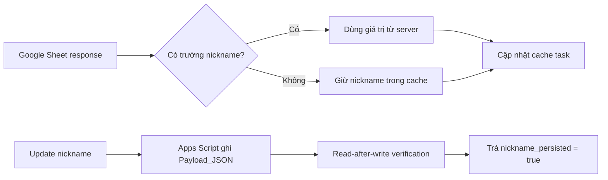

# BÁO CÁO CẬP NHẬT HỆ THỐNG NGÀY 26/09/2026

> **Phạm vi:** Motion runtime, ReUI Sonner stack, độ ổn định đồng bộ task và cơ chế tên gợi nhớ (nickname)
> **Nhánh làm việc:** `develop`
> **Trạng thái:** Hoàn thành, được hợp nhất trong commit `9726491` ngày 27/09/2026

---

## 1. Tóm tắt điều hành

Ngày 26/09/2026 tập trung xử lý bốn nhóm lỗi ảnh hưởng trực tiếp tới trải nghiệm người dùng:

1. Khôi phục hệ thống animation bị vô hiệu hóa khi trình duyệt nhận `prefers-reduced-motion: reduce` từ hệ điều hành.
2. Trả quyền bố trí và transform của toast stack cho Sonner, đồng thời chỉ hiển thị nút đóng trên toast phía trước.
3. Ngăn response thiếu `nickname` ghi đè tên gợi nhớ đã có trong cache và bổ sung hợp đồng xác nhận persistence với Google Apps Script.
4. Giảm cảnh báo đồng bộ task lặp lại và ngăn nhiều background sync chạy đồng thời.

---

## 2. Khôi phục animation toàn ứng dụng

### Hiện trạng

Trình duyệt trả về `window.matchMedia("(prefers-reduced-motion: reduce)").matches === true`. Cấu hình cũ có hai lớp cùng vô hiệu hóa chuyển động:

- `MotionConfig reducedMotion="user"` làm Framer Motion bỏ các chuyển động transform.
- CSS global ép toàn bộ `animation-duration` và `transition-duration` xuống `0.01ms`.

Kết quả là app gần như mất hoàn toàn animation, dù các component vẫn khai báo spring/motion đúng.

### Thay đổi

- `src/App.tsx`: chuyển runtime sang `MotionConfig reducedMotion="never"` cho cả Login Gate và application shell.
- `src/index.css`: bỏ rule toàn cục vô hiệu hóa mọi animation/transition; media query chỉ tắt native smooth scrolling.
- Giữ nguyên các motion token trong `src/lib/motion.ts` và cơ chế cách ly IA canvas.

### Ảnh hưởng

- Khôi phục page transition, popover, drawer, stepper và cascade animation.
- Không thay đổi business logic hoặc dữ liệu.
- IA map tiếp tục dùng GPU transform riêng, không nhận cascade DOM animation.

---

## 3. Sửa CSS Sonner toast stack

### Nguyên nhân

CSS tùy biến đã ghi đè `position`, `transition` và trạng thái opacity của Sonner. Điều này làm các toast phía sau biến thành những khung trắng, nút đóng xuất hiện trên nhiều lớp và transform stack không còn do Sonner kiểm soát.

### Thay đổi

- Bỏ `position: relative !important` trên từng toast.
- Bỏ utility `transition-all duration-300` khỏi class toast chính.
- Chỉ toast có `data-front="true"` được hiển thị close button.
- Toast phía sau đặt close button thành `opacity: 0` và `pointer-events: none`.
- Giữ action button, icon semantic và padding nội dung theo chuẩn ReUI.

### Quy tắc mới

> Sonner sở hữu hoàn toàn phép bố trí, translate, scale và khoảng cách của stack. CSS ứng dụng chỉ kiểm soát visual token và trạng thái nội dung.

---

## 4. Bảo vệ tên gợi nhớ khi đồng bộ task

### Vấn đề

Sau khi người dùng sửa tên gợi nhớ, một số response hoặc deployment Apps Script cũ không trả trường `nickname`. Hàm normalize biến response thiếu trường thành task không có nickname và ghi đè cache, khiến giao diện quay về tiêu đề gốc.

### Giải pháp frontend

Tạo `src/lib/nicknameSync.ts` với hai hợp đồng:

- `preserveCachedNickname()`: giữ nickname cache khi raw response không có property `nickname`.
- `mergeRemoteRequestsPreservingNicknames()`: áp dụng quy tắc trên cho toàn bộ danh sách đồng bộ.

Giá trị rỗng được server trả rõ ràng vẫn có quyền xóa nickname. Chỉ trường hợp property bị thiếu mới dùng cache.

### Giải pháp backend

`google-apps-script-backend.js` được bổ sung:

- Ghi nickname vào `RAW_TASKS.Payload_JSON`.
- `SpreadsheetApp.flush()` và đọc lại ô vừa ghi.
- Trả lỗi nếu nickname không tồn tại hoặc không khớp sau khi ghi.
- Response có `nickname_persistence_version: 1` và `nickname_persisted`.
- Frontend từ chối coi thao tác là thành công nếu deployment hiện tại chưa xác nhận contract version 1.

### Tác động vận hành

Sửa file backend local chưa đủ. Cần deploy một version Google Apps Script mới để production nhận contract persistence.

---

## 5. Ổn định đồng bộ danh sách task

`src/services/googleSheetService.ts` được tăng cường:

- Response task rỗng bất thường không được phép xóa cache đang có.
- Cảnh báo danh sách rỗng chỉ log một lần cho tới khi remote hoạt động bình thường trở lại.
- Background sync dùng single-flight promise để không chạy nhiều request trùng nhau.
- Nickname preservation được áp dụng cho fetch toàn bộ, background sync và fetch một task.
- Khi update thành công và backend trả `updated_item`, cache được cập nhật bằng object server đã xác nhận.

---

## 6. File ảnh hưởng

| File | Nội dung |
| :--- | :--- |
| `src/App.tsx` | Chính sách MotionConfig runtime |
| `src/index.css` | Reduced-motion CSS và Sonner stack CSS |
| `src/components/reui/sonner.tsx` | Loại bỏ transition ghi đè layout của Sonner |
| `src/lib/nicknameSync.ts` | Hợp đồng merge nickname an toàn |
| `src/services/googleSheetService.ts` | Cache preservation, single-flight sync, nickname contract |
| `google-apps-script-backend.js` | Ghi và xác nhận nickname trong Payload_JSON |
| `tests/test-nickname-sync.mjs` | Kiểm thử frontend merge và backend source contract |

---

## 7. Kiểm thử

- `node --experimental-strip-types tests/test-nickname-sync.mjs`: PASS.
- `npm run build`: PASS.
- Kiểm tra thủ công Sonner stack: chỉ toast phía trước có nút đóng, hover stack do Sonner điều khiển.
- Kiểm tra motion: animation hoạt động kể cả khi Windows báo reduced motion.

---

## 8. Rủi ro và việc vận hành còn lại

1. Phải deploy Apps Script mới; nếu không frontend sẽ báo deployment chưa hỗ trợ nickname persistence.
2. Chính sách luôn bật motion là quyết định sản phẩm hiện hành; nên bổ sung một toggle accessibility trong app nếu cần đáp ứng nhu cầu giảm chuyển động theo từng người dùng.
3. Cảnh báo task list rỗng đã được chống lặp nhưng nguyên nhân upstream vẫn cần kiểm tra nếu remote thực sự trả rỗng.

---

**Last Updated:** 27/09/2026
**Changelog:** Tạo báo cáo hồi cứu cho công việc ngày 26/09/2026.
