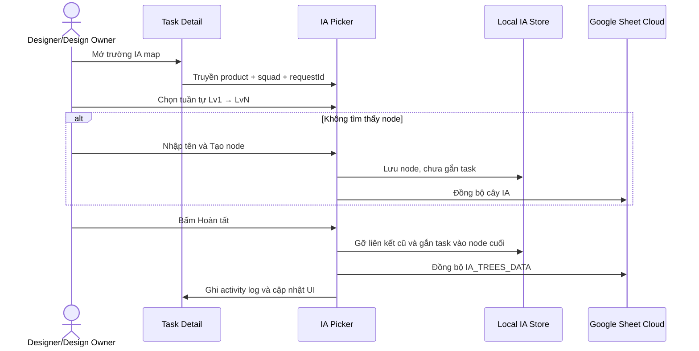

# BÁO CÁO CẬP NHẬT HỆ THỐNG NGÀY 27/09/2026

> **Phạm vi:** Task ↔ IA Map, IA Cloud persistence, IA UI refinements, kiểm thử hồi quy và nghiên cứu Designer Planner
> **Nhánh:** `develop`
> **Commit đã đẩy:** `9726491` — `feat: link tasks to IA nodes and refine IA interactions`

---

## 1. Tóm tắt điều hành

Ngày 27/09/2026 hoàn thiện luồng liên kết hai chiều giữa chi tiết task và IA map. Design Owner/Designer có quyền `cap-ia-edit` có thể duyệt cây IA theo sản phẩm và squad của task, tạo node mới theo từng cấp Lv1–Lv5 và chỉ xác nhận liên kết khi bấm **Hoàn tất**.

Song song, hệ thống xử lý các lỗi IA Cloud tự ghi đè thay đổi local, chuẩn hóa màu node theo level, căn giữa bottom dock, tối ưu slide-over và sửa cảnh báo React key. Cuối ngày, toàn bộ test/build đạt và commit được đẩy lên `origin/develop`.

---

## 2. Liên kết Task ↔ IA Map

### Quy tắc nghiệp vụ đã triển khai

- Một task chỉ gắn với một node IA tại một thời điểm.
- Node nhận task là node cuối cùng được chọn.
- Cây được lọc theo sản phẩm và squad gắn với task.
- Chọn tuần tự theo tab Lv1 → Lv5; chọn một node sẽ chuyển sang cấp tiếp theo.
- Người dùng có `cap-ia-edit` được tạo node tại cấp đang chọn.
- Tạo node chỉ tạo và lưu node; không gắn task ngay.
- Chỉ nút **Hoàn tất** mới liên kết task với node cuối cùng.
- Khi chuyển node, liên kết cũ được gỡ và liên kết mới được tạo trong cùng một phép biến đổi dữ liệu.
- Có thao tác **Gỡ liên kết** độc lập.

### Giao diện picker

- Tích hợp trực tiếp trong lưới metadata Task Detail, không dùng modal.
- Thứ tự trường: `Status – Priority`, `Date – IA map`, `Assignees – Viewers`.
- Header hiển thị sản phẩm và squad thay cho nút đóng riêng.
- Tab Lv1–Lv5, không xếp các cấp thành danh sách dọc.
- Mỗi tab hiển thị trực tiếp danh sách node; không cần mở native select.
- Ô tìm kiếm được focus tự động, tìm không phân biệt dấu/chữ hoa.
- Khi tên chưa tồn tại, hiển thị hành động `Tạo “…”` theo pattern Notion.
- Danh sách trải toàn bộ chiều ngang popover, không bọc thêm box lồng nhau.

### Thành phần mới

| File | Vai trò |
| :--- | :--- |
| `src/components/track/TaskIALinkField.tsx` | UI chọn/tạo/gỡ liên kết IA trong Task Detail |
| `src/lib/iaTaskLink.ts` | Product resolution, squad scope, atomic link/unlink, tạo node và merge Cloud |
| `tests/test-task-ia-linking.mjs` | Kiểm thử 1 task–1 node, phạm vi squad, tạo node và dirty merge |

---

## 3. Chống mất liên kết sau khi IA tự tải lại

### Nguyên nhân

Sau khi task gắn vào node, IA map hiển thị đúng từ local storage. Auto-pull Cloud sau đó có thể lấy về snapshot cũ chưa chứa liên kết và ghi đè cây local, khiến task biến mất khỏi node.

### Giải pháp

- Theo dõi danh sách product IA đang dirty bằng `ux_ia_dirty_products_v1`.
- Auto-pull chỉ cập nhật product không có thay đổi local đang chờ push.
- Product dirty được xóa sau khi Cloud xác nhận lưu thành công.
- Phát event `ia_trees_changed` để Task Detail và IA map cập nhật tức thì trong cùng tab.
- `IAPage` kiểm tra rõ `result.success`, không coi response lỗi là đã đồng bộ.

### Backend RBAC

`handleSyncMasterData()` vẫn yêu cầu Admin cho master data nói chung, nhưng cho phép payload chỉ chứa `IA_TREES_DATA` nếu role nằm trong cấu hình `cap-ia-edit`. Payload IA trộn với key master data khác vẫn bị chặn.

---

## 4. Chuẩn hóa giao diện IA Map

### Màu node theo level

Màu node không còn kế thừa màu sản phẩm xuống toàn bộ cây. `IATreeNodeCard` luôn lấy palette từ `node.tier`, giúp mọi sản phẩm hiển thị Lv1–Lv5 nhất quán như App MB.

### Bottom dock

- Chuyển dock sang `position: fixed`.
- Desktop bù `7.5rem`, tương ứng nửa sidebar `15rem`, để dock nằm giữa vùng nội dung IA.
- Fullscreen/mobile trở về giữa viewport.
- Icon Fit-to-view đổi từ `Maximize2` sang `LocateFixed`, tránh nhầm với fullscreen.

### Slide-over

- Panel Dữ liệu & Đồng bộ dùng chiều cao theo nội dung, không kéo dài thành khung trắng toàn màn hình.
- Các panel cần không gian chỉnh sửa vẫn giữ chiều cao đầy đủ.

### Task Detail và cảnh báo React

- Loại phase rỗng/trùng tên trước khi render workflow.
- React key thêm index để tránh duplicate key khi dữ liệu cấu hình cũ không sạch.
- Popover Viewers căn phải ổn định trong drawer.
- Nhãn workspace ở Sidebar rút gọn thành `Workspace`.

---

## 5. Kiểm thử và chất lượng

### Kết quả

- Task ↔ IA linking: **6/6 PASS**.
- IA bottom dock: **10/10 PASS**.
- Nickname sync contract: PASS.
- Design System E2E: **114/114 PASS**.
- IA Lv5, layout, viewport culling, Cloud chunking, security milestones: PASS.
- `npm test`: PASS toàn bộ.
- `npm run build`: PASS.
- `git diff --check`: PASS.

### Ổn định test theo thời gian

Hai fixture PO Pending được làm deterministic để không thất bại khi test chạy vào cuối tuần. Security test được cập nhật để phản ánh ngoại lệ IA-only theo `cap-ia-edit` mà vẫn bảo vệ các master-data key khác.

---

## 6. Nghiên cứu và triển khai trang Lịch & Planner dành cho Designer

Đã đánh giá yêu cầu thiết kế lại Calendar theo hướng bàn làm việc cá nhân, sau đó triển khai MVP bằng các nguồn dữ liệu hiện có.

### Khả năng tái sử dụng

- Lưới tháng, điều hướng Today/trước/sau và `+N mục khác`.
- Dữ liệu task, nghỉ phép, nghỉ lễ, sự kiện team.
- Risk engine, capacity/workload và danh sách task chưa xếp ngày.
- Notification UI và activity log của task.

### Khoảng trống cần xử lý trước khi triển khai

1. `planned_work_date` đã được tách khỏi deadline và bổ sung persistence vào payload Google Sheet/Apps Script.
2. Team/personal event vẫn tái sử dụng SystemConfig, chưa có schema owner/visibility riêng.
3. Notification read state vẫn là local browser, chưa phải inbox cloud theo tài khoản.
4. Trang cá nhân đã lọc task bằng `isTaskAssignedToUser()`.
5. Chưa có AI provider; briefing MVP dùng rule engine nội bộ và không gửi dữ liệu ra ngoài.

Đánh giá tổng thể: khả thi cao; phần logic tái sử dụng đã đủ để hoàn thiện MVP, còn personal event và notification read-state cần backend riêng cho giai đoạn sau.

---

## 7. Git và triển khai

- Commit: `9726491`.
- Remote: `origin/develop`.
- Trạng thái tại thời điểm push commit trên: local `develop` đồng bộ với remote.
- Apps Script cần deploy new version để nickname persistence và IA-only RBAC có hiệu lực trên môi trường Cloud.

---

## 8. Follow-up: Designer Planner MVP

- Tạo `src/pages/DesignerPlannerPage.tsx` và chuyển route `calendar` sang trải nghiệm cá nhân mới.
- Tạo `src/lib/designerPlanner.ts` cho week bounds, phase distribution, go-live và rule-based briefing.
- Bổ sung lời chào/câu cảm hứng, KPI, lịch tháng–tuần, bộ lọc task/event, panel chi tiết ngày, task ưu tiên, task chưa xếp lịch và feed cập nhật.
- Ngày không làm việc dùng nền xám; nghỉ lễ/làm bù hiển thị dạng watermark nền ô lịch, không tạo chip giống task.
- Bổ sung quick scheduling; `planned_work_date` được ghi vào cache, activity log và `RAW_TASKS.Payload_JSON` mà không đổi deadline.
- Tạo `tests/test-designer-planner.mjs`; toàn bộ `npm test`, 12 calendar/leave Vitest và production build đều PASS.
- Các thay đổi follow-up này đang ở working tree, chưa nằm trong commit `9726491`.

---

**Last Updated:** 27/09/2026
**Changelog:** Tạo báo cáo công việc ngày 27/09/2026; bổ sung kết quả triển khai Designer Planner MVP và persistence ngày dự kiến làm.
